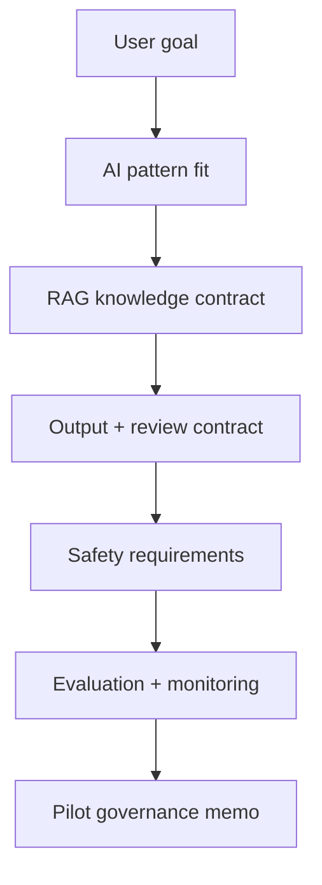

# Capstone 3: AI Assistant Requirement and Governance

<div class="lesson-meta">
  <span>Capstone</span>
  <span>Project simulation</span>
  <span>Senior BA</span>
</div>

Specify an AI assistant from user goal to RAG knowledge contract, human review, safety controls, evaluation, and operating model.

## Scenario

A support organization wants an AI assistant that drafts ticket replies using product documentation, policy articles, and historical tickets. The business wants faster response time, but legal worries about incorrect advice, support leads worry about tone, and engineering needs clear retrieval, logging, and fallback requirements.

## Your role

You are the AI-aware BA defining an assistant that is useful, governable, measurable, and safe enough for pilot release.

## Inputs to prepare

- Target user journeys and support personas
- Knowledge source inventory
- Sample tickets and approved replies
- Data sensitivity and PII policy
- Support QA scorecard
- Operational escalation and review rules

## Capstone workflow

1. Classify the AI pattern and explain why RAG plus human review fits the scenario.
2. Define source authority, freshness, chunking assumptions, citation behavior, access control, and conflict handling.
3. Specify output contract, confidence behavior, refusal/fallback, human review trigger, correction capture, and audit log requirements.
4. Create evaluation set design, answer-quality rubric, monitoring metrics, and pilot release gates.
5. Write acceptance criteria for prompt injection, unsafe input, bias/fairness, privacy, and cost guardrails.
6. Prepare stakeholder decision memo with risks, controls, and pilot scope.

## Diagram



## Expected deliverables

| Deliverable | What it contains | Why it matters |
| --- | --- | --- |
| AI feature operating contract | Task boundary, allowed inputs, output contract, confidence, fallback, and human review | Prevents uncontrolled AI behavior |
| RAG knowledge contract | Source inventory, authority, freshness, access, citations, conflict handling, and retrieval metrics | Defines what the assistant can trust |
| Evaluation and monitoring plan | Test set, rubric, telemetry, correction capture, alerts, and release gates | Makes quality measurable before and after release |
| Governance decision memo | Pilot scope, risk tier, controls, owners, and unresolved decisions | Gives sponsors a responsible go/no-go artifact |

## AI collaboration prompt

```text
Act as an expert AI product BA. Help me specify this support AI assistant. Create AI pattern fit, RAG knowledge contract, output contract, human review and fallback rules, privacy and prompt-injection requirements, evaluation set design, quality rubric, telemetry plan, pilot release gates, decision memo, and stakeholder questions. Separate facts, assumptions, unsupported claims, and decisions needed.
```

## Scoring rubric

| Review lens | High-score signal |
| --- | --- |
| AI fit | The selected AI pattern is justified against business outcome and risk. |
| Safety | Human review, fallback, privacy, access, and injection controls are testable. |
| Evaluation | The pilot has measurable quality, failure, and monitoring criteria. |
| Operating model | Owners, review gates, escalation, and post-release learning are defined. |

## Submission checklist

- Evidence labels are visible in every material artifact.
- Assumptions are separated from decisions.
- Frontend, backend, QA, operations, and governance handoffs are explicit where relevant.
- AI output has been reviewed for unsupported claims, missing context, and unsafe shortcuts.
- The final pack can drive a real refinement, workshop, or pilot decision.
