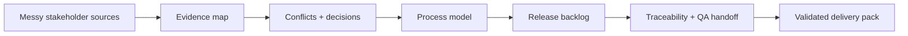

# Capstone 1: Discovery to Delivery AI BA Pack

<div class="lesson-meta">
  <span>Capstone</span>
  <span>Project simulation</span>
  <span>Senior BA</span>
</div>

Turn messy stakeholder input into a delivery-ready analysis pack with evidence, decisions, stories, risks, and QA handoff.

## Scenario

A mid-size operations team wants to modernize its request intake flow. Sales wants faster submission, operations wants fewer manual corrections, compliance wants approval evidence, and engineering needs a scoped first release. The source material is inconsistent and several decisions are still open.

## Your role

You are the senior BA accountable for shaping the first release without letting AI turn assumptions into approved scope.

## Inputs to prepare

- Stakeholder notes from sales, operations, compliance, support, and engineering
- Current-state process fragments
- Draft business goals and success metrics
- Known constraints about roles, audit, data, and timeline
- Three sample request tickets with exception cases

## Capstone workflow

1. Create a source map and classify facts, assumptions, conflicts, and decisions needed.
2. Draft current-state and target-state process diagrams with exception paths.
3. Split first-release scope into epics, user stories, and acceptance criteria.
4. Create a traceability matrix from business goal to story, rule, evidence, and test scenario.
5. Prepare a decision log and workshop agenda for unresolved items.
6. Run an AI-output review and mark unsupported claims before sharing.

## Diagram



## Expected deliverables

| Deliverable | What it contains | Why it matters |
| --- | --- | --- |
| Evidence-backed discovery synthesis | Source map, themes, conflicts, decisions needed, and assumptions | Protects the project from false consensus |
| Process and exception model | Current-state, target-state, decision points, exception loops, and handoffs | Shows the actual operational complexity |
| Release-ready backlog pack | Epics, stories, acceptance criteria, NFRs, and negative scenarios | Gives delivery teams testable work |
| Traceability and QA handoff | Goal-to-requirement-to-test map with owners | Connects BA work to release readiness |

## AI collaboration prompt

```text
Act as my senior BA reviewer. Given the project source pack, create a delivery-ready AI BA pack. Start by asking for missing evidence. Then produce source map, fact-assumption-conflict table, current-state flow, target-state flow, release scope, user stories, acceptance criteria, traceability matrix, decision log, and QA handoff. Mark unsupported claims and stakeholder decisions separately.
```

## Scoring rubric

| Review lens | High-score signal |
| --- | --- |
| Evidence discipline | Every material claim has a source, owner, or validation question. |
| Delivery readiness | Stories are estimable, testable, and tied to business value. |
| Risk handling | Compliance, audit, NFR, and exception risks are visible before sprint commitment. |
| AI control | AI output is used as draft analysis, not as an approval mechanism. |

## Submission checklist

- Evidence labels are visible in every material artifact.
- Assumptions are separated from decisions.
- Frontend, backend, QA, operations, and governance handoffs are explicit where relevant.
- AI output has been reviewed for unsupported claims, missing context, and unsafe shortcuts.
- The final pack can drive a real refinement, workshop, or pilot decision.
