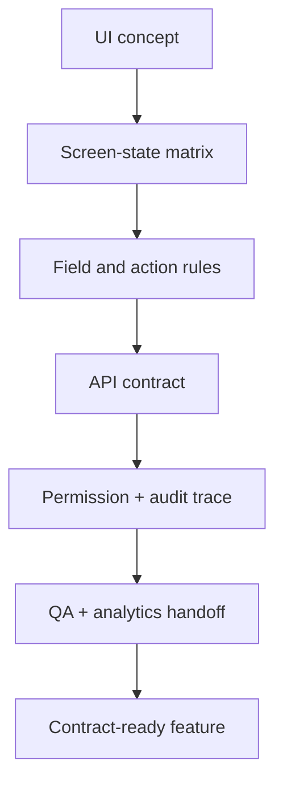

# Capstone 2: Frontend to Backend Contract Readiness

<div class="lesson-meta">
  <span>Capstone</span>
  <span>Project simulation</span>
  <span>Senior BA</span>
</div>

Translate a UI concept into screen behavior, API contract, data rules, error states, analytics, and test coverage.

## Scenario

A customer portal adds a reporting screen with filters, saved views, export, permissions, and partial data from three backend services. The Figma file shows the happy path but does not define loading, empty, error, partial failure, RBAC, analytics, or API edge cases.

## Your role

You are the BA connecting UX intent, frontend behavior, backend contract, QA scenarios, and stakeholder decisions.

## Inputs to prepare

- Figma screen or wireframe notes
- User roles and permission rules
- Draft API descriptions
- Sample response payloads
- Reporting metrics and business definitions
- Known browser, mobile, and accessibility expectations

## Capstone workflow

1. Create a screen-state behavior matrix for loading, empty, error, permission, partial data, and success states.
2. Define field-level rules, filter behavior, sorting, pagination, export, and saved-view logic.
3. Draft API contract requirements with request, response, validation, error codes, timeout, retry, and idempotency notes.
4. Map UI controls to backend permissions and audit needs.
5. Write analytics event requirements and QA test scenarios.
6. Identify design, product, frontend, backend, data, and QA decisions still needed.

## Diagram



## Expected deliverables

| Deliverable | What it contains | Why it matters |
| --- | --- | --- |
| Screen-state matrix | State, trigger, UI behavior, copy, action availability, and owner | Prevents hidden frontend requirements |
| API contract requirement pack | Endpoint, schema, validation, errors, timeouts, retries, and examples | Gives backend and frontend a shared contract |
| Permission and audit trace map | Role, control, API permission, audit event, and denial behavior | Avoids UI-only security assumptions |
| QA and analytics handoff | Test scenarios, event names, payload rules, and acceptance signals | Makes release behavior measurable |

## AI collaboration prompt

```text
Act as a senior BA for a frontend-backend refinement workshop. From the supplied UI concept and API notes, create screen-state matrix, field behavior rules, API contract requirements, permission trace map, error taxonomy, analytics events, QA scenarios, open decisions, and acceptance criteria. Flag any assumption that needs UX, product, backend, security, or QA confirmation.
```

## Scoring rubric

| Review lens | High-score signal |
| --- | --- |
| UI completeness | Non-happy-path screen states are fully specified. |
| Contract clarity | Frontend and backend teams can build independently from the same behavior agreement. |
| Security and audit | Visibility, authorization, and audit behavior are aligned. |
| Measurement | Analytics and QA expectations prove whether the feature works after release. |

## Submission checklist

- Evidence labels are visible in every material artifact.
- Assumptions are separated from decisions.
- Frontend, backend, QA, operations, and governance handoffs are explicit where relevant.
- AI output has been reviewed for unsupported claims, missing context, and unsafe shortcuts.
- The final pack can drive a real refinement, workshop, or pilot decision.
