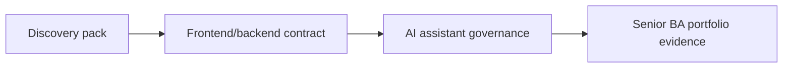

# Capstone Project Simulations

Use these capstones after the core lessons and project use cases. Each one asks you to produce artifacts a real delivery team could review.

<a class="template-card" href="./discovery-to-delivery-ai-ba-pack/"><strong>Capstone 1: Discovery to Delivery AI BA Pack</strong>Turn messy stakeholder input into a delivery-ready analysis pack with evidence, decisions, stories, risks, and QA handoff.</a>
<a class="template-card" href="./frontend-backend-contract-readiness/"><strong>Capstone 2: Frontend to Backend Contract Readiness</strong>Translate a UI concept into screen behavior, API contract, data rules, error states, analytics, and test coverage.</a>
<a class="template-card" href="./ai-assistant-requirement-and-governance/"><strong>Capstone 3: AI Assistant Requirement and Governance</strong>Specify an AI assistant from user goal to RAG knowledge contract, human review, safety controls, evaluation, and operating model.</a>

## Capstone progression

