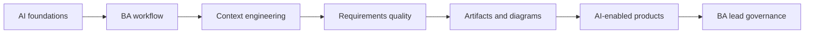

# AI for Business Analysts

A complete learning path for software Business Analysts who need to understand AI, use AI in analysis work, and specify AI-enabled products responsibly.

<strong>AI Foundations for Business Analysts</strong>Core concepts, practical workflows, and BA-ready artifacts.

<strong>AI-Augmented BA Workflow</strong>Core concepts, practical workflows, and BA-ready artifacts.

<strong>AI Collaboration and Context Engineering</strong>Core concepts, practical workflows, and BA-ready artifacts.

<strong>Requirements Engineering With AI</strong>Core concepts, practical workflows, and BA-ready artifacts.

<strong>Analysis Artifacts and Diagramming</strong>Core concepts, practical workflows, and BA-ready artifacts.

<strong>Building AI-Enabled Products as a BA</strong>Core concepts, practical workflows, and BA-ready artifacts.

<strong>BA Lead and Expert Track</strong>Core concepts, practical workflows, and BA-ready artifacts.

## Learning path

## What you will be able to do

- Explain AI concepts in language stakeholders can understand.
- Use AI to improve discovery, interviews, requirements, diagrams, and review.
- Write better prompts by designing context, constraints, evidence, and output format.
- Specify AI-enabled features with data, quality, fallback, monitoring, and governance requirements.
- Lead AI adoption in a BA team with practical controls and metrics.

## Start here

1. Read lessons 01-05 to build AI foundations.
2. Practice lessons 06-17 to improve BA workflows and artifacts.
3. Study lessons 18-20 if you analyze AI products or lead BA adoption.
4. Use the labs and resource library to apply the methods on real work.
