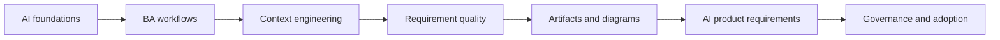

# AI for Business Analysts

A deep bilingual learning path for software Business Analysts who need to use AI responsibly, improve BA artifacts, and specify AI-enabled products with expert judgment.

<strong>AI Foundations for Business Analysts</strong>Distinct lessons with diagrams, artifacts, prompts, and review controls.

<strong>AI-Augmented BA Workflow</strong>Distinct lessons with diagrams, artifacts, prompts, and review controls.

<strong>AI Collaboration and Context Engineering</strong>Distinct lessons with diagrams, artifacts, prompts, and review controls.

<strong>Requirements Engineering With AI</strong>Distinct lessons with diagrams, artifacts, prompts, and review controls.

<strong>Analysis Artifacts and Diagramming</strong>Distinct lessons with diagrams, artifacts, prompts, and review controls.

<strong>Building AI-Enabled Products as a BA</strong>Distinct lessons with diagrams, artifacts, prompts, and review controls.

<strong>BA Lead and Expert Track</strong>Distinct lessons with diagrams, artifacts, prompts, and review controls.

<strong>Project Use Cases</strong>30 detailed scenarios showing how to apply AI in real software projects.

## Learning path

## What you will be able to do

- Explain AI concepts without hype and without unnecessary ML math.
- Use AI to improve discovery, synthesis, requirements, diagrams, and review.
- Build reusable prompt/context patterns for a BA team.
- Specify AI-enabled features with uncertainty, evaluation, human review, fallback, and monitoring.
- Lead AI adoption with governance, quality gates, metrics, and operating model.

## Start here

1. Read lessons 01-05 for AI foundations.
2. Practice lessons 06-17 to improve BA workflow and artifacts.
3. Study lessons 18-20 for AI-enabled product requirements and BA leadership.
4. Use the project use cases to adapt AI workflows to real delivery situations.
5. Use the labs and resource library on your real backlog.
