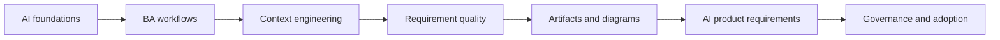

# AI for Business Analysts

A deep bilingual learning path for software Business Analysts who need to use AI responsibly, improve BA artifacts, and specify AI-enabled products with expert judgment.

## Course modules

<strong>AI Foundations for Business Analysts</strong>Understand AI patterns, LLM limits, grounding, RAG, source authority, and when a non-AI solution is better.

<strong>AI-Augmented BA Workflow</strong>Use AI to synthesize discovery, interviews, stories, process models, and stakeholder decisions without losing evidence.

<strong>AI Collaboration and Context Engineering</strong>Build reusable context packages, prompt patterns, critique loops, and structured outputs for BA team collaboration.

<strong>Requirements Engineering With AI</strong>Improve ambiguity analysis, NFRs, risk, traceability, testability, and backlog readiness before delivery commitment.

<strong>Analysis Artifacts and Diagramming</strong>Create BRD, SRS, decision artifacts, diagrams, matrices, and handoff packs that delivery teams can inspect.

<strong>Building AI-Enabled Products as a BA</strong>Specify AI-enabled features with task boundary, output contract, evaluation, human review, fallback, and monitoring.

<strong>BA Lead and Expert Track</strong>Scale AI adoption with governance, risk tiers, tool policy, quality gates, coaching, metrics, and operating model.

<strong>Project Use Cases</strong>70+ detailed scenarios, including frontend/UI, backend/API, data integration, QA, and AI product work.

## Learning path

## Role-based learning paths

<strong>New Software BA</strong>Start with AI foundations, then practice discovery and user stories.<em>Lessons 01-08, Labs 01-03, Discovery and Requirements use cases</em>

<strong>Senior Delivery BA</strong>Focus on ambiguity, NFRs, traceability, diagrams, and cross-team handoff.<em>Lessons 09, 13-17, Capstone 1, Frontend/Backend use cases</em>

<strong>BA Working With Frontend/UI</strong>Translate UX into behavior, state, permissions, analytics, accessibility, and QA coverage.<em>Frontend/UI use cases, UI State Template, Capstone 2</em>

<strong>BA Working With Backend/API</strong>Clarify API contracts, validation, errors, RBAC, idempotency, data mapping, and integration failure.<em>Backend/API use cases, API Contract Checklist, Capstone 2</em>

<strong>AI Product BA</strong>Specify RAG, AI output contracts, human review, fallback, evaluation, monitoring, and risk controls.<em>Lessons 18-20, RAG Canvas, AI Feature Template, Capstone 3</em>

<strong>BA Lead or Practice Lead</strong>Build governance, prompt library, quality gates, adoption metrics, and team operating model.<em>Lesson 20, AI Risk Matrix, DoR/DoD Template, Adoption Lab</em>

## What you will be able to do

- Explain AI concepts without hype and without unnecessary ML math.
- Use AI to improve discovery, synthesis, requirements, diagrams, and review.
- Build reusable prompt/context patterns for a BA team.
- Specify AI-enabled features with uncertainty, evaluation, human review, fallback, and monitoring.
- Lead AI adoption with governance, quality gates, metrics, and operating model.

## Start here

1. Read lessons 01-05 for AI foundations.
2. Practice lessons 06-17 to improve BA workflow and artifacts.
3. Study lessons 18-20 for AI-enabled product requirements and BA leadership.
4. Use the project use cases to adapt AI workflows to real delivery situations.
5. Use the labs and resource library on your real backlog.

## Capstone project simulations

- [Capstone 1: Discovery to Delivery AI BA Pack](./capstones/discovery-to-delivery-ai-ba-pack/) - Turn messy stakeholder input into a delivery-ready analysis pack with evidence, decisions, stories, risks, and QA handoff.
- [Capstone 2: Frontend to Backend Contract Readiness](./capstones/frontend-backend-contract-readiness/) - Translate a UI concept into screen behavior, API contract, data rules, error states, analytics, and test coverage.
- [Capstone 3: AI Assistant Requirement and Governance](./capstones/ai-assistant-requirement-and-governance/) - Specify an AI assistant from user goal to RAG knowledge contract, human review, safety controls, evaluation, and operating model.
