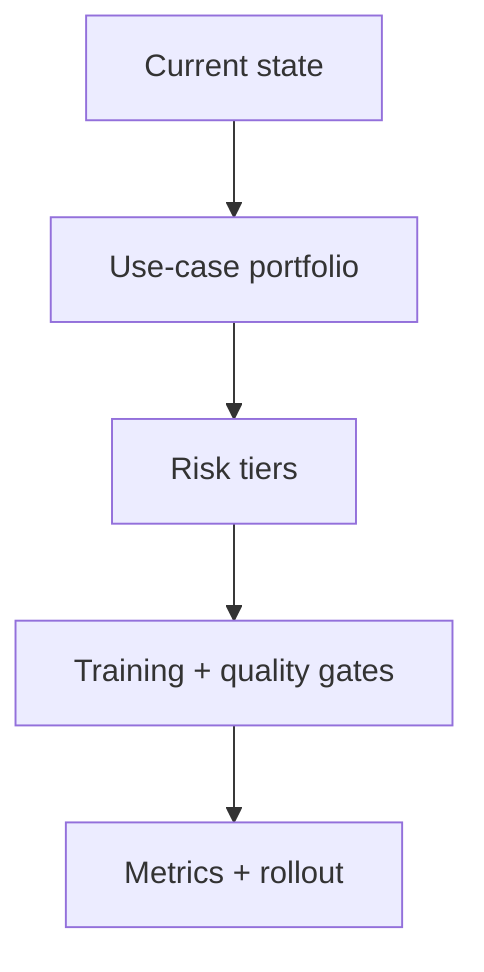

# AI Adoption Roadmap

## Scenario

You are a BA lead planning safe AI adoption for a 20-person BA practice.

## Input sample

```text
Current state: some BAs use public AI tools, no shared prompt library, no data policy, managers want productivity gains, compliance worries about confidential data.
```

## Diagram



## Exercise steps

1. Build use-case portfolio by value and risk.
2. Define risk tiers and data rules.
3. Create training and quality gates.
4. Define metrics and rollout phases.

## Deliverables

- use-case portfolio
- risk-tier policy
- training plan
- governance scorecard

## AI collaboration prompt

```text
Act as a senior BA coach. Help me complete this lab. First ask what source evidence is available. Then guide me through the exercise steps. Produce the deliverables in structured tables. Mark assumptions, unsupported claims, and questions for stakeholder validation.
```

## Review rubric

- Risk controls match use-case sensitivity.
- Quality gates are practical.
- Metrics include quality and cycle time.
- Rollout has owners and phases.
