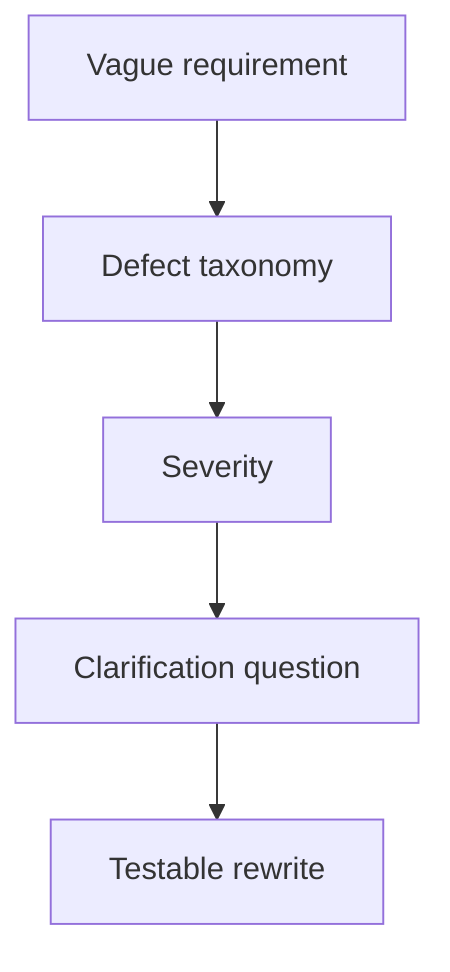

# Ambiguous Requirement Review

## Scenario

A product owner gives you vague requirements before sprint refinement. Your job is to make ambiguity visible and rewrite only what can be supported.

## Input sample

```text
Requirement excerpt: The system should notify users quickly when important account changes occur and make it easy for admins to manage exceptions.
```

## Diagram



## Exercise steps

1. Run the defect taxonomy.
2. Classify ambiguity, missing rule, conflict, and non-testable wording.
3. Write clarification questions.
4. Create a testable rewrite candidate with assumptions labeled.

## Deliverables

- defect register
- clarification question list
- rewritten requirement candidates
- severity ranking

## AI collaboration prompt

```text
Act as a senior BA coach. Help me complete this lab. First ask what source evidence is available. Then guide me through the exercise steps. Produce the deliverables in structured tables. Mark assumptions, unsupported claims, and questions for stakeholder validation.
```

## Review rubric

- Each issue has a defect type.
- Severity reflects business or delivery risk.
- Rewrites are measurable.
- Assumptions are not hidden.
