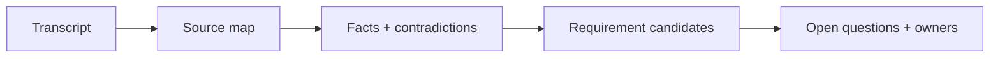

# Meeting Transcript to Requirements

## Scenario

You receive a messy discovery call about customer onboarding. The goal is to convert it into requirement candidates without hiding uncertainty.

## Input sample

```text
Transcript excerpt: Sales wants instant onboarding. Compliance says KYC must be complete before activation. Support says customers often upload the wrong document. Product wants a self-service status page.
```

## Diagram



## Exercise steps

1. Create a source map with stakeholder attribution.
2. Extract facts, assumptions, contradictions, and decisions needed.
3. Draft requirement candidates with evidence.
4. Write open questions and assign decision owners.

## Deliverables

- source map
- requirement candidate table
- contradiction list
- decision log

## AI collaboration prompt

```text
Act as a senior BA coach. Help me complete this lab. First ask what source evidence is available. Then guide me through the exercise steps. Produce the deliverables in structured tables. Mark assumptions, unsupported claims, and questions for stakeholder validation.
```

## Review rubric

- Every requirement has source evidence.
- Contradictions are not smoothed into false agreement.
- Open questions have owner and next action.
- No unsupported AI inference becomes final scope.
