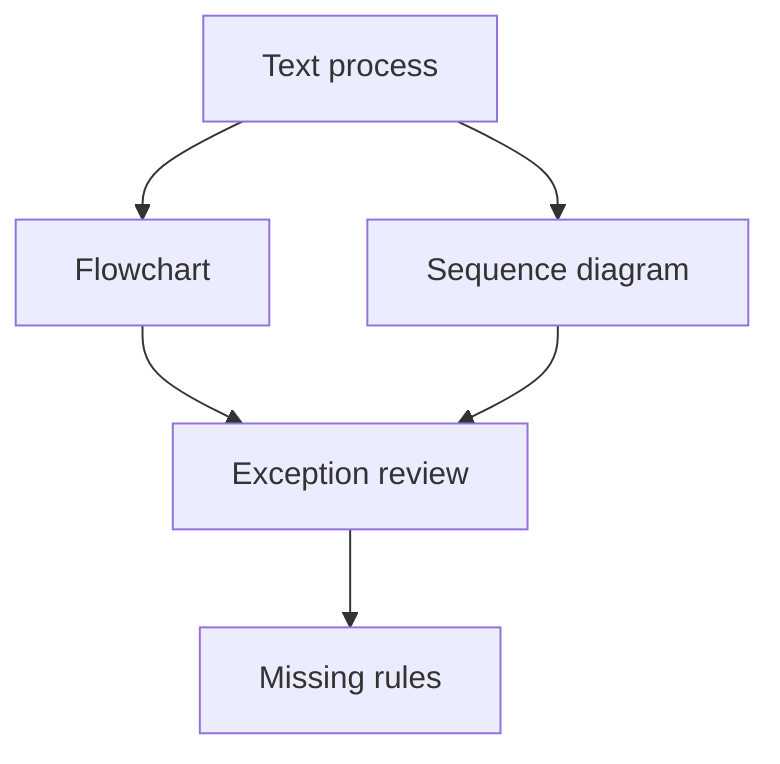

# Process and Sequence Diagrams

## Scenario

You need to explain an approval flow that crosses user, web app, workflow engine, notification service, and manager review.

## Input sample

```text
Process: User submits request. System validates documents. If amount is high, manager approves. User receives result. Missing documents return to user.
```

## Diagram



## Exercise steps

1. Draft a process flow.
2. Draft a sequence diagram.
3. Add exception paths and ownership.
4. List missing rules and integration assumptions.

## Deliverables

- process flow
- sequence diagram
- exception path list
- ownership notes

## AI collaboration prompt

```text
Act as a senior BA coach. Help me complete this lab. First ask what source evidence is available. Then guide me through the exercise steps. Produce the deliverables in structured tables. Mark assumptions, unsupported claims, and questions for stakeholder validation.
```

## Review rubric

- Actors and systems are separated.
- Decision rules are explicit.
- Exceptions are visible.
- Integration boundaries are clear.
