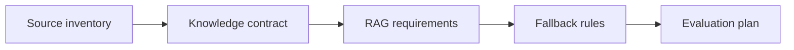

# RAG Assistant Requirements

## Scenario

Your organization wants a policy assistant that answers from internal documents and cites sources.

## Input sample

```text
Sources: HR policy portal, legacy PDF handbook, manager-only procedure, public FAQ. Users: employees and HR advisors.
```

## Diagram



## Exercise steps

1. Define source authority and freshness.
2. Specify access control and citation rules.
3. Write fallback behavior for weak evidence.
4. Define retrieval and answer-quality evaluation.

## Deliverables

- knowledge contract
- RAG requirement set
- fallback rules
- evaluation plan

## AI collaboration prompt

```text
Act as a senior BA coach. Help me complete this lab. First ask what source evidence is available. Then guide me through the exercise steps. Produce the deliverables in structured tables. Mark assumptions, unsupported claims, and questions for stakeholder validation.
```

## Review rubric

- Source priority is defined.
- Access control is testable.
- Fallback avoids invented answers.
- Evaluation covers retrieval and generation.
