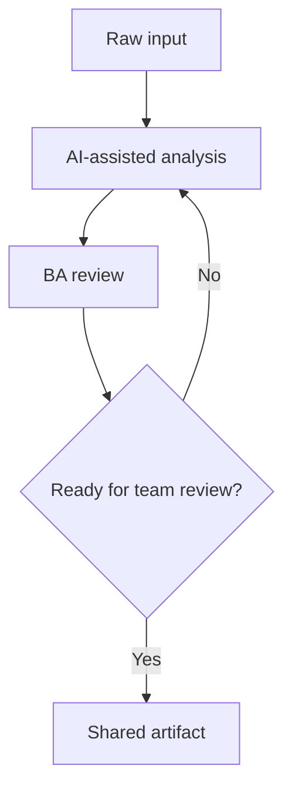

# Stories and Acceptance Criteria

## Objective

A feature idea needs to become development-ready user stories and Given-When-Then acceptance criteria.

## Scenario

You are working in a software product team. The team expects a BA-ready artifact that can be reviewed by product, engineering, QA, and operations.

## Diagram



## Instructions

1. Clarify the business goal and target users.
2. Ask AI to produce a first draft with explicit assumptions.
3. Review the output for ambiguity, gaps, risks, and evidence.
4. Revise the artifact until it can be shared with the delivery team.
5. Capture open questions instead of hiding uncertainty.

## Deliverables

- story map
- user stories
- acceptance criteria
- negative test cases

## Lab prompt

```text
Act as a senior BA coach. Help me complete this lab step by step. Ask clarifying questions first, then produce the requested artifact with assumptions, evidence, risks, and open questions.
```

## Review rubric

- Every recommendation has evidence or is marked as an assumption.
- Open questions are visible and assigned.
- The artifact is testable by QA and understandable by stakeholders.
- Risks are stated in business language, not only technical language.
