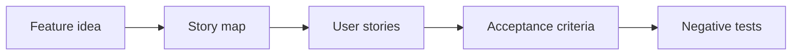

# Stories and Acceptance Criteria

## Scenario

A feature idea must become development-ready user stories with acceptance criteria and negative scenarios.

## Input sample

```text
Feature idea: Premium customers can export reports from the analytics dashboard.
```

## Diagram



## Exercise steps

1. Identify actors, goals, and business value.
2. Split stories by user goal and permission.
3. Draft Given-When-Then criteria.
4. Add negative, boundary, audit, and permission cases.

## Deliverables

- story map
- user stories
- acceptance criteria
- negative test cases

## AI collaboration prompt

```text
Act as a senior BA coach. Help me complete this lab. First ask what source evidence is available. Then guide me through the exercise steps. Produce the deliverables in structured tables. Mark assumptions, unsupported claims, and questions for stakeholder validation.
```

## Review rubric

- Stories carry business value.
- Acceptance criteria are observable.
- Negative cases are included.
- Permissions and audit are explicit.
