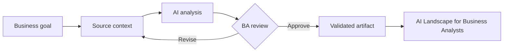

# AI Landscape for Business Analysts

<div class="lesson-meta">
  <span>AI Foundations for Business Analysts</span>
  <span>Software BA</span>
  <span>Core</span>
</div>

## Learning outcomes

- Explain ai landscape for business analysts in business language.
- Apply the concept to a realistic BA workflow.
- Use AI output as draft evidence, not as unchecked truth.
- Identify the review questions a BA must ask before sharing the artifact.

## Why this matters for BA work

AI changes how analysis work is produced, but it does not remove the BA's accountability for clarity, evidence, and decisions.

<div class="ba-callout">
Understand the AI map a BA needs: predictive AI, generative AI, LLMs, copilots, agents, RAG, and automation.
</div>

## Core concept

The useful BA pattern is controlled collaboration: provide the model with business context, ask for structured output, require evidence, then review the result against goals, rules, risks, and stakeholder decisions.

## Practical BA example

A product team asks whether an internal support assistant should be a chatbot, workflow automation, or search experience. A strong BA separates business outcome, user journey, data source, decision risk, and measurement before recommending a solution shape.

## Diagram



## BA workflow

1. Frame the business question before opening the AI tool.
2. Provide source context and explicit constraints.
3. Ask for structured output that maps back to the source.
4. Run a critique pass for ambiguity, gaps, risk, and testability.
5. Convert the result into an artifact the team can inspect and own.

## Prompt or template

```text
Act as a senior BA. Classify this AI idea by business outcome, user group, data dependency, decision risk, and whether it needs GenAI, classic automation, search, or human workflow.
```

## What a BA should remember

- AI is a reasoning accelerator, not a decision owner.
- Ground every important claim in source context or stakeholder confirmation.
- A good BA keeps the review loop visible: draft, critique, revise, validate.
