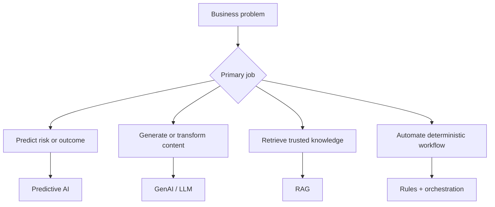

# AI Landscape for Business Analysts

<div class="lesson-meta">
  <span>AI Foundations for Business Analysts</span>
  <span>Software BA</span>
  <span>Core</span>
</div>

## Learning outcomes

- Distinguish predictive AI, GenAI, RAG, agents, copilots, and automation.
- Select the right AI pattern for a business scenario before solutioning.
- Spot ideas that are better solved by workflow, rules, or search instead of GenAI.

## Why this matters for BA work

<div class="ba-callout">
A BA does not need to be a machine learning engineer, but must know which AI pattern fits which business problem.
</div>

This lesson matters because the earliest failure in AI initiatives is usually problem classification, not model selection. If the BA frames a deterministic workflow issue as a GenAI feature, the team inherits avoidable uncertainty, cost, and governance work. Correct classification protects budget, backlog priority, vendor conversations, and stakeholder expectations before architecture starts.

## Common difficulties for BAs

In AI Foundations for Business Analysts, AI Landscape for Business Analysts becomes difficult when stakeholders expect a simple AI answer while the actual issue depends on model capability, data readiness, tool boundaries, and business decision risk. A BA should inspect the points below before treating an AI-supported artifact as ready for stakeholder decision or delivery handoff.

| Difficulty | Why it is hard in BA work | How a BA should handle it |
| --- | --- | --- |
| Calling every AI idea a chatbot. | The mistake "Calling every AI idea a chatbot." appears when the team discusses problem fit, model boundary, data dependency, and decision risk without agreeing which source is authoritative. AI can smooth over the disagreement, so the BA must keep uncertainty visible. | Apply this control: ask the model to compare AI and non-AI options before drafting requirements. Then use the stronger pattern "Classify the job as prediction, retrieval, generation, automation, or decision support before naming the solution." and ask who must approve the artifact before it affects scope, build, test, or release. |
| Skipping the distinction between content generation and business decisioning. | For AI Landscape for Business Analysts, the friction is that A BA does not need to be a machine learning engineer, but must know which AI pattern fits which business problem. The weak pattern is tempting because AI can produce a fluent answer before the BA has checked ownership, source freshness, or decision rights. | Apply this control: ask the model to compare AI and non-AI options before drafting requirements. Then use the stronger pattern "Define outcome metric, data dependency, source authority, and user decision first." and ask who must approve the artifact before it affects scope, build, test, or release. |
| Ignoring whether the problem has reliable data and a measurable outcome. | This becomes hard when AI Pattern Fit Matrix is expected to support the solution-shape decision. If the BA does not challenge the draft, unsupported assumptions may enter planning, testing, or stakeholder communication. | Apply this control: ask the model to compare AI and non-AI options before drafting requirements. Then use the stronger pattern "Use rules, workflow, search, or RAG when they fit better than open-ended generation." and ask who must approve the artifact before it affects scope, build, test, or release. |

## Where this applies in real projects

Use this lesson when an AI idea first enters discovery, vendor discussion, roadmap planning, or feasibility analysis. The practical output is not a longer document; it is AI Pattern Fit Matrix with enough evidence, ownership, and decision clarity for the next project conversation.

| Project moment | How to apply this lesson | Concrete BA output |
| --- | --- | --- |
| Idea intake | Take one AI idea in your backlog and classify it with the matrix. | AI Pattern Fit Matrix showing problem fit, model boundary, data dependency, and decision risk, with the action "Take one AI idea in your backlog and classify it with the matrix." translated into a reviewable decision, requirement, checklist, or question for the next meeting. |
| Feasibility review | Write down the user decision the feature is supposed to improve. | AI Pattern Fit Matrix showing source evidence, with the action "Write down the user decision the feature is supposed to improve." translated into a reviewable decision, requirement, checklist, or question for the next meeting. |
| Solution framing | Identify one non-AI alternative that could solve the same pain. | AI Pattern Fit Matrix showing decision owner, with the action "Identify one non-AI alternative that could solve the same pain." translated into a reviewable decision, requirement, checklist, or question for the next meeting. |

## If this is missing

If AI Landscape for Business Analysts is missing, the team may choose a tool before understanding the problem shape, creating expensive automation that does not match the business outcome. The BA can still recover, but only by converting the polished AI draft back into explicit evidence, assumptions, owners, and testable decisions.

| If missing | Project impact | Recovery action |
| --- | --- | --- |
| Ask for a chatbot because leadership wants AI | It treats the tool as the requirement and hides the actual decision problem. | Recover by using the stronger pattern: Classify the job as prediction, retrieval, generation, automation, or decision support before naming the solution. Rework AI Pattern Fit Matrix until it exposes problem fit, model boundary, data dependency, and decision risk, and do not share it as final until evidence, ownership, and validation path are explicit. |
| Compare AI vendors before defining evidence and data needs | Vendor demos look convincing even when the business problem is still ambiguous. | Recover by using the stronger pattern: Define outcome metric, data dependency, source authority, and user decision first. Rework AI Pattern Fit Matrix until it exposes problem fit, model boundary, data dependency, and decision risk, and do not share it as final until evidence, ownership, and validation path are explicit. |
| Put every idea into the GenAI backlog | Simple routing and stable policy checks become slower and riskier. | Recover by using the stronger pattern: Use rules, workflow, search, or RAG when they fit better than open-ended generation. Rework AI Pattern Fit Matrix until it exposes problem fit, model boundary, data dependency, and decision risk, and do not share it as final until evidence, ownership, and validation path are explicit. |

## Mental model or core concept

Treat AI as a portfolio of capability patterns, not one magic chatbot. The BA's first job is to classify the business problem: prediction, generation, retrieval, decision support, automation, or human workflow acceleration. This prevents expensive AI-shaped solutions for problems that need cleaner data, clearer process, or better search.

## Practical BA example

A sales operations team asks for an AI assistant to reduce quote approval time. A weak analysis jumps straight to chatbot requirements. A stronger BA maps the pain: approvals are slow because pricing exceptions lack policy clarity, approval rules live in email, and managers need risk signals. The solution may combine rules automation, policy retrieval, and a GenAI explanation layer.

## Diagram



## BA artifact

### AI Pattern Fit Matrix

| Business problem | Best-fit AI pattern | BA questions | Anti-pattern warning |
| --- | --- | --- | --- |
| Predict churn or risk | Predictive AI | What historical labels and decisions exist? | Do not ask GenAI to guess risk without data. |
| Answer from internal policy | RAG | Which sources are authoritative and current? | Do not let the model answer without citations. |
| Draft email, story, summary | GenAI | What context and quality rubric define good output? | Do not treat the first draft as approved content. |
| Route a request | Rules or workflow automation | Are rules deterministic and stable? | Do not add LLM uncertainty to simple routing. |

## AI expert note

As an AI reviewer, I would ask the BA to prove the problem type before approving any solution shape. Good AI analysis separates language generation, knowledge retrieval, prediction, orchestration, and decision support. That distinction drives data needs, evaluation metrics, risk controls, UX behavior, and whether the feature should use AI at all.

## Bad vs better example

| Weak pattern | Why it fails | Stronger BA pattern |
| --- | --- | --- |
| Ask for a chatbot because leadership wants AI | It treats the tool as the requirement and hides the actual decision problem. | Classify the job as prediction, retrieval, generation, automation, or decision support before naming the solution. |
| Compare AI vendors before defining evidence and data needs | Vendor demos look convincing even when the business problem is still ambiguous. | Define outcome metric, data dependency, source authority, and user decision first. |
| Put every idea into the GenAI backlog | Simple routing and stable policy checks become slower and riskier. | Use rules, workflow, search, or RAG when they fit better than open-ended generation. |

## Stakeholder questions to ask

| Stakeholder | Question | Why the BA asks it |
| --- | --- | --- |
| Product owner | Which outcome should AI Landscape for Business Analysts improve, and what trade-off are you willing to accept? | Prevents AI output from optimizing for a vague goal. |
| Engineering lead | What source, system, data, or constraint would make AI Pattern Fit Matrix hard to implement? | Turns hidden technical constraints into visible requirement questions. |
| QA lead | Which rule, exception, or user state must be testable before you trust this artifact? | Converts fluent AI wording into observable behavior. |
| Operations or support | What failure path would create manual work if the lesson principle "AI solution shape follows problem shape" is ignored? | Surfaces support load, exception handling, and operating impact. |

## Decision log entries

| Decision item | Options to capture | Owner | Evidence needed |
| --- | --- | --- | --- |
| Scope boundary for AI Pattern Fit Matrix | Must-have, later, out of scope | Product owner | Business outcome and release constraint |
| Authority for problem fit, model boundary, data dependency, and decision risk | Documented source, stakeholder decision, assumption to validate | BA + accountable stakeholder | Source ID, date, and approval status |
| Review gate before handoff | Peer review, QA review, engineering review, formal approval | BA lead or project lead | Risk level and receiving-team readiness |
| Recovery if Calling every AI idea a chatbot. | Rewrite, defer, escalate, or run validation workshop | Decision owner | Impact on scope, testability, and release risk |

## Definition of Ready / Done

| Gate | Ready signal | Done signal |
| --- | --- | --- |
| Definition of Ready | Sources for problem fit, model boundary, data dependency, and decision risk are labeled and current. | AI Pattern Fit Matrix can be reviewed without guessing missing context. |
| Definition of Ready | Open assumptions have owners and validation paths. | Stakeholders can decide whether to accept, reject, or defer each assumption. |
| Definition of Done | The artifact applies this control: ask the model to compare AI and non-AI options before drafting requirements. | Delivery, QA, or governance teams can act on the artifact. |
| Definition of Done | The weak pattern "Calling every AI idea a chatbot." has been explicitly checked. | No unsupported AI claim is treated as an approved requirement. |

## Before and after artifact example

| Before | AI draft risk | Senior BA revision |
| --- | --- | --- |
| Prompt: "Create AI Pattern Fit Matrix for AI Landscape for Business Analysts." | The model may invent source facts, owners, thresholds, or implementation rules. | Add sources, scope boundary, source authority, output schema, and the instruction: Classify the job as prediction, retrieval, generation, automation, or decision support before naming the solution. |
| Draft statement: "Take one AI idea in your backlog and classify it with the matrix." | Useful action, but not yet tied to a decision owner or acceptance signal. | Rewrite as a project step with owner, expected artifact, review gate, and evidence required before handoff. |
| Final-looking paragraph about solution-shape decision | The tone may hide uncertainty and missing stakeholder approval. | Convert it into a table of fact, assumption, decision needed, risk, and validation question. |

## Manual verification after AI output

| Verification lens | Manual check | Pass signal |
| --- | --- | --- |
| Evidence | Trace every important statement in AI Pattern Fit Matrix to a source, decision, or labeled assumption. | No unsupported claim remains hidden. |
| Completeness | Check problem fit, model boundary, data dependency, and decision risk against the intended audience and receiving team. | The artifact answers what product, engineering, QA, and operations need. |
| Testability | Ask whether QA can create positive, negative, boundary, and exception scenarios. | Ambiguous wording has been rewritten or logged as a question. |
| Accountability | Confirm who approves, who reviews, and who acts when the artifact is wrong. | Owners and escalation path are explicit. |

## AI collaboration prompt

```text
Act as a senior BA. Classify this idea using the AI Pattern Fit Matrix. For each option, explain business outcome, data dependency, decision risk, user touchpoint, and why GenAI, RAG, predictive AI, rules automation, or human workflow is the best fit. Mark unsupported assumptions explicitly.
```

## Mistakes to avoid

- Calling every AI idea a chatbot.
- Skipping the distinction between content generation and business decisioning.
- Ignoring whether the problem has reliable data and a measurable outcome.
- Letting vendors define the solution category before the BA frames the problem.

## Apply this tomorrow

1. Take one AI idea in your backlog and classify it with the matrix.
2. Write down the user decision the feature is supposed to improve.
3. Identify one non-AI alternative that could solve the same pain.
4. Ask stakeholders what metric would prove the AI feature worked.

## What a BA should remember

- AI solution shape follows problem shape.
- GenAI is useful for language tasks, but many BA problems need rules, data quality, or search.
- The BA creates clarity before the team chooses a model or tool.
