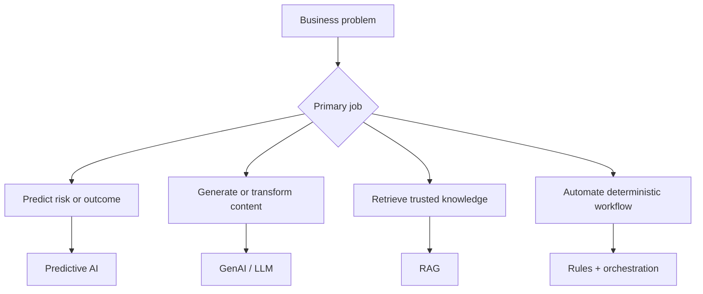

# AI Landscape for Business Analysts

<div class="lesson-meta">
  <span>AI Foundations for Business Analysts</span>
  <span>Software BA</span>
  <span>Core</span>
</div>

## Learning outcomes

- Distinguish predictive AI, GenAI, RAG, agents, copilots, and automation.
- Select the right AI pattern for a business scenario before solutioning.
- Spot ideas that are better solved by workflow, rules, or search instead of GenAI.

## Why this matters for BA work

<div class="ba-callout">
A BA does not need to be a machine learning engineer, but must know which AI pattern fits which business problem.
</div>

This lesson matters because the earliest failure in AI initiatives is usually problem classification, not model selection. If the BA frames a deterministic workflow issue as a GenAI feature, the team inherits avoidable uncertainty, cost, and governance work. Correct classification protects budget, backlog priority, vendor conversations, and stakeholder expectations before architecture starts.

## Mental model or core concept

Treat AI as a portfolio of capability patterns, not one magic chatbot. The BA's first job is to classify the business problem: prediction, generation, retrieval, decision support, automation, or human workflow acceleration. This prevents expensive AI-shaped solutions for problems that need cleaner data, clearer process, or better search.

## Practical BA example

A sales operations team asks for an AI assistant to reduce quote approval time. A weak analysis jumps straight to chatbot requirements. A stronger BA maps the pain: approvals are slow because pricing exceptions lack policy clarity, approval rules live in email, and managers need risk signals. The solution may combine rules automation, policy retrieval, and a GenAI explanation layer.

## Diagram



## BA artifact

### AI Pattern Fit Matrix

| Business problem | Best-fit AI pattern | BA questions | Anti-pattern warning |
| --- | --- | --- | --- |
| Predict churn or risk | Predictive AI | What historical labels and decisions exist? | Do not ask GenAI to guess risk without data. |
| Answer from internal policy | RAG | Which sources are authoritative and current? | Do not let the model answer without citations. |
| Draft email, story, summary | GenAI | What context and quality rubric define good output? | Do not treat the first draft as approved content. |
| Route a request | Rules or workflow automation | Are rules deterministic and stable? | Do not add LLM uncertainty to simple routing. |

## AI expert note

As an AI reviewer, I would ask the BA to prove the problem type before approving any solution shape. Good AI analysis separates language generation, knowledge retrieval, prediction, orchestration, and decision support. That distinction drives data needs, evaluation metrics, risk controls, UX behavior, and whether the feature should use AI at all.

## Bad vs better example

| Weak pattern | Why it fails | Stronger BA pattern |
| --- | --- | --- |
| Ask for a chatbot because leadership wants AI | It treats the tool as the requirement and hides the actual decision problem. | Classify the job as prediction, retrieval, generation, automation, or decision support before naming the solution. |
| Compare AI vendors before defining evidence and data needs | Vendor demos look convincing even when the business problem is still ambiguous. | Define outcome metric, data dependency, source authority, and user decision first. |
| Put every idea into the GenAI backlog | Simple routing and stable policy checks become slower and riskier. | Use rules, workflow, search, or RAG when they fit better than open-ended generation. |

## AI collaboration prompt

```text
Act as a senior BA. Classify this idea using the AI Pattern Fit Matrix. For each option, explain business outcome, data dependency, decision risk, user touchpoint, and why GenAI, RAG, predictive AI, rules automation, or human workflow is the best fit. Mark unsupported assumptions explicitly.
```

## Mistakes to avoid

- Calling every AI idea a chatbot.
- Skipping the distinction between content generation and business decisioning.
- Ignoring whether the problem has reliable data and a measurable outcome.
- Letting vendors define the solution category before the BA frames the problem.

## Apply this tomorrow

1. Take one AI idea in your backlog and classify it with the matrix.
2. Write down the user decision the feature is supposed to improve.
3. Identify one non-AI alternative that could solve the same pain.
4. Ask stakeholders what metric would prove the AI feature worked.

## What a BA should remember

- AI solution shape follows problem shape.
- GenAI is useful for language tasks, but many BA problems need rules, data quality, or search.
- The BA creates clarity before the team chooses a model or tool.
