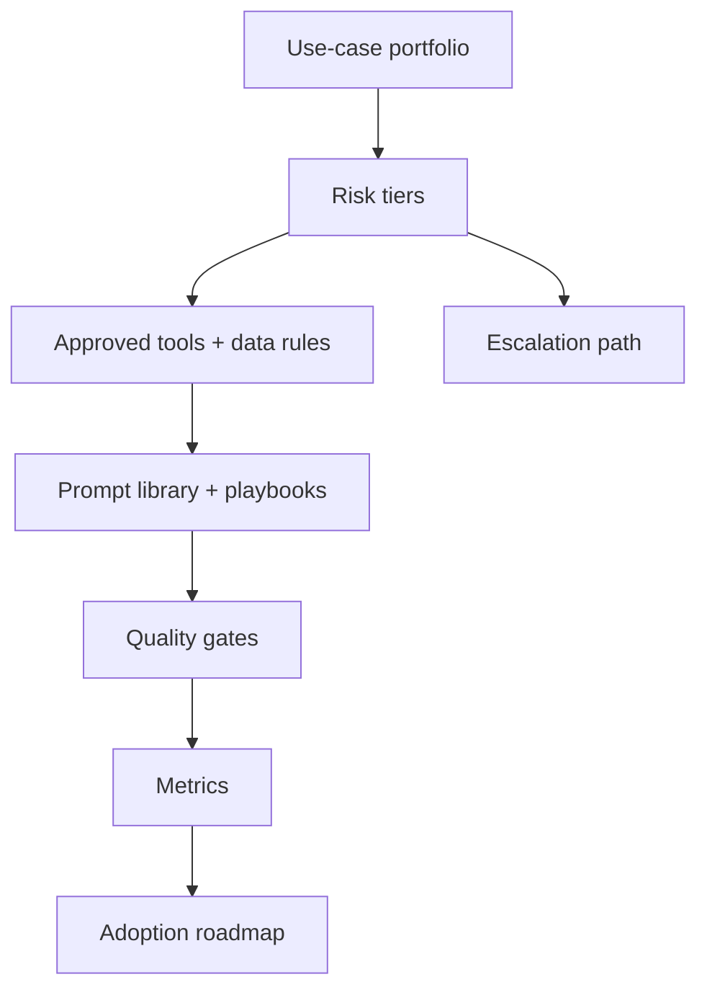

# AI Strategy, Governance, and Adoption

<div class="lesson-meta">
  <span>BA Lead and Expert Track</span>
  <span>Software BA</span>
  <span>Expert</span>
</div>

## Learning outcomes

- Create an AI adoption roadmap for BA teams.
- Define governance controls for AI use in analysis work.
- Measure adoption by quality, cycle time, and risk reduction.

## Why this matters for BA work

<div class="ba-callout">
BA leads should scale AI adoption through use-case selection, risk tiers, quality gates, and operating model, not tool enthusiasm.
</div>

Business Analysts sit between problem framing, stakeholder meaning, delivery constraints, and product decisions. In AI work, that position becomes more important because unclear language can create false certainty quickly. This lesson gives you a practical control you can apply before AI output becomes scope, backlog, or delivery commitment.

## Mental model or core concept

AI adoption fails when it starts with tools instead of operating model. A BA lead should define safe use cases, prohibited data, approved tools, prompt patterns, quality gates, training, review rituals, metrics, and escalation paths. Governance should enable useful work while preventing data leakage and low-quality artifacts.

## Practical BA example

A BA practice wants everyone to use AI. The lead creates risk tiers: low-risk drafting, medium-risk requirement review, high-risk AI product decisions. Each tier has allowed tools, data rules, review gates, and measurement. Adoption becomes managed capability, not random experimentation.

## Diagram



## BA artifact

### BA AI Adoption Scorecard

| Dimension | Level 1 | Level 2 | Level 3 |
| --- | --- | --- | --- |
| Use cases | Ad hoc personal use. | Approved BA workflows. | Measured portfolio by value and risk. |
| Governance | No shared rules. | Data and review policy defined. | Risk-tier controls and audit. |
| Quality | AI output shared directly. | Peer review for AI-assisted artifacts. | Quality gates and rubric metrics. |
| Capability | Individual tips. | Team prompt library. | Coaching, playbooks, and communities of practice. |

## AI collaboration prompt

```text
Create a BA team AI adoption roadmap. Include use-case portfolio, risk tiers, approved tools, prohibited data, review gates, prompt library, training plan, governance roles, success metrics, rollout phases, and escalation process.
```

## Mistakes to avoid

- Buying tools before defining safe use cases.
- Ignoring confidential data and PII rules.
- Measuring adoption only by number of users.
- Letting every BA invent their own quality standard.

## Apply this tomorrow

1. Classify BA AI use cases into risk tiers.
2. Define one approved workflow and one prohibited use.
3. Create a quality gate for AI-assisted requirements.
4. Measure cycle time and defect reduction for one pilot.

## What a BA should remember

- Adoption is an operating model.
- Governance should make good AI use easier.
- BA leads scale quality through shared patterns and review gates.
