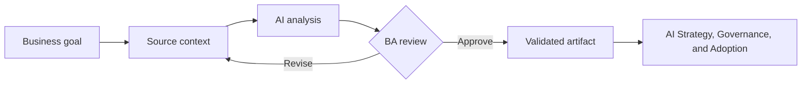

# AI Strategy, Governance, and Adoption

<div class="lesson-meta">
  <span>BA Lead and Expert Track</span>
  <span>Software BA</span>
  <span>Expert</span>
</div>

## Learning outcomes

- Explain ai strategy, governance, and adoption in business language.
- Apply the concept to a realistic BA workflow.
- Use AI output as draft evidence, not as unchecked truth.
- Identify the review questions a BA must ask before sharing the artifact.

## Why this matters for BA work

AI changes how analysis work is produced, but it does not remove the BA's accountability for clarity, evidence, and decisions.

<div class="ba-callout">
Guide BA teams through AI adoption with governance, measurement, tool selection, and operating model.
</div>

## Core concept

The useful BA pattern is controlled collaboration: provide the model with business context, ask for structured output, require evidence, then review the result against goals, rules, risks, and stakeholder decisions.

## Practical BA example

A BA lead wants every analyst to use AI. Instead of buying tools first, they define safe use cases, data policy, prompt patterns, quality checks, training, and adoption metrics.

## Diagram



## BA workflow

1. Frame the business question before opening the AI tool.
2. Provide source context and explicit constraints.
3. Ask for structured output that maps back to the source.
4. Run a critique pass for ambiguity, gaps, risk, and testability.
5. Convert the result into an artifact the team can inspect and own.

## Prompt or template

```text
Create a BA team AI adoption plan with use cases, risk tiers, data rules, approved tools, training, quality gates, metrics, governance roles, and rollout phases.
```

## What a BA should remember

- AI is a reasoning accelerator, not a decision owner.
- Ground every important claim in source context or stakeholder confirmation.
- A good BA keeps the review loop visible: draft, critique, revise, validate.
