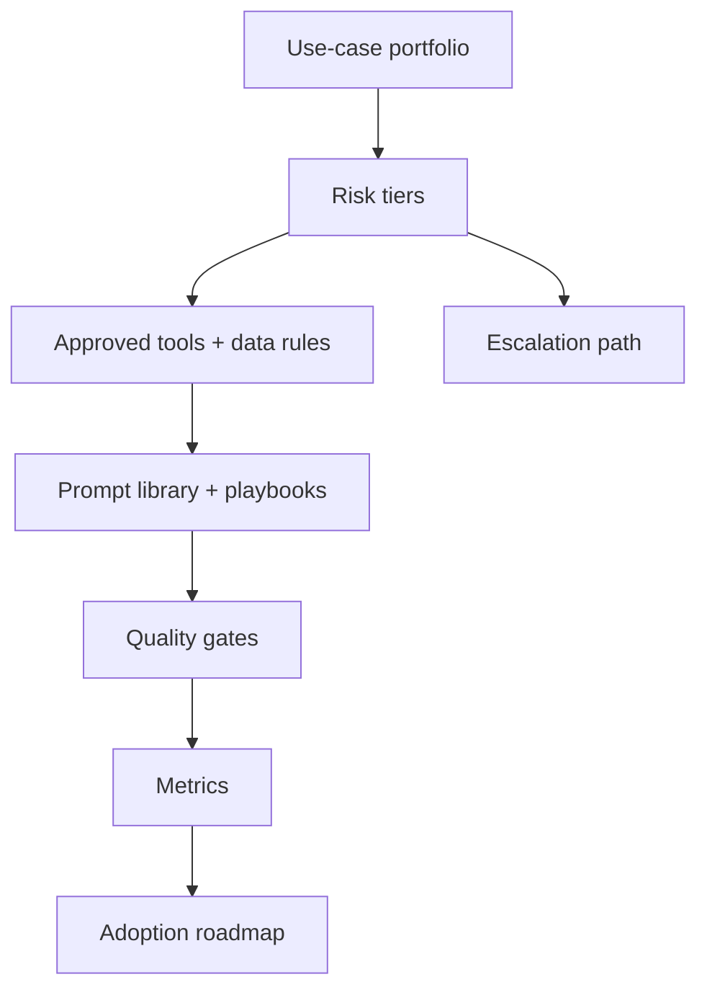

# AI Strategy, Governance, and Adoption

<div class="lesson-meta">
  <span>BA Lead and Expert Track</span>
  <span>Software BA</span>
  <span>Expert</span>
</div>

## Learning outcomes

- Create an AI adoption roadmap for BA teams.
- Define governance controls for AI use in analysis work.
- Measure adoption by quality, cycle time, and risk reduction.

## Why this matters for BA work

<div class="ba-callout">
BA leads should scale AI adoption through use-case selection, risk tiers, quality gates, and operating model, not tool enthusiasm.
</div>

This lesson matters because AI adoption at BA-team scale can improve quality and cycle time, but it can also spread inconsistent artifacts, data leakage, and false confidence. A BA lead needs an operating model: approved use cases, risk tiers, tool policy, prompt library, quality gates, training, metrics, and escalation paths.

## Common difficulties for BAs

In BA Lead and Expert Track, AI Strategy, Governance, and Adoption becomes difficult when individual productivity gains must become a team operating model with governance, adoption metrics, and practical risk controls. A BA should inspect the points below before treating an AI-supported artifact as ready for stakeholder decision or delivery handoff.

| Difficulty | Why it is hard in BA work | How a BA should handle it |
| --- | --- | --- |
| Buying tools before defining safe use cases. | The mistake "Buying tools before defining safe use cases." appears when the team discusses portfolio fit, policy, quality gates, adoption metrics, training, and escalation model without agreeing which source is authoritative. AI can smooth over the disagreement, so the BA must keep uncertainty visible. | Apply this control: tier AI use cases by sensitivity, decision impact, evidence quality, and human review requirement. Then use the stronger pattern "Create risk-tiered workflows, approved tools, training, prompt library, and review gates." and ask who must approve the artifact before it affects scope, build, test, or release. |
| Ignoring confidential data and PII rules. | For AI Strategy, Governance, and Adoption, the friction is that BA leads should scale AI adoption through use-case selection, risk tiers, quality gates, and operating model, not tool enthusiasm. The weak pattern is tempting because AI can produce a fluent answer before the BA has checked ownership, source freshness, or decision rights. | Apply this control: tier AI use cases by sensitivity, decision impact, evidence quality, and human review requirement. Then use the stronger pattern "Measure cycle time, defect reduction, evidence quality, rework, and stakeholder confidence." and ask who must approve the artifact before it affects scope, build, test, or release. |
| Measuring adoption only by number of users. | This becomes hard when BA AI Adoption Scorecard is expected to support the BA practice operating model. If the BA does not challenge the draft, unsupported assumptions may enter planning, testing, or stakeholder communication. | Apply this control: tier AI use cases by sensitivity, decision impact, evidence quality, and human review requirement. Then use the stronger pattern "Establish a BA AI operating model with governance roles, audits, and escalation." and ask who must approve the artifact before it affects scope, build, test, or release. |

## Where this applies in real projects

Use this lesson when BA leaders need to scale AI use across people, tools, project types, and governance expectations. The practical output is not a longer document; it is BA AI Adoption Scorecard with enough evidence, ownership, and decision clarity for the next project conversation.

| Project moment | How to apply this lesson | Concrete BA output |
| --- | --- | --- |
| Portfolio review | Classify BA AI use cases into risk tiers. | BA AI Adoption Scorecard showing portfolio fit, policy, quality gates, adoption metrics, training, and escalation model, with the action "Classify BA AI use cases into risk tiers." translated into a reviewable decision, requirement, checklist, or question for the next meeting. |
| Governance design | Define one approved workflow and one prohibited use. | BA AI Adoption Scorecard showing source evidence, with the action "Define one approved workflow and one prohibited use." translated into a reviewable decision, requirement, checklist, or question for the next meeting. |
| Practice rollout | Create a quality gate for AI-assisted requirements. | BA AI Adoption Scorecard showing decision owner, with the action "Create a quality gate for AI-assisted requirements." translated into a reviewable decision, requirement, checklist, or question for the next meeting. |

## If this is missing

If AI Strategy, Governance, and Adoption is missing, AI usage becomes inconsistent, risky, hard to audit, and difficult to improve across the BA practice. The BA can still recover, but only by converting the polished AI draft back into explicit evidence, assumptions, owners, and testable decisions.

| If missing | Project impact | Recovery action |
| --- | --- | --- |
| Roll out an AI tool to all BAs and call it adoption | Usage increases without shared standards, safety rules, or quality evidence. | Recover by using the stronger pattern: Create risk-tiered workflows, approved tools, training, prompt library, and review gates. Rework BA AI Adoption Scorecard until it exposes portfolio fit, policy, quality gates, adoption metrics, training, and escalation model, and do not share it as final until evidence, ownership, and validation path are explicit. |
| Measure success by number of prompts or users | Activity does not prove better requirements or safer decisions. | Recover by using the stronger pattern: Measure cycle time, defect reduction, evidence quality, rework, and stakeholder confidence. Rework BA AI Adoption Scorecard until it exposes portfolio fit, policy, quality gates, adoption metrics, training, and escalation model, and do not share it as final until evidence, ownership, and validation path are explicit. |
| Let every project invent its own AI rules | Quality and compliance vary widely across teams. | Recover by using the stronger pattern: Establish a BA AI operating model with governance roles, audits, and escalation. Rework BA AI Adoption Scorecard until it exposes portfolio fit, policy, quality gates, adoption metrics, training, and escalation model, and do not share it as final until evidence, ownership, and validation path are explicit. |

## Mental model or core concept

AI adoption fails when it starts with tools instead of operating model. A BA lead should define safe use cases, prohibited data, approved tools, prompt patterns, quality gates, training, review rituals, metrics, and escalation paths. Governance should enable useful work while preventing data leakage and low-quality artifacts.

## Practical BA example

A BA practice wants everyone to use AI. The lead creates risk tiers: low-risk drafting, medium-risk requirement review, high-risk AI product decisions. Each tier has allowed tools, data rules, review gates, and measurement. Adoption becomes managed capability, not random experimentation.

## Diagram



## BA artifact

### BA AI Adoption Scorecard

| Dimension | Level 1 | Level 2 | Level 3 |
| --- | --- | --- | --- |
| Use cases | Ad hoc personal use. | Approved BA workflows. | Measured portfolio by value and risk. |
| Governance | No shared rules. | Data and review policy defined. | Risk-tier controls and audit. |
| Quality | AI output shared directly. | Peer review for AI-assisted artifacts. | Quality gates and rubric metrics. |
| Capability | Individual tips. | Team prompt library. | Coaching, playbooks, and communities of practice. |

## AI expert note

AI governance should enable high-quality work, not freeze experimentation. Expert BA leadership defines low-risk workflows for productivity, medium-risk workflows with review gates, and high-risk workflows requiring formal approval. Adoption metrics should measure artifact quality, review defects, cycle time, stakeholder satisfaction, and avoided risk, not just tool usage.

## Bad vs better example

| Weak pattern | Why it fails | Stronger BA pattern |
| --- | --- | --- |
| Roll out an AI tool to all BAs and call it adoption | Usage increases without shared standards, safety rules, or quality evidence. | Create risk-tiered workflows, approved tools, training, prompt library, and review gates. |
| Measure success by number of prompts or users | Activity does not prove better requirements or safer decisions. | Measure cycle time, defect reduction, evidence quality, rework, and stakeholder confidence. |
| Let every project invent its own AI rules | Quality and compliance vary widely across teams. | Establish a BA AI operating model with governance roles, audits, and escalation. |

## Stakeholder questions to ask

| Stakeholder | Question | Why the BA asks it |
| --- | --- | --- |
| Product owner | Which outcome should AI Strategy, Governance, and Adoption improve, and what trade-off are you willing to accept? | Prevents AI output from optimizing for a vague goal. |
| Engineering lead | What source, system, data, or constraint would make BA AI Adoption Scorecard hard to implement? | Turns hidden technical constraints into visible requirement questions. |
| QA lead | Which rule, exception, or user state must be testable before you trust this artifact? | Converts fluent AI wording into observable behavior. |
| Operations or support | What failure path would create manual work if the lesson principle "Adoption is an operating model" is ignored? | Surfaces support load, exception handling, and operating impact. |

## Decision log entries

| Decision item | Options to capture | Owner | Evidence needed |
| --- | --- | --- | --- |
| Scope boundary for BA AI Adoption Scorecard | Must-have, later, out of scope | Product owner | Business outcome and release constraint |
| Authority for portfolio fit, policy, quality gates, adoption metrics, training, and escalation model | Documented source, stakeholder decision, assumption to validate | BA + accountable stakeholder | Source ID, date, and approval status |
| Review gate before handoff | Peer review, QA review, engineering review, formal approval | BA lead or project lead | Risk level and receiving-team readiness |
| Recovery if Buying tools before defining safe use cases. | Rewrite, defer, escalate, or run validation workshop | Decision owner | Impact on scope, testability, and release risk |

## Definition of Ready / Done

| Gate | Ready signal | Done signal |
| --- | --- | --- |
| Definition of Ready | Sources for portfolio fit, policy, quality gates, adoption metrics, training, and escalation model are labeled and current. | BA AI Adoption Scorecard can be reviewed without guessing missing context. |
| Definition of Ready | Open assumptions have owners and validation paths. | Stakeholders can decide whether to accept, reject, or defer each assumption. |
| Definition of Done | The artifact applies this control: tier AI use cases by sensitivity, decision impact, evidence quality, and human review requirement. | Delivery, QA, or governance teams can act on the artifact. |
| Definition of Done | The weak pattern "Buying tools before defining safe use cases." has been explicitly checked. | No unsupported AI claim is treated as an approved requirement. |

## Before and after artifact example

| Before | AI draft risk | Senior BA revision |
| --- | --- | --- |
| Prompt: "Create BA AI Adoption Scorecard for AI Strategy, Governance, and Adoption." | The model may invent source facts, owners, thresholds, or implementation rules. | Add sources, scope boundary, source authority, output schema, and the instruction: Create risk-tiered workflows, approved tools, training, prompt library, and review gates. |
| Draft statement: "Classify BA AI use cases into risk tiers." | Useful action, but not yet tied to a decision owner or acceptance signal. | Rewrite as a project step with owner, expected artifact, review gate, and evidence required before handoff. |
| Final-looking paragraph about BA practice operating model | The tone may hide uncertainty and missing stakeholder approval. | Convert it into a table of fact, assumption, decision needed, risk, and validation question. |

## Manual verification after AI output

| Verification lens | Manual check | Pass signal |
| --- | --- | --- |
| Evidence | Trace every important statement in BA AI Adoption Scorecard to a source, decision, or labeled assumption. | No unsupported claim remains hidden. |
| Completeness | Check portfolio fit, policy, quality gates, adoption metrics, training, and escalation model against the intended audience and receiving team. | The artifact answers what product, engineering, QA, and operations need. |
| Testability | Ask whether QA can create positive, negative, boundary, and exception scenarios. | Ambiguous wording has been rewritten or logged as a question. |
| Accountability | Confirm who approves, who reviews, and who acts when the artifact is wrong. | Owners and escalation path are explicit. |

## AI collaboration prompt

```text
Create a BA team AI adoption roadmap. Include use-case portfolio, risk tiers, approved tools, prohibited data, review gates, prompt library, training plan, governance roles, success metrics, rollout phases, and escalation process.
```

## Mistakes to avoid

- Buying tools before defining safe use cases.
- Ignoring confidential data and PII rules.
- Measuring adoption only by number of users.
- Letting every BA invent their own quality standard.

## Apply this tomorrow

1. Classify BA AI use cases into risk tiers.
2. Define one approved workflow and one prohibited use.
3. Create a quality gate for AI-assisted requirements.
4. Measure cycle time and defect reduction for one pilot.

## What a BA should remember

- Adoption is an operating model.
- Governance should make good AI use easier.
- BA leads scale quality through shared patterns and review gates.
