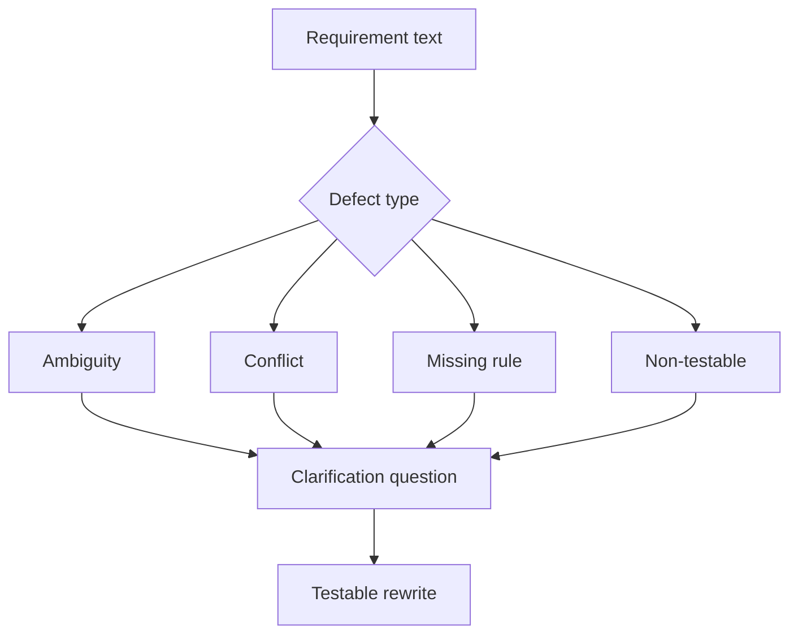

# Ambiguity, Conflict, and Gap Analysis

<div class="lesson-meta">
  <span>Requirements Engineering With AI</span>
  <span>Software BA</span>
  <span>Core</span>
</div>

## Learning outcomes

- Detect ambiguity, conflict, missing rules, and non-testable language.
- Use severity to prioritize clarification.
- Rewrite weak requirements into testable alternatives.

## Why this matters for BA work

<div class="ba-callout">
AI is useful for requirement defect detection when the BA provides a precise defect taxonomy and severity rubric.
</div>

Business Analysts sit between problem framing, stakeholder meaning, delivery constraints, and product decisions. In AI work, that position becomes more important because unclear language can create false certainty quickly. This lesson gives you a practical control you can apply before AI output becomes scope, backlog, or delivery commitment.

## Mental model or core concept

Requirement review improves when defects have names. Ambiguity, conflict, missing actor, missing data, hidden assumption, and non-testable wording are different problems. AI can scan for these categories quickly, but the BA must decide severity and ask the right clarification question.

## Practical BA example

A requirement says, 'The system should notify users quickly when important changes happen.' AI flags quickly, users, important, channel, retry, opt-out, audit, and SLA as gaps. The BA rewrites it into measurable notification scenarios.

## Diagram



## BA artifact

### Requirement Defect Taxonomy

| Defect type | Signal | Clarification question | Example rewrite |
| --- | --- | --- | --- |
| Ambiguity | Vague terms or undefined actors. | What exact term or actor applies? | Notify account owner within 10 minutes. |
| Conflict | Two rules cannot both be true. | Which rule wins and when? | VIP SLA overrides standard SLA. |
| Missing rule | Decision branch lacks condition. | What business rule selects this path? | Reject if KYC status is expired. |
| Non-testable | No observable expected result. | How will QA verify success? | Email status is logged as sent or failed. |

## AI collaboration prompt

```text
Review these requirements using the defect taxonomy. Return defect type, severity, affected text, why it matters, clarification question, and a testable rewrite candidate. Keep unsupported rewrites labeled as assumptions.
```

## Mistakes to avoid

- Saying 'unclear' without naming the defect.
- Fixing wording but not the underlying business rule.
- Treating all defects as equal severity.
- Letting AI rewrite requirements without source validation.

## Apply this tomorrow

1. Run taxonomy review on five backlog items.
2. Add severity and clarification question to each finding.
3. Rewrite one vague requirement into testable language.
4. Ask a stakeholder to approve the rewritten rule.

## What a BA should remember

- Named defects make review faster.
- Clarification questions are as valuable as rewrites.
- AI can find likely defects; BA confirms business meaning.
