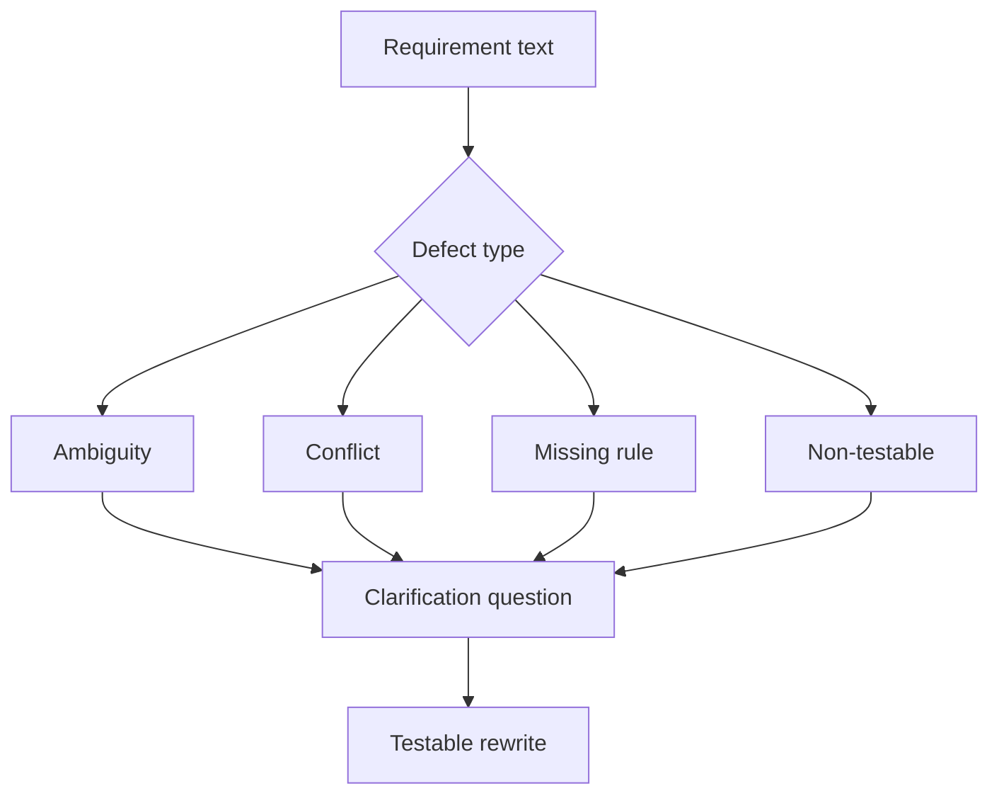

# Ambiguity, Conflict, and Gap Analysis

<div class="lesson-meta">
  <span>Requirements Engineering With AI</span>
  <span>Software BA</span>
  <span>Core</span>
</div>

## Learning outcomes

- Detect ambiguity, conflict, missing rules, and non-testable language.
- Use severity to prioritize clarification.
- Rewrite weak requirements into testable alternatives.

## Why this matters for BA work

<div class="ba-callout">
AI is useful for requirement defect detection when the BA provides a precise defect taxonomy and severity rubric.
</div>

This lesson matters because ambiguous requirements create the most expensive defects when they survive into design, build, and testing. AI can help scan for vague language and contradictions, but the BA must turn findings into a disciplined defect taxonomy. The goal is not better wording; it is earlier decision clarity.

## Common difficulties for BAs

In Requirements Engineering With AI, Ambiguity, Conflict, and Gap Analysis becomes difficult when business rules, edge cases, quality attributes, and testability constraints must survive the move from conversation into backlog. A BA should inspect the points below before treating an AI-supported artifact as ready for stakeholder decision or delivery handoff.

| Difficulty | Why it is hard in BA work | How a BA should handle it |
| --- | --- | --- |
| Saying 'unclear' without naming the defect. | The mistake "Saying 'unclear' without naming the defect." appears when the team discusses ambiguity, NFR risk, traceability, testability, and rule ownership without agreeing which source is authoritative. AI can smooth over the disagreement, so the BA must keep uncertainty visible. | Apply this control: force every requirement statement to expose actor, trigger, data, rule, exception, and verification signal. Then use the stronger pattern "Classify the issue type, severity, evidence, and owner before rewriting." and ask who must approve the artifact before it affects scope, build, test, or release. |
| Fixing wording but not the underlying business rule. | For Ambiguity, Conflict, and Gap Analysis, the friction is that AI is useful for requirement defect detection when the BA provides a precise defect taxonomy and severity rubric. The weak pattern is tempting because AI can produce a fluent answer before the BA has checked ownership, source freshness, or decision rights. | Apply this control: force every requirement statement to expose actor, trigger, data, rule, exception, and verification signal. Then use the stronger pattern "Rank ambiguity by business impact, test impact, regulatory impact, and dependency." and ask who must approve the artifact before it affects scope, build, test, or release. |
| Treating all defects as equal severity. | This becomes hard when Requirement Defect Taxonomy is expected to support the delivery-ready requirement. If the BA does not challenge the draft, unsupported assumptions may enter planning, testing, or stakeholder communication. | Apply this control: force every requirement statement to expose actor, trigger, data, rule, exception, and verification signal. Then use the stronger pattern "Only rewrite source-supported parts and mark the rest as clarification questions." and ask who must approve the artifact before it affects scope, build, test, or release. |

## Where this applies in real projects

Use this lesson when requirements are being refined, split, clarified, tested, or challenged by QA and delivery teams. The practical output is not a longer document; it is Requirement Defect Taxonomy with enough evidence, ownership, and decision clarity for the next project conversation.

| Project moment | How to apply this lesson | Concrete BA output |
| --- | --- | --- |
| Backlog refinement | Run taxonomy review on five backlog items. | Requirement Defect Taxonomy showing ambiguity, NFR risk, traceability, testability, and rule ownership, with the action "Run taxonomy review on five backlog items." translated into a reviewable decision, requirement, checklist, or question for the next meeting. |
| QA alignment | Add severity and clarification question to each finding. | Requirement Defect Taxonomy showing source evidence, with the action "Add severity and clarification question to each finding." translated into a reviewable decision, requirement, checklist, or question for the next meeting. |
| Release readiness | Rewrite one vague requirement into testable language. | Requirement Defect Taxonomy showing decision owner, with the action "Rewrite one vague requirement into testable language." translated into a reviewable decision, requirement, checklist, or question for the next meeting. |

## If this is missing

If Ambiguity, Conflict, and Gap Analysis is missing, requirements may look complete but still fail implementation, testing, release readiness, or operational support. The BA can still recover, but only by converting the polished AI draft back into explicit evidence, assumptions, owners, and testable decisions.

| If missing | Project impact | Recovery action |
| --- | --- | --- |
| Ask AI to make the requirement clearer | The model may smooth over a missing decision instead of exposing it. | Recover by using the stronger pattern: Classify the issue type, severity, evidence, and owner before rewriting. Rework Requirement Defect Taxonomy until it exposes ambiguity, NFR risk, traceability, testability, and rule ownership, and do not share it as final until evidence, ownership, and validation path are explicit. |
| Treat all ambiguity as equal | A vague label and a missing compliance rule carry very different delivery risk. | Recover by using the stronger pattern: Rank ambiguity by business impact, test impact, regulatory impact, and dependency. Rework Requirement Defect Taxonomy until it exposes ambiguity, NFR risk, traceability, testability, and rule ownership, and do not share it as final until evidence, ownership, and validation path are explicit. |
| Accept AI rewrites that add new detail | The rewrite may invent thresholds, actors, or policy. | Recover by using the stronger pattern: Only rewrite source-supported parts and mark the rest as clarification questions. Rework Requirement Defect Taxonomy until it exposes ambiguity, NFR risk, traceability, testability, and rule ownership, and do not share it as final until evidence, ownership, and validation path are explicit. |

## Mental model or core concept

Requirement review improves when defects have names. Ambiguity, conflict, missing actor, missing data, hidden assumption, and non-testable wording are different problems. AI can scan for these categories quickly, but the BA must decide severity and ask the right clarification question.

## Practical BA example

A requirement says, 'The system should notify users quickly when important changes happen.' AI flags quickly, users, important, channel, retry, opt-out, audit, and SLA as gaps. The BA rewrites it into measurable notification scenarios.

## Diagram



## BA artifact

### Requirement Defect Taxonomy

| Defect type | Signal | Clarification question | Example rewrite |
| --- | --- | --- | --- |
| Ambiguity | Vague terms or undefined actors. | What exact term or actor applies? | Notify account owner within 10 minutes. |
| Conflict | Two rules cannot both be true. | Which rule wins and when? | VIP SLA overrides standard SLA. |
| Missing rule | Decision branch lacks condition. | What business rule selects this path? | Reject if KYC status is expired. |
| Non-testable | No observable expected result. | How will QA verify success? | Email status is logged as sent or failed. |

## AI expert note

Ambiguity analysis should distinguish missing information, conflicting rules, undefined terms, non-testable adjectives, actor confusion, and decision gaps. AI is strong at pattern detection, but expert BA work assigns severity, evidence, owner, and clarification path. A rewrite without decision support is still an assumption.

## Bad vs better example

| Weak pattern | Why it fails | Stronger BA pattern |
| --- | --- | --- |
| Ask AI to make the requirement clearer | The model may smooth over a missing decision instead of exposing it. | Classify the issue type, severity, evidence, and owner before rewriting. |
| Treat all ambiguity as equal | A vague label and a missing compliance rule carry very different delivery risk. | Rank ambiguity by business impact, test impact, regulatory impact, and dependency. |
| Accept AI rewrites that add new detail | The rewrite may invent thresholds, actors, or policy. | Only rewrite source-supported parts and mark the rest as clarification questions. |

## Stakeholder questions to ask

| Stakeholder | Question | Why the BA asks it |
| --- | --- | --- |
| Product owner | Which outcome should Ambiguity, Conflict, and Gap Analysis improve, and what trade-off are you willing to accept? | Prevents AI output from optimizing for a vague goal. |
| Engineering lead | What source, system, data, or constraint would make Requirement Defect Taxonomy hard to implement? | Turns hidden technical constraints into visible requirement questions. |
| QA lead | Which rule, exception, or user state must be testable before you trust this artifact? | Converts fluent AI wording into observable behavior. |
| Operations or support | What failure path would create manual work if the lesson principle "Named defects make review faster" is ignored? | Surfaces support load, exception handling, and operating impact. |

## Decision log entries

| Decision item | Options to capture | Owner | Evidence needed |
| --- | --- | --- | --- |
| Scope boundary for Requirement Defect Taxonomy | Must-have, later, out of scope | Product owner | Business outcome and release constraint |
| Authority for ambiguity, NFR risk, traceability, testability, and rule ownership | Documented source, stakeholder decision, assumption to validate | BA + accountable stakeholder | Source ID, date, and approval status |
| Review gate before handoff | Peer review, QA review, engineering review, formal approval | BA lead or project lead | Risk level and receiving-team readiness |
| Recovery if Saying 'unclear' without naming the defect. | Rewrite, defer, escalate, or run validation workshop | Decision owner | Impact on scope, testability, and release risk |

## Definition of Ready / Done

| Gate | Ready signal | Done signal |
| --- | --- | --- |
| Definition of Ready | Sources for ambiguity, NFR risk, traceability, testability, and rule ownership are labeled and current. | Requirement Defect Taxonomy can be reviewed without guessing missing context. |
| Definition of Ready | Open assumptions have owners and validation paths. | Stakeholders can decide whether to accept, reject, or defer each assumption. |
| Definition of Done | The artifact applies this control: force every requirement statement to expose actor, trigger, data, rule, exception, and verification signal. | Delivery, QA, or governance teams can act on the artifact. |
| Definition of Done | The weak pattern "Saying 'unclear' without naming the defect." has been explicitly checked. | No unsupported AI claim is treated as an approved requirement. |

## Before and after artifact example

| Before | AI draft risk | Senior BA revision |
| --- | --- | --- |
| Prompt: "Create Requirement Defect Taxonomy for Ambiguity, Conflict, and Gap Analysis." | The model may invent source facts, owners, thresholds, or implementation rules. | Add sources, scope boundary, source authority, output schema, and the instruction: Classify the issue type, severity, evidence, and owner before rewriting. |
| Draft statement: "Run taxonomy review on five backlog items." | Useful action, but not yet tied to a decision owner or acceptance signal. | Rewrite as a project step with owner, expected artifact, review gate, and evidence required before handoff. |
| Final-looking paragraph about delivery-ready requirement | The tone may hide uncertainty and missing stakeholder approval. | Convert it into a table of fact, assumption, decision needed, risk, and validation question. |

## Manual verification after AI output

| Verification lens | Manual check | Pass signal |
| --- | --- | --- |
| Evidence | Trace every important statement in Requirement Defect Taxonomy to a source, decision, or labeled assumption. | No unsupported claim remains hidden. |
| Completeness | Check ambiguity, NFR risk, traceability, testability, and rule ownership against the intended audience and receiving team. | The artifact answers what product, engineering, QA, and operations need. |
| Testability | Ask whether QA can create positive, negative, boundary, and exception scenarios. | Ambiguous wording has been rewritten or logged as a question. |
| Accountability | Confirm who approves, who reviews, and who acts when the artifact is wrong. | Owners and escalation path are explicit. |

## AI collaboration prompt

```text
Review these requirements using the defect taxonomy. Return defect type, severity, affected text, why it matters, clarification question, and a testable rewrite candidate. Keep unsupported rewrites labeled as assumptions.
```

## Mistakes to avoid

- Saying 'unclear' without naming the defect.
- Fixing wording but not the underlying business rule.
- Treating all defects as equal severity.
- Letting AI rewrite requirements without source validation.

## Apply this tomorrow

1. Run taxonomy review on five backlog items.
2. Add severity and clarification question to each finding.
3. Rewrite one vague requirement into testable language.
4. Ask a stakeholder to approve the rewritten rule.

## What a BA should remember

- Named defects make review faster.
- Clarification questions are as valuable as rewrites.
- AI can find likely defects; BA confirms business meaning.
