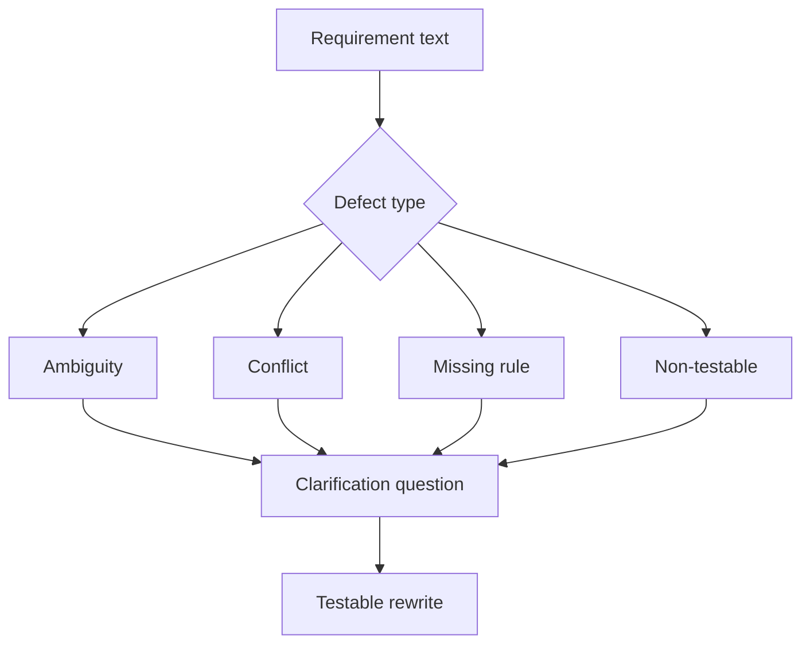

# Ambiguity, Conflict, and Gap Analysis

<div class="lesson-meta">
  <span>Requirements Engineering With AI</span>
  <span>Software BA</span>
  <span>Core</span>
</div>

## Learning outcomes

- Detect ambiguity, conflict, missing rules, and non-testable language.
- Use severity to prioritize clarification.
- Rewrite weak requirements into testable alternatives.

## Why this matters for BA work

<div class="ba-callout">
AI is useful for requirement defect detection when the BA provides a precise defect taxonomy and severity rubric.
</div>

This lesson matters because ambiguous requirements create the most expensive defects when they survive into design, build, and testing. AI can help scan for vague language and contradictions, but the BA must turn findings into a disciplined defect taxonomy. The goal is not better wording; it is earlier decision clarity.

## Common difficulties for BAs

In real projects, this topic is difficult because the BA must turn messy evidence into decisions without letting AI hide uncertainty. Watch for these friction points before treating the output as ready.

| Difficulty | Why it is hard in BA work | How a BA should handle it |
| --- | --- | --- |
| Saying 'unclear' without naming the defect. | This is hard because Ambiguity, Conflict, and Gap Analysis is usually applied under deadline pressure, incomplete evidence, and stakeholder disagreement. A fluent AI draft can make the gap less visible. | Use source labels, explicit assumptions, and a named review owner before turning this into backlog, specification, or delivery commitment. |
| Fixing wording but not the underlying business rule. | This is hard because Ambiguity, Conflict, and Gap Analysis is usually applied under deadline pressure, incomplete evidence, and stakeholder disagreement. A fluent AI draft can make the gap less visible. | Use source labels, explicit assumptions, and a named review owner before turning this into backlog, specification, or delivery commitment. |
| Treating all defects as equal severity. | This is hard because Ambiguity, Conflict, and Gap Analysis is usually applied under deadline pressure, incomplete evidence, and stakeholder disagreement. A fluent AI draft can make the gap less visible. | Use source labels, explicit assumptions, and a named review owner before turning this into backlog, specification, or delivery commitment. |

## Where this applies in real projects

This lesson is useful when the BA needs to move from conversation, policy, design, or technical input into a shared artifact that the team can implement and test.

| Project moment | How to apply this lesson | Concrete BA output |
| --- | --- | --- |
| Discovery | Run taxonomy review on five backlog items. | Requirement Defect Taxonomy: a reviewable artifact that connects the learned concept to decisions, acceptance criteria, risks, or stakeholder alignment. |
| Refinement | Add severity and clarification question to each finding. | Requirement Defect Taxonomy: a reviewable artifact that connects the learned concept to decisions, acceptance criteria, risks, or stakeholder alignment. |
| Delivery | Rewrite one vague requirement into testable language. | Requirement Defect Taxonomy: a reviewable artifact that connects the learned concept to decisions, acceptance criteria, risks, or stakeholder alignment. |

## If this is missing

If this capability is missing, AI may still produce polished text, but the project loses reviewability. The result is usually rework, hidden assumptions, weak acceptance criteria, or business decisions made without enough evidence.

| If missing | Project impact | Recovery action |
| --- | --- | --- |
| Ask AI to make the requirement clearer | The model may smooth over a missing decision instead of exposing it. | Recover by using the stronger pattern: Classify the issue type, severity, evidence, and owner before rewriting. Then re-check the artifact against evidence, testability, ownership, and business impact before sharing it. |
| Treat all ambiguity as equal | A vague label and a missing compliance rule carry very different delivery risk. | Recover by using the stronger pattern: Rank ambiguity by business impact, test impact, regulatory impact, and dependency. Then re-check the artifact against evidence, testability, ownership, and business impact before sharing it. |
| Accept AI rewrites that add new detail | The rewrite may invent thresholds, actors, or policy. | Recover by using the stronger pattern: Only rewrite source-supported parts and mark the rest as clarification questions. Then re-check the artifact against evidence, testability, ownership, and business impact before sharing it. |

## Mental model or core concept

Requirement review improves when defects have names. Ambiguity, conflict, missing actor, missing data, hidden assumption, and non-testable wording are different problems. AI can scan for these categories quickly, but the BA must decide severity and ask the right clarification question.

## Practical BA example

A requirement says, 'The system should notify users quickly when important changes happen.' AI flags quickly, users, important, channel, retry, opt-out, audit, and SLA as gaps. The BA rewrites it into measurable notification scenarios.

## Diagram



## BA artifact

### Requirement Defect Taxonomy

| Defect type | Signal | Clarification question | Example rewrite |
| --- | --- | --- | --- |
| Ambiguity | Vague terms or undefined actors. | What exact term or actor applies? | Notify account owner within 10 minutes. |
| Conflict | Two rules cannot both be true. | Which rule wins and when? | VIP SLA overrides standard SLA. |
| Missing rule | Decision branch lacks condition. | What business rule selects this path? | Reject if KYC status is expired. |
| Non-testable | No observable expected result. | How will QA verify success? | Email status is logged as sent or failed. |

## AI expert note

Ambiguity analysis should distinguish missing information, conflicting rules, undefined terms, non-testable adjectives, actor confusion, and decision gaps. AI is strong at pattern detection, but expert BA work assigns severity, evidence, owner, and clarification path. A rewrite without decision support is still an assumption.

## Bad vs better example

| Weak pattern | Why it fails | Stronger BA pattern |
| --- | --- | --- |
| Ask AI to make the requirement clearer | The model may smooth over a missing decision instead of exposing it. | Classify the issue type, severity, evidence, and owner before rewriting. |
| Treat all ambiguity as equal | A vague label and a missing compliance rule carry very different delivery risk. | Rank ambiguity by business impact, test impact, regulatory impact, and dependency. |
| Accept AI rewrites that add new detail | The rewrite may invent thresholds, actors, or policy. | Only rewrite source-supported parts and mark the rest as clarification questions. |

## AI collaboration prompt

```text
Review these requirements using the defect taxonomy. Return defect type, severity, affected text, why it matters, clarification question, and a testable rewrite candidate. Keep unsupported rewrites labeled as assumptions.
```

## Mistakes to avoid

- Saying 'unclear' without naming the defect.
- Fixing wording but not the underlying business rule.
- Treating all defects as equal severity.
- Letting AI rewrite requirements without source validation.

## Apply this tomorrow

1. Run taxonomy review on five backlog items.
2. Add severity and clarification question to each finding.
3. Rewrite one vague requirement into testable language.
4. Ask a stakeholder to approve the rewritten rule.

## What a BA should remember

- Named defects make review faster.
- Clarification questions are as valuable as rewrites.
- AI can find likely defects; BA confirms business meaning.
