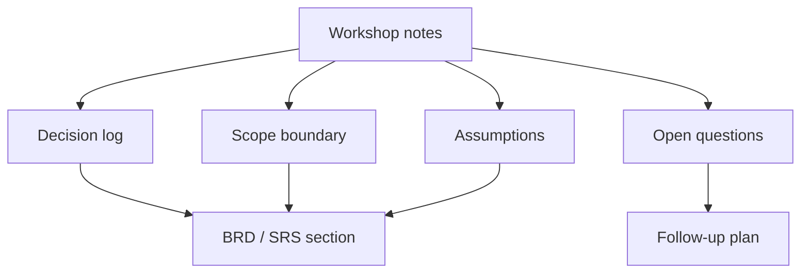

# BRD, SRS, and Decision Artifacts

<div class="lesson-meta">
  <span>Analysis Artifacts and Diagramming</span>
  <span>Software BA</span>
  <span>Core</span>
</div>

## Learning outcomes

- Use AI to structure BRD and SRS sections without losing ownership.
- Preserve decisions, assumptions, risks, and evidence.
- Avoid document polish that hides unresolved scope.

## Why this matters for BA work

<div class="ba-callout">
AI can draft documents, but BA value comes from decision structure, evidence, scope control, and reviewability.
</div>

This lesson matters because AI can draft BRD and SRS sections quickly, but formal documents are not just text. They are records of decisions, scope boundaries, evidence, ownership, and change control. A BA must ensure AI-assisted documents preserve decision logic instead of producing polished pages that hide unresolved commitments.

## Common difficulties for BAs

In real projects, this topic is difficult because the BA must turn messy evidence into decisions without letting AI hide uncertainty. Watch for these friction points before treating the output as ready.

| Difficulty | Why it is hard in BA work | How a BA should handle it |
| --- | --- | --- |
| Using AI to create polished documents before decisions are clear. | This is hard because BRD, SRS, and Decision Artifacts is usually applied under deadline pressure, incomplete evidence, and stakeholder disagreement. A fluent AI draft can make the gap less visible. | Use source labels, explicit assumptions, and a named review owner before turning this into backlog, specification, or delivery commitment. |
| Hiding assumptions in prose. | This is hard because BRD, SRS, and Decision Artifacts is usually applied under deadline pressure, incomplete evidence, and stakeholder disagreement. A fluent AI draft can make the gap less visible. | Use source labels, explicit assumptions, and a named review owner before turning this into backlog, specification, or delivery commitment. |
| Mixing current state, future state, and open questions. | This is hard because BRD, SRS, and Decision Artifacts is usually applied under deadline pressure, incomplete evidence, and stakeholder disagreement. A fluent AI draft can make the gap less visible. | Use source labels, explicit assumptions, and a named review owner before turning this into backlog, specification, or delivery commitment. |

## Where this applies in real projects

This lesson is useful when the BA needs to move from conversation, policy, design, or technical input into a shared artifact that the team can implement and test.

| Project moment | How to apply this lesson | Concrete BA output |
| --- | --- | --- |
| Discovery | Add a decision log to one document. | Decision Artifact Skeleton: a reviewable artifact that connects the learned concept to decisions, acceptance criteria, risks, or stakeholder alignment. |
| Refinement | Ask AI to extract assumptions from your draft. | Decision Artifact Skeleton: a reviewable artifact that connects the learned concept to decisions, acceptance criteria, risks, or stakeholder alignment. |
| Delivery | Move unresolved items into an open-question table. | Decision Artifact Skeleton: a reviewable artifact that connects the learned concept to decisions, acceptance criteria, risks, or stakeholder alignment. |

## If this is missing

If this capability is missing, AI may still produce polished text, but the project loses reviewability. The result is usually rework, hidden assumptions, weak acceptance criteria, or business decisions made without enough evidence.

| If missing | Project impact | Recovery action |
| --- | --- | --- |
| Ask AI to create a complete BRD from notes | The draft may invent decisions and make unresolved areas look approved. | Recover by using the stronger pattern: Generate a document skeleton plus decision gaps, evidence map, and open approval items. Then re-check the artifact against evidence, testability, ownership, and business impact before sharing it. |
| Use polished wording to resolve stakeholder conflict | Good prose can mask disagreement instead of escalating it. | Recover by using the stronger pattern: Represent conflicts explicitly with options, impact, owner, and decision date. Then re-check the artifact against evidence, testability, ownership, and business impact before sharing it. |
| Remove assumptions to make the document cleaner | Stakeholders lose visibility into what still needs validation. | Recover by using the stronger pattern: Keep assumptions, dependencies, and open questions in governed sections. Then re-check the artifact against evidence, testability, ownership, and business impact before sharing it. |

## Mental model or core concept

A BA document is not valuable because it is long; it is valuable because it makes decisions inspectable. AI can create first drafts, but the BA must maintain decision log, scope boundaries, source evidence, risks, assumptions, and open questions. A polished document with hidden uncertainty is dangerous.

## Practical BA example

Workshop notes become a BRD section. AI drafts a clean narrative, but the BA adds a decision table, explicit out-of-scope items, unresolved pricing rules, and stakeholder approval status before sharing.

## Diagram



## BA artifact

### Decision Artifact Skeleton

| Section | Purpose | AI can help with | BA must own |
| --- | --- | --- | --- |
| Business objective | State why the work exists. | Summarize workshop notes. | Metric and priority tradeoff. |
| Scope boundary | Prevent accidental expansion. | Draft in/out lists. | Final scope decision. |
| Decision log | Show what is settled. | Format decisions. | Owner, date, rationale. |
| Open questions | Keep uncertainty visible. | Cluster questions. | Resolution path and owner. |

## AI expert note

Expert BA documentation separates narrative from decision artifacts. AI is useful for drafting, summarizing, and reorganizing, but it should not decide scope, acceptance, or policy. BRD and SRS outputs should include decision log references, source evidence, version history, open issues, and explicit approval checkpoints.

## Bad vs better example

| Weak pattern | Why it fails | Stronger BA pattern |
| --- | --- | --- |
| Ask AI to create a complete BRD from notes | The draft may invent decisions and make unresolved areas look approved. | Generate a document skeleton plus decision gaps, evidence map, and open approval items. |
| Use polished wording to resolve stakeholder conflict | Good prose can mask disagreement instead of escalating it. | Represent conflicts explicitly with options, impact, owner, and decision date. |
| Remove assumptions to make the document cleaner | Stakeholders lose visibility into what still needs validation. | Keep assumptions, dependencies, and open questions in governed sections. |

## AI collaboration prompt

```text
Draft a BRD/SRS section from these notes. Include objective, scope, stakeholders, decisions, assumptions, requirements, risks, metrics, open questions, and source evidence. Label anything inferred, and keep unresolved items out of final requirements.
```

## Mistakes to avoid

- Using AI to create polished documents before decisions are clear.
- Hiding assumptions in prose.
- Mixing current state, future state, and open questions.
- Forgetting scope boundaries.

## Apply this tomorrow

1. Add a decision log to one document.
2. Ask AI to extract assumptions from your draft.
3. Move unresolved items into an open-question table.
4. Review out-of-scope items with stakeholders.

## What a BA should remember

- Documents should make decisions visible.
- Polish is not clarity.
- AI drafts; BA controls scope and evidence.
