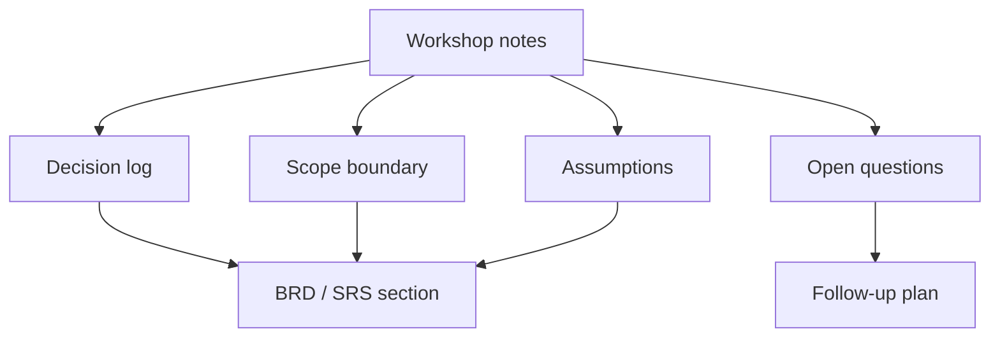

# BRD, SRS, and Decision Artifacts

<div class="lesson-meta">
  <span>Analysis Artifacts and Diagramming</span>
  <span>Software BA</span>
  <span>Core</span>
</div>

## Learning outcomes

- Use AI to structure BRD and SRS sections without losing ownership.
- Preserve decisions, assumptions, risks, and evidence.
- Avoid document polish that hides unresolved scope.

## Why this matters for BA work

<div class="ba-callout">
AI can draft documents, but BA value comes from decision structure, evidence, scope control, and reviewability.
</div>

This lesson matters because AI can draft BRD and SRS sections quickly, but formal documents are not just text. They are records of decisions, scope boundaries, evidence, ownership, and change control. A BA must ensure AI-assisted documents preserve decision logic instead of producing polished pages that hide unresolved commitments.

## Common difficulties for BAs

In Analysis Artifacts and Diagramming, BRD, SRS, and Decision Artifacts becomes difficult when the BA must translate complex decisions into artifacts that product, engineering, QA, support, and compliance can all inspect. A BA should inspect the points below before treating an AI-supported artifact as ready for stakeholder decision or delivery handoff.

| Difficulty | Why it is hard in BA work | How a BA should handle it |
| --- | --- | --- |
| Using AI to create polished documents before decisions are clear. | The mistake "Using AI to create polished documents before decisions are clear." appears when the team discusses artifact purpose, audience, diagram clarity, decision trace, and handoff quality without agreeing which source is authoritative. AI can smooth over the disagreement, so the BA must keep uncertainty visible. | Apply this control: review the artifact with the team that must build, test, or operate from it. Then use the stronger pattern "Generate a document skeleton plus decision gaps, evidence map, and open approval items." and ask who must approve the artifact before it affects scope, build, test, or release. |
| Hiding assumptions in prose. | For BRD, SRS, and Decision Artifacts, the friction is that AI can draft documents, but BA value comes from decision structure, evidence, scope control, and reviewability. The weak pattern is tempting because AI can produce a fluent answer before the BA has checked ownership, source freshness, or decision rights. | Apply this control: review the artifact with the team that must build, test, or operate from it. Then use the stronger pattern "Represent conflicts explicitly with options, impact, owner, and decision date." and ask who must approve the artifact before it affects scope, build, test, or release. |
| Mixing current state, future state, and open questions. | This becomes hard when Decision Artifact Skeleton is expected to support the cross-functional handoff artifact. If the BA does not challenge the draft, unsupported assumptions may enter planning, testing, or stakeholder communication. | Apply this control: review the artifact with the team that must build, test, or operate from it. Then use the stronger pattern "Keep assumptions, dependencies, and open questions in governed sections." and ask who must approve the artifact before it affects scope, build, test, or release. |

## Where this applies in real projects

Use this lesson when BRD, SRS, decision memo, flow, sequence, or integration artifact must carry decisions across roles. The practical output is not a longer document; it is Decision Artifact Skeleton with enough evidence, ownership, and decision clarity for the next project conversation.

| Project moment | How to apply this lesson | Concrete BA output |
| --- | --- | --- |
| Artifact drafting | Add a decision log to one document. | Decision Artifact Skeleton showing artifact purpose, audience, diagram clarity, decision trace, and handoff quality, with the action "Add a decision log to one document." translated into a reviewable decision, requirement, checklist, or question for the next meeting. |
| Diagram review | Ask AI to extract assumptions from your draft. | Decision Artifact Skeleton showing source evidence, with the action "Ask AI to extract assumptions from your draft." translated into a reviewable decision, requirement, checklist, or question for the next meeting. |
| Handoff | Move unresolved items into an open-question table. | Decision Artifact Skeleton showing decision owner, with the action "Move unresolved items into an open-question table." translated into a reviewable decision, requirement, checklist, or question for the next meeting. |

## If this is missing

If BRD, SRS, and Decision Artifacts is missing, handoffs become interpretation exercises, and teams re-argue decisions that should have been captured in the artifact. The BA can still recover, but only by converting the polished AI draft back into explicit evidence, assumptions, owners, and testable decisions.

| If missing | Project impact | Recovery action |
| --- | --- | --- |
| Ask AI to create a complete BRD from notes | The draft may invent decisions and make unresolved areas look approved. | Recover by using the stronger pattern: Generate a document skeleton plus decision gaps, evidence map, and open approval items. Rework Decision Artifact Skeleton until it exposes artifact purpose, audience, diagram clarity, decision trace, and handoff quality, and do not share it as final until evidence, ownership, and validation path are explicit. |
| Use polished wording to resolve stakeholder conflict | Good prose can mask disagreement instead of escalating it. | Recover by using the stronger pattern: Represent conflicts explicitly with options, impact, owner, and decision date. Rework Decision Artifact Skeleton until it exposes artifact purpose, audience, diagram clarity, decision trace, and handoff quality, and do not share it as final until evidence, ownership, and validation path are explicit. |
| Remove assumptions to make the document cleaner | Stakeholders lose visibility into what still needs validation. | Recover by using the stronger pattern: Keep assumptions, dependencies, and open questions in governed sections. Rework Decision Artifact Skeleton until it exposes artifact purpose, audience, diagram clarity, decision trace, and handoff quality, and do not share it as final until evidence, ownership, and validation path are explicit. |

## Mental model or core concept

A BA document is not valuable because it is long; it is valuable because it makes decisions inspectable. AI can create first drafts, but the BA must maintain decision log, scope boundaries, source evidence, risks, assumptions, and open questions. A polished document with hidden uncertainty is dangerous.

## Practical BA example

Workshop notes become a BRD section. AI drafts a clean narrative, but the BA adds a decision table, explicit out-of-scope items, unresolved pricing rules, and stakeholder approval status before sharing.

## Diagram



## BA artifact

### Decision Artifact Skeleton

| Section | Purpose | AI can help with | BA must own |
| --- | --- | --- | --- |
| Business objective | State why the work exists. | Summarize workshop notes. | Metric and priority tradeoff. |
| Scope boundary | Prevent accidental expansion. | Draft in/out lists. | Final scope decision. |
| Decision log | Show what is settled. | Format decisions. | Owner, date, rationale. |
| Open questions | Keep uncertainty visible. | Cluster questions. | Resolution path and owner. |

## AI expert note

Expert BA documentation separates narrative from decision artifacts. AI is useful for drafting, summarizing, and reorganizing, but it should not decide scope, acceptance, or policy. BRD and SRS outputs should include decision log references, source evidence, version history, open issues, and explicit approval checkpoints.

## Bad vs better example

| Weak pattern | Why it fails | Stronger BA pattern |
| --- | --- | --- |
| Ask AI to create a complete BRD from notes | The draft may invent decisions and make unresolved areas look approved. | Generate a document skeleton plus decision gaps, evidence map, and open approval items. |
| Use polished wording to resolve stakeholder conflict | Good prose can mask disagreement instead of escalating it. | Represent conflicts explicitly with options, impact, owner, and decision date. |
| Remove assumptions to make the document cleaner | Stakeholders lose visibility into what still needs validation. | Keep assumptions, dependencies, and open questions in governed sections. |

## Stakeholder questions to ask

| Stakeholder | Question | Why the BA asks it |
| --- | --- | --- |
| Product owner | Which outcome should BRD, SRS, and Decision Artifacts improve, and what trade-off are you willing to accept? | Prevents AI output from optimizing for a vague goal. |
| Engineering lead | What source, system, data, or constraint would make Decision Artifact Skeleton hard to implement? | Turns hidden technical constraints into visible requirement questions. |
| QA lead | Which rule, exception, or user state must be testable before you trust this artifact? | Converts fluent AI wording into observable behavior. |
| Operations or support | What failure path would create manual work if the lesson principle "Documents should make decisions visible" is ignored? | Surfaces support load, exception handling, and operating impact. |

## Decision log entries

| Decision item | Options to capture | Owner | Evidence needed |
| --- | --- | --- | --- |
| Scope boundary for Decision Artifact Skeleton | Must-have, later, out of scope | Product owner | Business outcome and release constraint |
| Authority for artifact purpose, audience, diagram clarity, decision trace, and handoff quality | Documented source, stakeholder decision, assumption to validate | BA + accountable stakeholder | Source ID, date, and approval status |
| Review gate before handoff | Peer review, QA review, engineering review, formal approval | BA lead or project lead | Risk level and receiving-team readiness |
| Recovery if Using AI to create polished documents before decisions are clear. | Rewrite, defer, escalate, or run validation workshop | Decision owner | Impact on scope, testability, and release risk |

## Definition of Ready / Done

| Gate | Ready signal | Done signal |
| --- | --- | --- |
| Definition of Ready | Sources for artifact purpose, audience, diagram clarity, decision trace, and handoff quality are labeled and current. | Decision Artifact Skeleton can be reviewed without guessing missing context. |
| Definition of Ready | Open assumptions have owners and validation paths. | Stakeholders can decide whether to accept, reject, or defer each assumption. |
| Definition of Done | The artifact applies this control: review the artifact with the team that must build, test, or operate from it. | Delivery, QA, or governance teams can act on the artifact. |
| Definition of Done | The weak pattern "Using AI to create polished documents before decisions are clear." has been explicitly checked. | No unsupported AI claim is treated as an approved requirement. |

## Before and after artifact example

| Before | AI draft risk | Senior BA revision |
| --- | --- | --- |
| Prompt: "Create Decision Artifact Skeleton for BRD, SRS, and Decision Artifacts." | The model may invent source facts, owners, thresholds, or implementation rules. | Add sources, scope boundary, source authority, output schema, and the instruction: Generate a document skeleton plus decision gaps, evidence map, and open approval items. |
| Draft statement: "Add a decision log to one document." | Useful action, but not yet tied to a decision owner or acceptance signal. | Rewrite as a project step with owner, expected artifact, review gate, and evidence required before handoff. |
| Final-looking paragraph about cross-functional handoff artifact | The tone may hide uncertainty and missing stakeholder approval. | Convert it into a table of fact, assumption, decision needed, risk, and validation question. |

## Manual verification after AI output

| Verification lens | Manual check | Pass signal |
| --- | --- | --- |
| Evidence | Trace every important statement in Decision Artifact Skeleton to a source, decision, or labeled assumption. | No unsupported claim remains hidden. |
| Completeness | Check artifact purpose, audience, diagram clarity, decision trace, and handoff quality against the intended audience and receiving team. | The artifact answers what product, engineering, QA, and operations need. |
| Testability | Ask whether QA can create positive, negative, boundary, and exception scenarios. | Ambiguous wording has been rewritten or logged as a question. |
| Accountability | Confirm who approves, who reviews, and who acts when the artifact is wrong. | Owners and escalation path are explicit. |

## AI collaboration prompt

```text
Draft a BRD/SRS section from these notes. Include objective, scope, stakeholders, decisions, assumptions, requirements, risks, metrics, open questions, and source evidence. Label anything inferred, and keep unresolved items out of final requirements.
```

## Mistakes to avoid

- Using AI to create polished documents before decisions are clear.
- Hiding assumptions in prose.
- Mixing current state, future state, and open questions.
- Forgetting scope boundaries.

## Apply this tomorrow

1. Add a decision log to one document.
2. Ask AI to extract assumptions from your draft.
3. Move unresolved items into an open-question table.
4. Review out-of-scope items with stakeholders.

## What a BA should remember

- Documents should make decisions visible.
- Polish is not clarity.
- AI drafts; BA controls scope and evidence.
