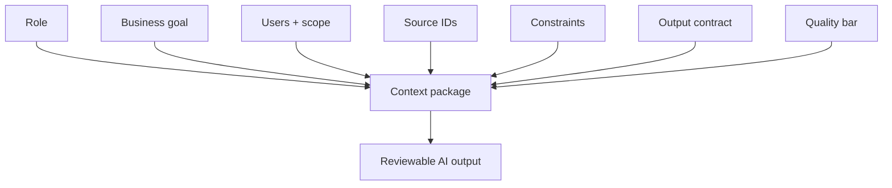

# Context Engineering Patterns

<div class="lesson-meta">
  <span>AI Collaboration and Context Engineering</span>
  <span>Software BA</span>
  <span>Core</span>
</div>

## Learning outcomes

- Build context packages for repeatable BA tasks.
- Define output contracts for AI-assisted analysis.
- Reduce hallucination by controlling source and review rules.

## Why this matters for BA work

<div class="ba-callout">
Good AI work is not a clever prompt; it is a reusable context package with goals, sources, constraints, and review criteria.
</div>

This lesson matters because one-off prompts do not scale BA quality. Teams need repeatable context patterns that define role, goal, evidence, constraints, output format, review rules, and escalation behavior. Context engineering lets AI work become auditable, teachable, and reusable across projects instead of depending on individual prompt luck.

## Common difficulties for BAs

In AI Collaboration and Context Engineering, Context Engineering Patterns becomes difficult when AI can draft quickly, but reviewers need repeatable context, structured output, and critique rules to trust the result. A BA should inspect the points below before treating an AI-supported artifact as ready for stakeholder decision or delivery handoff.

| Difficulty | Why it is hard in BA work | How a BA should handle it |
| --- | --- | --- |
| Calling a one-line instruction 'prompt engineering'. | The mistake "Calling a one-line instruction 'prompt engineering'." appears when the team discusses context package quality, prompt reuse, critique loop, and output contract without agreeing which source is authoritative. AI can smooth over the disagreement, so the BA must keep uncertainty visible. | Apply this control: separate context preparation, generation, critique, and human approval into visible steps. Then use the stronger pattern "Create reusable prompt patterns with source rules, output contracts, and review gates." and ask who must approve the artifact before it affects scope, build, test, or release. |
| Skipping output format. | For Context Engineering Patterns, the friction is that Good AI work is not a clever prompt; it is a reusable context package with goals, sources, constraints, and review criteria. The weak pattern is tempting because AI can produce a fluent answer before the BA has checked ownership, source freshness, or decision rights. | Apply this control: separate context preparation, generation, critique, and human approval into visible steps. Then use the stronger pattern "Specify allowed sources, unsupported-claim labels, and validation questions." and ask who must approve the artifact before it affects scope, build, test, or release. |
| Failing to provide source IDs. | This becomes hard when BA Context Package is expected to support the repeatable collaboration pattern. If the BA does not challenge the draft, unsupported assumptions may enter planning, testing, or stakeholder communication. | Apply this control: separate context preparation, generation, critique, and human approval into visible steps. Then use the stronger pattern "Use staged prompts: context pack, analysis, artifact draft, critique, and revision." and ask who must approve the artifact before it affects scope, build, test, or release. |

## Where this applies in real projects

Use this lesson when a BA team wants reusable AI collaboration patterns instead of one-off prompts that depend on individual habit. The practical output is not a longer document; it is BA Context Package with enough evidence, ownership, and decision clarity for the next project conversation.

| Project moment | How to apply this lesson | Concrete BA output |
| --- | --- | --- |
| Context setup | Create a reusable context package for requirement review. | BA Context Package showing context package quality, prompt reuse, critique loop, and output contract, with the action "Create a reusable context package for requirement review." translated into a reviewable decision, requirement, checklist, or question for the next meeting. |
| Prompt reuse | Add output columns before asking AI to draft. | BA Context Package showing source evidence, with the action "Add output columns before asking AI to draft." translated into a reviewable decision, requirement, checklist, or question for the next meeting. |
| Peer review | Include a quality bar in one prompt. | BA Context Package showing decision owner, with the action "Include a quality bar in one prompt." translated into a reviewable decision, requirement, checklist, or question for the next meeting. |

## If this is missing

If Context Engineering Patterns is missing, outputs vary by person, assumptions stay hidden, and review quality depends on who happened to write the prompt. The BA can still recover, but only by converting the polished AI draft back into explicit evidence, assumptions, owners, and testable decisions.

| If missing | Project impact | Recovery action |
| --- | --- | --- |
| Write a clever prompt for each new task | Quality depends on individual improvisation and is hard to review. | Recover by using the stronger pattern: Create reusable prompt patterns with source rules, output contracts, and review gates. Rework BA Context Package until it exposes context package quality, prompt reuse, critique loop, and output contract, and do not share it as final until evidence, ownership, and validation path are explicit. |
| Give AI role and goal but no evidence rules | The model may blend provided facts with plausible external assumptions. | Recover by using the stronger pattern: Specify allowed sources, unsupported-claim labels, and validation questions. Rework BA Context Package until it exposes context package quality, prompt reuse, critique loop, and output contract, and do not share it as final until evidence, ownership, and validation path are explicit. |
| Ask for a complete answer in one step | The model hides missing context while optimizing for fluency. | Recover by using the stronger pattern: Use staged prompts: context pack, analysis, artifact draft, critique, and revision. Rework BA Context Package until it exposes context package quality, prompt reuse, critique loop, and output contract, and do not share it as final until evidence, ownership, and validation path are explicit. |

## Mental model or core concept

Prompting is the visible instruction; context engineering is the full operating design around it. For BA work, a context package should include business goal, users, scope, sources, constraints, artifact format, quality bar, and questions the AI must ask before drafting.

## Practical BA example

Two BAs ask AI to review requirements. One writes 'find gaps'; the other supplies product goal, stakeholder roles, source IDs, NFR checklist, output columns, severity levels, and evidence rules. The second BA gets a usable review artifact.

## Diagram



## BA artifact

### BA Context Package

| Component | What to include | Why it matters | Example |
| --- | --- | --- | --- |
| Role | Perspective and expertise expected. | Shapes review lens. | Senior BA for fintech onboarding. |
| Source | Documents, notes, IDs, freshness. | Controls grounding. | SRS v0.8, policy P-12, workshop notes. |
| Task | Specific analysis job. | Avoids broad summaries. | Find ambiguity and NFR gaps. |
| Output contract | Columns, format, quality bar. | Makes output reviewable. | Table with evidence and questions. |

## AI expert note

Context engineering is the BA equivalent of designing a controlled analysis environment. The expert move is to make task boundaries explicit: what sources may be used, what must be ignored, what format is required, what counts as evidence, and what the model must do when information is missing or conflicting.

## Bad vs better example

| Weak pattern | Why it fails | Stronger BA pattern |
| --- | --- | --- |
| Write a clever prompt for each new task | Quality depends on individual improvisation and is hard to review. | Create reusable prompt patterns with source rules, output contracts, and review gates. |
| Give AI role and goal but no evidence rules | The model may blend provided facts with plausible external assumptions. | Specify allowed sources, unsupported-claim labels, and validation questions. |
| Ask for a complete answer in one step | The model hides missing context while optimizing for fluency. | Use staged prompts: context pack, analysis, artifact draft, critique, and revision. |

## AI collaboration prompt

```text
Use this context package: Role, Business Goal, Users, Scope, Source IDs, Constraints, Task, Output Format, Quality Bar, and Questions Before Drafting. Ask clarification questions first if any required component is missing.
```

## Mistakes to avoid

- Calling a one-line instruction 'prompt engineering'.
- Skipping output format.
- Failing to provide source IDs.
- Not telling AI what quality means for the artifact.

## Apply this tomorrow

1. Create a reusable context package for requirement review.
2. Add output columns before asking AI to draft.
3. Include a quality bar in one prompt.
4. Ask AI what context is missing before it answers.

## What a BA should remember

- Context engineering makes AI work repeatable.
- Output format is part of the requirement.
- A prompt without source and review rules is fragile.
