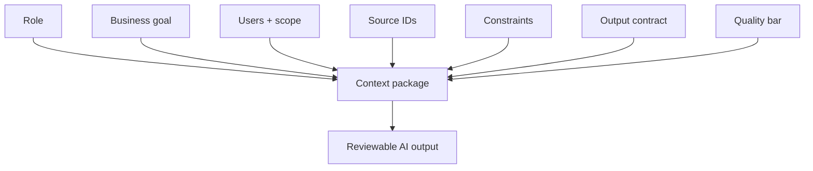

# Context Engineering Patterns

<div class="lesson-meta">
  <span>AI Collaboration and Context Engineering</span>
  <span>Software BA</span>
  <span>Core</span>
</div>

## Learning outcomes

- Build context packages for repeatable BA tasks.
- Define output contracts for AI-assisted analysis.
- Reduce hallucination by controlling source and review rules.

## Why this matters for BA work

<div class="ba-callout">
Good AI work is not a clever prompt; it is a reusable context package with goals, sources, constraints, and review criteria.
</div>

Business Analysts sit between problem framing, stakeholder meaning, delivery constraints, and product decisions. In AI work, that position becomes more important because unclear language can create false certainty quickly. This lesson gives you a practical control you can apply before AI output becomes scope, backlog, or delivery commitment.

## Mental model or core concept

Prompting is the visible instruction; context engineering is the full operating design around it. For BA work, a context package should include business goal, users, scope, sources, constraints, artifact format, quality bar, and questions the AI must ask before drafting.

## Practical BA example

Two BAs ask AI to review requirements. One writes 'find gaps'; the other supplies product goal, stakeholder roles, source IDs, NFR checklist, output columns, severity levels, and evidence rules. The second BA gets a usable review artifact.

## Diagram



## BA artifact

### BA Context Package

| Component | What to include | Why it matters | Example |
| --- | --- | --- | --- |
| Role | Perspective and expertise expected. | Shapes review lens. | Senior BA for fintech onboarding. |
| Source | Documents, notes, IDs, freshness. | Controls grounding. | SRS v0.8, policy P-12, workshop notes. |
| Task | Specific analysis job. | Avoids broad summaries. | Find ambiguity and NFR gaps. |
| Output contract | Columns, format, quality bar. | Makes output reviewable. | Table with evidence and questions. |

## AI collaboration prompt

```text
Use this context package: Role, Business Goal, Users, Scope, Source IDs, Constraints, Task, Output Format, Quality Bar, and Questions Before Drafting. Ask clarification questions first if any required component is missing.
```

## Mistakes to avoid

- Calling a one-line instruction 'prompt engineering'.
- Skipping output format.
- Failing to provide source IDs.
- Not telling AI what quality means for the artifact.

## Apply this tomorrow

1. Create a reusable context package for requirement review.
2. Add output columns before asking AI to draft.
3. Include a quality bar in one prompt.
4. Ask AI what context is missing before it answers.

## What a BA should remember

- Context engineering makes AI work repeatable.
- Output format is part of the requirement.
- A prompt without source and review rules is fragile.
