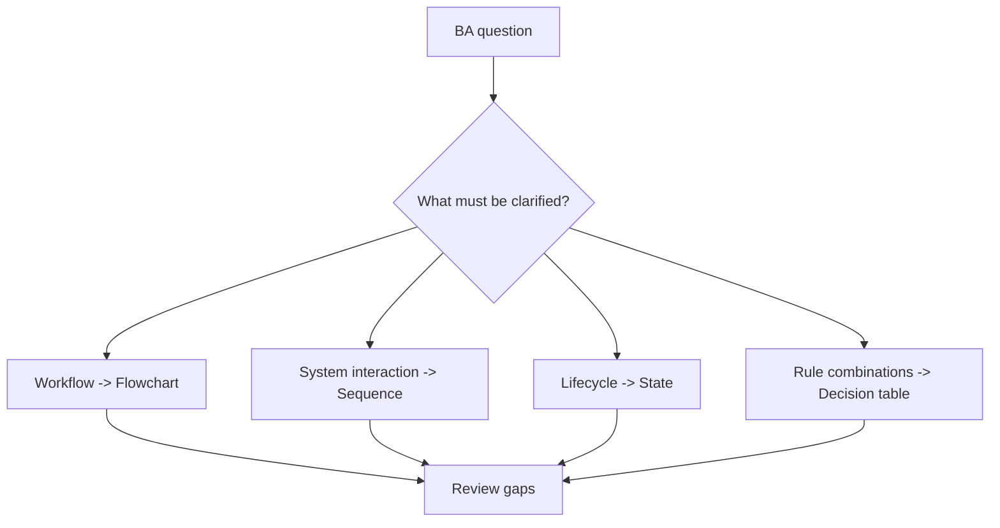

# Diagramming for BA

<div class="lesson-meta">
  <span>Analysis Artifacts and Diagramming</span>
  <span>Software BA</span>
  <span>Core</span>
</div>

## Learning outcomes

- Choose the right diagram type for a BA question.
- Use AI to draft Mermaid diagrams safely.
- Review diagrams for missing actors, flows, and exceptions.

## Why this matters for BA work

<div class="ba-callout">
A good diagram changes the conversation; it reveals decisions, boundaries, and gaps that text hides.
</div>

This lesson matters because diagrams expose reasoning that prose can hide. AI can create flowcharts, sequence diagrams, and state models quickly, but a diagram is valuable only when it reveals missing actors, unclear rules, system boundaries, and exception paths. The BA must use diagrams as analysis instruments, not visual decoration.

## Mental model or core concept

Diagrams are thinking tools. Flowcharts clarify process decisions; sequence diagrams clarify system interactions; state diagrams clarify lifecycle; matrices clarify rule combinations. AI can translate text to Mermaid, but the BA must validate system boundaries, actor responsibility, exception paths, and business rules.

## Practical BA example

A requirement says 'payment is verified before fulfillment.' A sequence diagram reveals missing responsibility between payment gateway, order service, warehouse, and customer notification. The BA then asks who handles payment failure and when inventory is released.

## Diagram



## BA artifact

### Diagram Selection Guide

| BA question | Diagram type | Use when | Review focus |
| --- | --- | --- | --- |
| How does work flow? | Flowchart | Process and decisions matter. | Actors, decision rules, exceptions. |
| How do systems interact? | Sequence diagram | APIs/events are involved. | System boundaries and failure messages. |
| What states can an entity have? | State diagram | Lifecycle matters. | Allowed transitions and triggers. |
| Which rule applies? | Decision table | Combinations drive outcomes. | Complete and exclusive rules. |

## AI expert note

AI-generated diagrams should be reviewed like requirements. Expert BAs check notation fit, actor-system separation, decision labels, data movement, error paths, and whether the diagram answers a stakeholder question. Diagramming is especially powerful when the BA asks AI to generate competing views and then reconciles their differences.

## Bad vs better example

| Weak pattern | Why it fails | Stronger BA pattern |
| --- | --- | --- |
| Generate one diagram and add it to the document | A single view may hide timing, data, or responsibility issues. | Create process, sequence, and state views when the problem crosses workflow and systems. |
| Accept diagram labels that are vague | Decision diamonds like valid or approved do not define business rules. | Replace vague labels with rule source, threshold, owner, or open question. |
| Use diagrams only for presentation | The team misses the chance to find defects before build. | Run diagram review sessions to identify gaps, exceptions, and ownership issues. |

## AI collaboration prompt

```text
Choose the best diagram type for this requirement and explain why. Then draft the Mermaid diagram. After the diagram, list missing actors, unclear boundaries, exception paths, and business rules that need validation.
```

## Mistakes to avoid

- Using one diagram type for every problem.
- Letting AI draw a diagram without checking business meaning.
- Omitting failure paths.
- Creating diagrams that are pretty but not decision-useful.

## Apply this tomorrow

1. Convert one text-heavy requirement into a Mermaid diagram.
2. Ask AI which diagram type fits the question.
3. Review the diagram with a developer for boundary gaps.
4. Add exception paths before sharing.

## What a BA should remember

- Diagrams are analysis, not decoration.
- The best diagram exposes the next decision.
- AI draws quickly; BA checks meaning.
