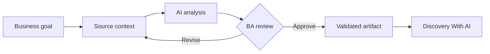

# Discovery With AI

<div class="lesson-meta">
  <span>AI-Augmented BA Workflow</span>
  <span>Software BA</span>
  <span>Core</span>
</div>

## Learning outcomes

- Explain discovery with ai in business language.
- Apply the concept to a realistic BA workflow.
- Use AI output as draft evidence, not as unchecked truth.
- Identify the review questions a BA must ask before sharing the artifact.

## Why this matters for BA work

AI changes how analysis work is produced, but it does not remove the BA's accountability for clarity, evidence, and decisions.

<div class="ba-callout">
Use AI to prepare discovery questions, compare hypotheses, and expose unknowns before stakeholder sessions.
</div>

## Core concept

The useful BA pattern is controlled collaboration: provide the model with business context, ask for structured output, require evidence, then review the result against goals, rules, risks, and stakeholder decisions.

## Practical BA example

Before a workshop on claim approval automation, the BA asks AI to map actors, decisions, policy constraints, exceptions, and metrics. The output becomes a better interview plan, not the final truth.

## Diagram



## BA workflow

1. Frame the business question before opening the AI tool.
2. Provide source context and explicit constraints.
3. Ask for structured output that maps back to the source.
4. Run a critique pass for ambiguity, gaps, risk, and testability.
5. Convert the result into an artifact the team can inspect and own.

## Prompt or template

```text
Generate a discovery plan for this business problem. Include stakeholders, questions, assumptions to validate, likely data sources, risks, and decisions the workshop must make.
```

## What a BA should remember

- AI is a reasoning accelerator, not a decision owner.
- Ground every important claim in source context or stakeholder confirmation.
- A good BA keeps the review loop visible: draft, critique, revise, validate.
