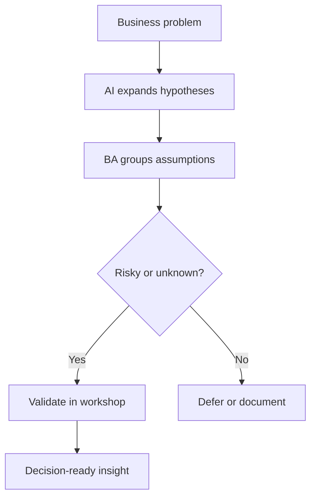

# Discovery With AI

<div class="lesson-meta">
  <span>AI-Augmented BA Workflow</span>
  <span>Software BA</span>
  <span>Core</span>
</div>

## Learning outcomes

- Use AI to generate hypotheses and interview plans.
- Separate assumptions, evidence, and decisions before workshops.
- Turn AI output into a better discovery agenda.

## Why this matters for BA work

<div class="ba-callout">
AI can widen discovery, but the BA must still decide what needs validation with real stakeholders.
</div>

Business Analysts sit between problem framing, stakeholder meaning, delivery constraints, and product decisions. In AI work, that position becomes more important because unclear language can create false certainty quickly. This lesson gives you a practical control you can apply before AI output becomes scope, backlog, or delivery commitment.

## Mental model or core concept

Discovery is about reducing uncertainty, not producing documents. AI helps by proposing actors, constraints, risks, and questions, but its output should become a hypothesis backlog. The BA then validates or rejects those hypotheses with users, data, policy, and stakeholder decisions.

## Practical BA example

For claim approval automation, AI suggests fraud checks, SLA tiers, escalation paths, and missing document scenarios. The BA converts these into workshop questions and prioritizes the riskiest assumptions: who can override, what policy applies, and what counts as a valid exception.

## Diagram



## BA artifact

### Discovery Hypothesis Backlog

| Hypothesis | Evidence needed | Validation method | Decision owner |
| --- | --- | --- | --- |
| High-value claims need manager review. | Policy threshold and historical claim data. | Policy review plus data sample. | Claims operations lead |
| Missing documents trigger customer notification. | Current support script and customer journey. | Interview support agents. | Customer service manager |
| Fraud risk changes SLA. | Fraud rules and compliance constraints. | Compliance workshop. | Risk owner |
| Manual override must be audited. | Audit policy and regulator expectation. | Security review. | Compliance lead |

## AI collaboration prompt

```text
Create a discovery hypothesis backlog for this business problem. Include actors, assumptions, evidence needed, validation method, decision owner, risk level, and workshop questions. Do not write final requirements yet.
```

## Mistakes to avoid

- Asking AI to write requirements before uncertainty is mapped.
- Treating generated questions as complete discovery.
- Ignoring decision owners.
- Prioritizing easy questions instead of risky assumptions.

## Apply this tomorrow

1. Turn your next workshop agenda into hypotheses.
2. Ask AI for missing stakeholder groups.
3. Add evidence needed next to every assumption.
4. Open the workshop with decisions required, not only topics.

## What a BA should remember

- Discovery output is validated learning.
- AI expands your question space; stakeholders validate it.
- A good discovery artifact shows what is unknown.
