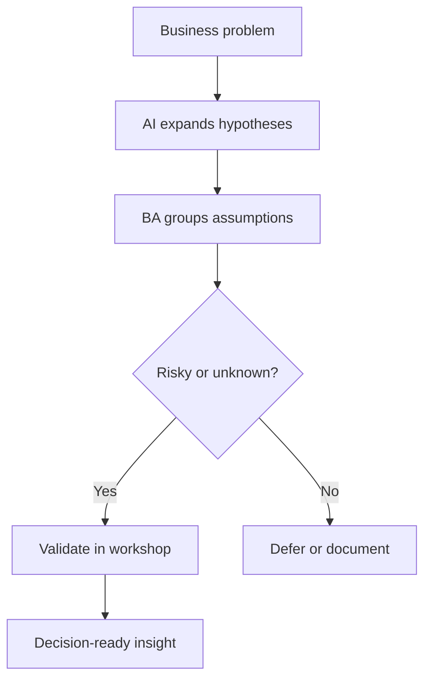

# Discovery With AI

<div class="lesson-meta">
  <span>AI-Augmented BA Workflow</span>
  <span>Software BA</span>
  <span>Core</span>
</div>

## Learning outcomes

- Use AI to generate hypotheses and interview plans.
- Separate assumptions, evidence, and decisions before workshops.
- Turn AI output into a better discovery agenda.

## Why this matters for BA work

<div class="ba-callout">
AI can widen discovery, but the BA must still decide what needs validation with real stakeholders.
</div>

This lesson matters because AI can make discovery feel faster while silently replacing uncertainty with invented completeness. The BA's value is to turn AI suggestions into hypotheses, not conclusions. A good discovery workflow uses AI to widen the question space, then uses evidence, workshops, interviews, and data to decide what is true.

## Common difficulties for BAs

In AI-Augmented BA Workflow, Discovery With AI becomes difficult when messy notes, half-validated decisions, and incomplete stakeholder context must become a shared artifact quickly. A BA should inspect the points below before treating an AI-supported artifact as ready for stakeholder decision or delivery handoff.

| Difficulty | Why it is hard in BA work | How a BA should handle it |
| --- | --- | --- |
| Asking AI to write requirements before uncertainty is mapped. | The mistake "Asking AI to write requirements before uncertainty is mapped." appears when the team discusses source attribution, conflict visibility, workshop decision flow, and backlog readiness without agreeing which source is authoritative. AI can smooth over the disagreement, so the BA must keep uncertainty visible. | Apply this control: keep speaker/source attribution visible until the responsible stakeholder confirms meaning. Then use the stronger pattern "Ask for hypotheses, assumptions, evidence needed, and workshop questions first." and ask who must approve the artifact before it affects scope, build, test, or release. |
| Treating generated questions as complete discovery. | For Discovery With AI, the friction is that AI can widen discovery, but the BA must still decide what needs validation with real stakeholders. The weak pattern is tempting because AI can produce a fluent answer before the BA has checked ownership, source freshness, or decision rights. | Apply this control: keep speaker/source attribution visible until the responsible stakeholder confirms meaning. Then use the stronger pattern "Validate actors against process maps, org roles, customer journeys, and decision rights." and ask who must approve the artifact before it affects scope, build, test, or release. |
| Ignoring decision owners. | This becomes hard when Discovery Hypothesis Backlog is expected to support the validated working artifact. If the BA does not challenge the draft, unsupported assumptions may enter planning, testing, or stakeholder communication. | Apply this control: keep speaker/source attribution visible until the responsible stakeholder confirms meaning. Then use the stronger pattern "Rank hypotheses by business impact, evidence gap, and decision urgency." and ask who must approve the artifact before it affects scope, build, test, or release. |

## Where this applies in real projects

Use this lesson when discovery or refinement produces more raw input than the BA can safely synthesize by hand in the available time. The practical output is not a longer document; it is Discovery Hypothesis Backlog with enough evidence, ownership, and decision clarity for the next project conversation.

| Project moment | How to apply this lesson | Concrete BA output |
| --- | --- | --- |
| Discovery | Turn your next workshop agenda into hypotheses. | Discovery Hypothesis Backlog showing source attribution, conflict visibility, workshop decision flow, and backlog readiness, with the action "Turn your next workshop agenda into hypotheses." translated into a reviewable decision, requirement, checklist, or question for the next meeting. |
| Synthesis | Ask AI for missing stakeholder groups. | Discovery Hypothesis Backlog showing source evidence, with the action "Ask AI for missing stakeholder groups." translated into a reviewable decision, requirement, checklist, or question for the next meeting. |
| Refinement | Add evidence needed next to every assumption. | Discovery Hypothesis Backlog showing decision owner, with the action "Add evidence needed next to every assumption." translated into a reviewable decision, requirement, checklist, or question for the next meeting. |

## If this is missing

If Discovery With AI is missing, important signals from interviews, tickets, process notes, or decisions may be lost before they reach the backlog. The BA can still recover, but only by converting the polished AI draft back into explicit evidence, assumptions, owners, and testable decisions.

| If missing | Project impact | Recovery action |
| --- | --- | --- |
| Ask AI to write requirements from a business problem | The model will collapse discovery uncertainty into premature scope. | Recover by using the stronger pattern: Ask for hypotheses, assumptions, evidence needed, and workshop questions first. Rework Discovery Hypothesis Backlog until it exposes source attribution, conflict visibility, workshop decision flow, and backlog readiness, and do not share it as final until evidence, ownership, and validation path are explicit. |
| Use AI-generated stakeholder lists as final | Important internal owners, regulators, or operational users may be absent. | Recover by using the stronger pattern: Validate actors against process maps, org roles, customer journeys, and decision rights. Rework Discovery Hypothesis Backlog until it exposes source attribution, conflict visibility, workshop decision flow, and backlog readiness, and do not share it as final until evidence, ownership, and validation path are explicit. |
| Prioritize questions that are easy to answer | The team may avoid the riskiest assumptions until delivery. | Recover by using the stronger pattern: Rank hypotheses by business impact, evidence gap, and decision urgency. Rework Discovery Hypothesis Backlog until it exposes source attribution, conflict visibility, workshop decision flow, and backlog readiness, and do not share it as final until evidence, ownership, and validation path are explicit. |

## Mental model or core concept

Discovery is about reducing uncertainty, not producing documents. AI helps by proposing actors, constraints, risks, and questions, but its output should become a hypothesis backlog. The BA then validates or rejects those hypotheses with users, data, policy, and stakeholder decisions.

## Practical BA example

For claim approval automation, AI suggests fraud checks, SLA tiers, escalation paths, and missing document scenarios. The BA converts these into workshop questions and prioritizes the riskiest assumptions: who can override, what policy applies, and what counts as a valid exception.

## Diagram



## BA artifact

### Discovery Hypothesis Backlog

| Hypothesis | Evidence needed | Validation method | Decision owner |
| --- | --- | --- | --- |
| High-value claims need manager review. | Policy threshold and historical claim data. | Policy review plus data sample. | Claims operations lead |
| Missing documents trigger customer notification. | Current support script and customer journey. | Interview support agents. | Customer service manager |
| Fraud risk changes SLA. | Fraud rules and compliance constraints. | Compliance workshop. | Risk owner |
| Manual override must be audited. | Audit policy and regulator expectation. | Security review. | Compliance lead |

## AI expert note

AI is useful in discovery because it can generate alternative actors, edge cases, risks, and interview angles quickly. The danger is anchoring: once a fluent list exists, stakeholders may stop exploring. The BA should explicitly label hypothesis, evidence needed, validation method, and decision owner before converting anything into requirements.

## Bad vs better example

| Weak pattern | Why it fails | Stronger BA pattern |
| --- | --- | --- |
| Ask AI to write requirements from a business problem | The model will collapse discovery uncertainty into premature scope. | Ask for hypotheses, assumptions, evidence needed, and workshop questions first. |
| Use AI-generated stakeholder lists as final | Important internal owners, regulators, or operational users may be absent. | Validate actors against process maps, org roles, customer journeys, and decision rights. |
| Prioritize questions that are easy to answer | The team may avoid the riskiest assumptions until delivery. | Rank hypotheses by business impact, evidence gap, and decision urgency. |

## AI collaboration prompt

```text
Create a discovery hypothesis backlog for this business problem. Include actors, assumptions, evidence needed, validation method, decision owner, risk level, and workshop questions. Do not write final requirements yet.
```

## Mistakes to avoid

- Asking AI to write requirements before uncertainty is mapped.
- Treating generated questions as complete discovery.
- Ignoring decision owners.
- Prioritizing easy questions instead of risky assumptions.

## Apply this tomorrow

1. Turn your next workshop agenda into hypotheses.
2. Ask AI for missing stakeholder groups.
3. Add evidence needed next to every assumption.
4. Open the workshop with decisions required, not only topics.

## What a BA should remember

- Discovery output is validated learning.
- AI expands your question space; stakeholders validate it.
- A good discovery artifact shows what is unknown.
