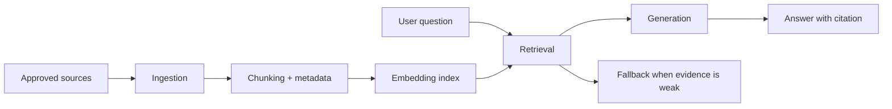

# Embeddings, RAG, and Product Knowledge

<div class="lesson-meta">
  <span>AI Foundations for Business Analysts</span>
  <span>Software BA</span>
  <span>Core</span>
</div>

## Learning outcomes

- Explain the RAG pipeline and where quality can fail.
- Write BA requirements for source authority, freshness, access, and citation.
- Define retrieval quality metrics for an AI assistant.

## Why this matters for BA work

<div class="ba-callout">
For BA work, RAG is less about chatbot UI and more about governing which knowledge the system can trust.
</div>

Business Analysts sit between problem framing, stakeholder meaning, delivery constraints, and product decisions. In AI work, that position becomes more important because unclear language can create false certainty quickly. This lesson gives you a practical control you can apply before AI output becomes scope, backlog, or delivery commitment.

## Mental model or core concept

RAG retrieves source material before the model generates an answer. It improves grounding only when the right sources are indexed, chunked, ranked, permissioned, and cited. A BA specifying RAG must define the knowledge contract: which documents count, how conflicts are resolved, and what the assistant does when evidence is weak.

## Practical BA example

An HR policy assistant answers maternity leave questions from both a 2024 policy and an obsolete 2021 handbook. The BA adds requirements for source priority, effective date, citation display, conflict warning, and fallback to HR when the system finds conflicting policies.

## Diagram



## BA artifact

### RAG Knowledge Contract

| Requirement area | BA specification | Quality metric | Failure mode |
| --- | --- | --- | --- |
| Source authority | Only approved policy repository and HR knowledge base. | 100% answers cite approved source. | Assistant cites stale PDF. |
| Freshness | Policy effective date must be visible and rank newer source higher. | Freshness errors below 1%. | Old policy overrides current rule. |
| Access control | Retrieve only documents user is allowed to see. | No cross-role leakage in tests. | Manager-only policy exposed to employee. |
| Fallback | If no confident citation, answer with escalation path. | Fallback used on unsupported questions. | Assistant invents policy. |

## AI collaboration prompt

```text
Draft RAG requirements for this assistant. Include source inventory, chunking assumptions, access control, citation behavior, conflict handling, fallback, retrieval metrics, and test scenarios. Separate must-have controls from nice-to-have UX.
```

## Mistakes to avoid

- Treating RAG as magic accuracy.
- Ignoring document ownership and freshness.
- Forgetting access control in retrieval.
- Measuring only answer tone instead of retrieval correctness.

## Apply this tomorrow

1. List authoritative sources for one AI assistant idea.
2. Define what the assistant must do when two sources conflict.
3. Write one test question that should trigger fallback.
4. Add citation requirements to the feature spec.

## What a BA should remember

- RAG quality starts with knowledge governance.
- A cited wrong source is still wrong.
- BA requirements must cover retrieval, not only generated answers.
