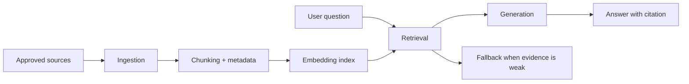

# Embeddings, RAG, and Product Knowledge

<div class="lesson-meta">
  <span>AI Foundations for Business Analysts</span>
  <span>Software BA</span>
  <span>Core</span>
</div>

## Learning outcomes

- Explain the RAG pipeline and where quality can fail.
- Write BA requirements for source authority, freshness, access, and citation.
- Define retrieval quality metrics for an AI assistant.

## Why this matters for BA work

<div class="ba-callout">
For BA work, RAG is less about chatbot UI and more about governing which knowledge the system can trust.
</div>

This lesson matters because many organizations call a feature RAG when the real requirement is trusted knowledge governance. If the BA only specifies a chat interface, the assistant may retrieve stale, inaccessible, or conflicting material. Defining source authority, freshness, permissions, citation behavior, and fallback is what turns RAG into a usable business capability.

## Common difficulties for BAs

In AI Foundations for Business Analysts, Embeddings, RAG, and Product Knowledge becomes difficult when stakeholders expect a simple AI answer while the actual issue depends on model capability, data readiness, tool boundaries, and business decision risk. A BA should inspect the points below before treating an AI-supported artifact as ready for stakeholder decision or delivery handoff.

| Difficulty | Why it is hard in BA work | How a BA should handle it |
| --- | --- | --- |
| Treating RAG as magic accuracy. | The mistake "Treating RAG as magic accuracy." appears when the team discusses problem fit, model boundary, data dependency, and decision risk without agreeing which source is authoritative. AI can smooth over the disagreement, so the BA must keep uncertainty visible. | Apply this control: ask the model to compare AI and non-AI options before drafting requirements. Then use the stronger pattern "Create a knowledge contract with source inventory, owner, effective date, and access rules." and ask who must approve the artifact before it affects scope, build, test, or release. |
| Ignoring document ownership and freshness. | For Embeddings, RAG, and Product Knowledge, the friction is that For BA work, RAG is less about chatbot UI and more about governing which knowledge the system can trust. The weak pattern is tempting because AI can produce a fluent answer before the BA has checked ownership, source freshness, or decision rights. | Apply this control: ask the model to compare AI and non-AI options before drafting requirements. Then use the stronger pattern "Measure retrieval precision, citation support, fallback rate, and conflict detection." and ask who must approve the artifact before it affects scope, build, test, or release. |
| Forgetting access control in retrieval. | This becomes hard when RAG Knowledge Contract is expected to support the solution-shape decision. If the BA does not challenge the draft, unsupported assumptions may enter planning, testing, or stakeholder communication. | Apply this control: ask the model to compare AI and non-AI options before drafting requirements. Then use the stronger pattern "Show conflict warning, cite both sources, and route to the accountable owner." and ask who must approve the artifact before it affects scope, build, test, or release. |

## Where this applies in real projects

Use this lesson when an AI idea first enters discovery, vendor discussion, roadmap planning, or feasibility analysis. The practical output is not a longer document; it is RAG Knowledge Contract with enough evidence, ownership, and decision clarity for the next project conversation.

| Project moment | How to apply this lesson | Concrete BA output |
| --- | --- | --- |
| Idea intake | List authoritative sources for one AI assistant idea. | RAG Knowledge Contract showing problem fit, model boundary, data dependency, and decision risk, with the action "List authoritative sources for one AI assistant idea." translated into a reviewable decision, requirement, checklist, or question for the next meeting. |
| Feasibility review | Define what the assistant must do when two sources conflict. | RAG Knowledge Contract showing source evidence, with the action "Define what the assistant must do when two sources conflict." translated into a reviewable decision, requirement, checklist, or question for the next meeting. |
| Solution framing | Write one test question that should trigger fallback. | RAG Knowledge Contract showing decision owner, with the action "Write one test question that should trigger fallback." translated into a reviewable decision, requirement, checklist, or question for the next meeting. |

## If this is missing

If Embeddings, RAG, and Product Knowledge is missing, the team may choose a tool before understanding the problem shape, creating expensive automation that does not match the business outcome. The BA can still recover, but only by converting the polished AI draft back into explicit evidence, assumptions, owners, and testable decisions.

| If missing | Project impact | Recovery action |
| --- | --- | --- |
| Specify that answers must use company documents | The phrase does not define which documents are approved, current, or visible to each role. | Recover by using the stronger pattern: Create a knowledge contract with source inventory, owner, effective date, and access rules. Rework RAG Knowledge Contract until it exposes problem fit, model boundary, data dependency, and decision risk, and do not share it as final until evidence, ownership, and validation path are explicit. |
| Evaluate only whether answers sound helpful | A friendly answer can still cite the wrong policy or miss a better source. | Recover by using the stronger pattern: Measure retrieval precision, citation support, fallback rate, and conflict detection. Rework RAG Knowledge Contract until it exposes problem fit, model boundary, data dependency, and decision risk, and do not share it as final until evidence, ownership, and validation path are explicit. |
| Let the assistant answer when sources conflict | Users may act on the wrong rule while the system appears confident. | Recover by using the stronger pattern: Show conflict warning, cite both sources, and route to the accountable owner. Rework RAG Knowledge Contract until it exposes problem fit, model boundary, data dependency, and decision risk, and do not share it as final until evidence, ownership, and validation path are explicit. |

## Mental model or core concept

RAG retrieves source material before the model generates an answer. It improves grounding only when the right sources are indexed, chunked, ranked, permissioned, and cited. A BA specifying RAG must define the knowledge contract: which documents count, how conflicts are resolved, and what the assistant does when evidence is weak.

## Practical BA example

An HR policy assistant answers maternity leave questions from both a 2024 policy and an obsolete 2021 handbook. The BA adds requirements for source priority, effective date, citation display, conflict warning, and fallback to HR when the system finds conflicting policies.

## Diagram



## BA artifact

### RAG Knowledge Contract

| Requirement area | BA specification | Quality metric | Failure mode |
| --- | --- | --- | --- |
| Source authority | Only approved policy repository and HR knowledge base. | 100% answers cite approved source. | Assistant cites stale PDF. |
| Freshness | Policy effective date must be visible and rank newer source higher. | Freshness errors below 1%. | Old policy overrides current rule. |
| Access control | Retrieve only documents user is allowed to see. | No cross-role leakage in tests. | Manager-only policy exposed to employee. |
| Fallback | If no confident citation, answer with escalation path. | Fallback used on unsupported questions. | Assistant invents policy. |

## AI expert note

RAG quality fails in retrieval before it fails in generation. A strong BA specification covers ingestion ownership, metadata, chunking assumptions, ranking priority, access control, source conflict handling, and retrieval evaluation. Answer tone is secondary; the primary test is whether the system found the right evidence for the right user.

## Bad vs better example

| Weak pattern | Why it fails | Stronger BA pattern |
| --- | --- | --- |
| Specify that answers must use company documents | The phrase does not define which documents are approved, current, or visible to each role. | Create a knowledge contract with source inventory, owner, effective date, and access rules. |
| Evaluate only whether answers sound helpful | A friendly answer can still cite the wrong policy or miss a better source. | Measure retrieval precision, citation support, fallback rate, and conflict detection. |
| Let the assistant answer when sources conflict | Users may act on the wrong rule while the system appears confident. | Show conflict warning, cite both sources, and route to the accountable owner. |

## AI collaboration prompt

```text
Draft RAG requirements for this assistant. Include source inventory, chunking assumptions, access control, citation behavior, conflict handling, fallback, retrieval metrics, and test scenarios. Separate must-have controls from nice-to-have UX.
```

## Mistakes to avoid

- Treating RAG as magic accuracy.
- Ignoring document ownership and freshness.
- Forgetting access control in retrieval.
- Measuring only answer tone instead of retrieval correctness.

## Apply this tomorrow

1. List authoritative sources for one AI assistant idea.
2. Define what the assistant must do when two sources conflict.
3. Write one test question that should trigger fallback.
4. Add citation requirements to the feature spec.

## What a BA should remember

- RAG quality starts with knowledge governance.
- A cited wrong source is still wrong.
- BA requirements must cover retrieval, not only generated answers.
