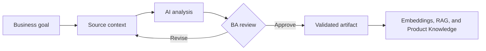

# Embeddings, RAG, and Product Knowledge

<div class="lesson-meta">
  <span>AI Foundations for Business Analysts</span>
  <span>Software BA</span>
  <span>Core</span>
</div>

## Learning outcomes

- Explain embeddings, rag, and product knowledge in business language.
- Apply the concept to a realistic BA workflow.
- Use AI output as draft evidence, not as unchecked truth.
- Identify the review questions a BA must ask before sharing the artifact.

## Why this matters for BA work

AI changes how analysis work is produced, but it does not remove the BA's accountability for clarity, evidence, and decisions.

<div class="ba-callout">
Understand how RAG retrieves knowledge and why retrieval quality matters more than chatbot polish.
</div>

## Core concept

The useful BA pattern is controlled collaboration: provide the model with business context, ask for structured output, require evidence, then review the result against goals, rules, risks, and stakeholder decisions.

## Practical BA example

A support chatbot gives wrong refund guidance because old policy pages are indexed with new pages. The BA should specify freshness, authority, source ranking, conflict handling, and answer citation requirements.

## Diagram



## BA workflow

1. Frame the business question before opening the AI tool.
2. Provide source context and explicit constraints.
3. Ask for structured output that maps back to the source.
4. Run a critique pass for ambiguity, gaps, risk, and testability.
5. Convert the result into an artifact the team can inspect and own.

## Prompt or template

```text
Define the knowledge contract for this RAG feature: source systems, freshness, access control, citation rules, conflict resolution, fallback answer, and quality metrics.
```

## What a BA should remember

- AI is a reasoning accelerator, not a decision owner.
- Ground every important claim in source context or stakeholder confirmation.
- A good BA keeps the review loop visible: draft, critique, revise, validate.
