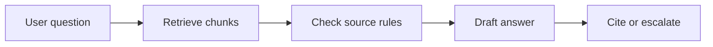
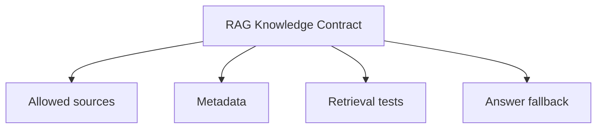

# Embeddings, RAG, and Knowledge

<div class="lesson-meta">
  <span>AI Foundations for Business Analysts</span>
  <span>Software BA</span>
  <span>Core</span>
</div>

## Story mode: project walkthrough

<div class="story-mode-panel">
  <p class="story-eyebrow">Story prototype</p>
  <h3>The policy assistant that found the wrong policy faster</h3>
  <p class="story-intro">A team builds a policy assistant for internal support. The demo is fast, but it retrieves an outdated travel policy because no one defined source authority.</p>
  <div class="story-scene-grid">
<article class="story-scene">
  <span>Scene 1</span>
  <b>01</b>
  <strong>The demo impresses the room</strong>
  <p>The assistant answers in seconds and cites a document that looks relevant.</p>
</article>
<article class="story-scene">
  <span>Scene 2</span>
  <b>02</b>
  <strong>The answer is from the wrong library</strong>
  <p>Maya notices the cited policy was archived six months ago.</p>
</article>
<article class="story-scene">
  <span>Scene 3</span>
  <b>03</b>
  <strong>Knowledge becomes a requirement</strong>
  <p>She writes rules for allowed sources, chunk ownership, freshness, and fallback.</p>
</article>
<article class="story-scene">
  <span>Scene 4</span>
  <b>04</b>
  <strong>The assistant gets safer</strong>
  <p>The next demo refuses stale sources and asks for human review when confidence is low.</p>
</article>
  </div>
  <div class="visual-takeaway-strip">
<span>RAG needs source governance</span>
<span>Retrieval is not approval</span>
<span>Fallback is part of the answer</span>
  </div>
</div>

## AI words in plain English

| AI term | Simple meaning | BA use |
| --- | --- | --- |
| Embedding | A numeric representation of text meaning. | It helps the system find related content, but it does not prove the content is correct. |
| Vector search | Search by meaning instead of exact keywords. | Use it for policies, FAQs, and knowledge bases with varied wording. |
| RAG | Retrieval-Augmented Generation: retrieve documents, then generate an answer from them. | Specify sources, citation rules, and what to do when retrieval is weak. |
| Chunk | A small piece of a document used for retrieval. | Define chunk size, owner, date, and section metadata. |

## Reality check: how this shows up in projects

<div class="fact-card-grid">
<article class="fact-card">
  <strong>Search returns something, not always the right thing</strong>
  <span>Define source authority before testing answer quality.</span>
  <p>A semantically similar document can still be outdated or unauthorized.</p>
</article>
<article class="fact-card">
  <strong>Citation can create false comfort</strong>
  <span>Review citation relevance, not only citation presence.</span>
  <p>A cited answer may cite the wrong section.</p>
</article>
<article class="fact-card">
  <strong>Knowledge changes over time</strong>
  <span>Add freshness and ownership fields to the knowledge contract.</span>
  <p>Policies, product limits, and SOPs expire.</p>
</article>
</div>

## Visual walkthrough



## Visual decision map

<div class="visual-ba-map">
  <h3>RAG Knowledge Contract: what the BA should look for</h3>
<div>
  <strong>Knowledge scope</strong>
  <span>Which documents are allowed.</span>
  <em>Exclude drafts, archives, and personal notes.</em>
</div>
<div>
  <strong>Retrieval quality</strong>
  <span>Which source chunks are returned.</span>
  <em>Check relevance, freshness, and coverage.</em>
</div>
<div>
  <strong>Answer behavior</strong>
  <span>What the assistant says when evidence is weak.</span>
  <em>Use refusal, escalation, or clarification.</em>
</div>
</div>

## Learning outcomes

- Explain RAG without technical overload.
- Write requirements for knowledge sources and retrieval behavior.
- Define fallback rules for weak or conflicting evidence.

## Why this matters for BA work

<div class="ba-callout">
RAG is useful only when the BA defines trusted knowledge, retrieval boundaries, and answer behavior.
</div>

This lesson matters because many teams say they want a chatbot when the real need is trusted knowledge access. The BA must define the knowledge contract: what sources are allowed, how freshness is checked, how citations are reviewed, and when the assistant should refuse to answer.

## Common difficulties for BAs

| Difficulty | Why it is hard in BA work | How a BA handles it |
| --- | --- | --- |
| Stakeholders think RAG means the assistant knows company policy. | RAG only retrieves from the sources and setup it receives. | Define allowed sources, excluded sources, metadata, and review ownership. |
| Citations look convincing. | A citation may point to a related paragraph that does not answer the question. | Test citation relevance with real user questions and edge cases. |
| Documents are messy. | Duplicate, archived, and conflicting files reduce answer quality. | Create a knowledge cleanup backlog before promising automation. |

## Where this applies in real projects

| Project moment | BA move | Concrete output |
| --- | --- | --- |
| Internal policy assistant | Define source authority and fallback for missing policy. | RAG Knowledge Contract. |
| Support knowledge base | Map user questions to approved answer sources. | Question-source coverage matrix. |
| Vendor evaluation | Ask vendors how they handle stale, conflicting, and restricted documents. | RAG evaluation checklist. |

## If this is missing

If RAG requirements are missing, the assistant may answer quickly from the wrong knowledge.

| If missing | Project impact | Recovery action |
| --- | --- | --- |
| No source authority | The assistant may retrieve archived or draft content. | Create an allowed-source register. |
| No citation review | Users trust answers that cite irrelevant sections. | Add citation relevance tests. |
| No fallback behavior | The assistant guesses when evidence is weak. | Define refusal and human handoff rules. |

## Mental model or core concept

RAG is not magic memory. It is a controlled pattern: retrieve trusted context, generate an answer, and show enough evidence for review.

## Practical BA example

For HR policy questions, Maya defines that only approved HR portal articles are allowed. If two articles conflict, the assistant must show both and route to HR instead of choosing one.

## Diagram



## BA artifact

### RAG Knowledge Contract

| Artifact line | What the BA writes | Ready signal | Risk signal |
| --- | --- | --- | --- |
| Source scope | Approved libraries, excluded content, owner. | Only trusted sources are indexed. | Archives appear in answers. |
| Metadata | Date, version, department, confidentiality. | Freshness can be filtered. | Old and new rules mix. |
| Question coverage | Representative user questions and expected source. | Retrieval is testable. | Demo uses only easy questions. |
| Fallback | Clarify, refuse, or hand off. | Weak evidence has a safe path. | Assistant fills gaps. |

## AI expert note

A strong RAG requirement treats knowledge as product behavior, not just data ingestion. The expert BA asks how sources are governed, how retrieval is evaluated, and how the assistant behaves when evidence is absent, stale, restricted, or contradictory.

## Bad vs better example

| Weak pattern | Why it fails | Better BA pattern |
| --- | --- | --- |
| Upload all documents and test with three friendly questions. | The system may pass the demo and fail real usage. | Create a question-source coverage test set. |
| Assume citation means correctness. | The citation may not support the answer. | Review whether the cited passage actually answers the question. |
| Ignore restricted content. | Users may see information they should not access. | Add access control and source filtering requirements. |

## Stakeholder questions to ask

| Stakeholder | Question | Why the BA asks |
| --- | --- | --- |
| Product owner | Which outcome should Embeddings, RAG, and Knowledge improve first? | Keeps AI work tied to business value. |
| Engineering lead | Which source, system, or constraint could make RAG Knowledge Contract hard to implement? | Turns hidden technical constraints into requirement questions. |
| QA lead | Which behavior must be testable before we trust this artifact? | Converts fluent AI text into observable checks. |
| Operations or support | What failure path creates manual work after release? | Surfaces support load and fallback needs. |

## Decision log entries

| Decision item | Options to capture | Owner | Evidence needed |
| --- | --- | --- | --- |
| Scope boundary for RAG Knowledge Contract | Must-have, later, out of scope | Product owner | Business outcome and release constraint |
| Authority for Allowed sources and Metadata | Documented source, stakeholder decision, assumption to validate | BA + accountable stakeholder | Source ID, date, and approval status |
| Review gate before handoff | Peer review, QA review, engineering review, formal approval | BA lead or project lead | Risk level and receiving-team readiness |
| Recovery if Calling every knowledge problem a chatbot. | Rewrite, defer, escalate, or run validation workshop | Decision owner | Impact on scope, testability, and release risk |

## Definition of Ready / Done

| Gate | Ready signal | Done signal |
| --- | --- | --- |
| Definition of Ready | Sources for Allowed sources are named. | RAG Knowledge Contract can be reviewed without guessing context. |
| Definition of Ready | Open assumptions have owners and validation paths. | Stakeholders can accept, reject, or defer each assumption. |
| Definition of Done | The artifact applies this principle: RAG is useful only when the BA defines trusted knowledge, retrieval boundaries, and answer behavior. | Delivery, QA, or governance teams can act on it. |
| Definition of Done | The weak pattern "Upload all documents and test with three friendly questions." has been checked. | No unsupported AI claim is treated as approved scope. |

## Before and after artifact example

| Before | AI draft risk | Senior BA revision |
| --- | --- | --- |
| Prompt: "Create RAG Knowledge Contract." | The model may invent source facts, owners, or thresholds. | Add sources, scope boundary, output schema, and review criteria. |
| Draft statement: "Define source authority and fallback for missing policy." | Useful, but not tied to owner or acceptance signal. | Rewrite as a project step with owner, expected artifact, and review gate. |
| Final-looking paragraph | Tone may hide uncertainty or missing stakeholder approval. | Convert into fact, assumption, decision needed, risk, and validation question. |

## Manual verification after AI output

| Verification lens | Manual check | Pass signal |
| --- | --- | --- |
| Evidence | Trace important statements in RAG Knowledge Contract to a source, decision, or labeled assumption. | No unsupported claim remains hidden. |
| Completeness | Check Allowed sources, Metadata, Retrieval tests, Answer fallback against the intended audience. | Product, Engineering, QA, and Operations have what they need. |
| Testability | Ask whether QA can create positive, negative, boundary, and exception scenarios. | Ambiguous wording is rewritten or logged as a question. |
| Accountability | Confirm who approves, who reviews, and who acts when output is wrong. | Owners and escalation path are explicit. |

## AI collaboration prompt

```text
Design a RAG knowledge contract for this assistant. Include allowed sources, excluded sources, metadata, freshness rule, access rule, sample questions, citation behavior, and fallback when evidence is weak or conflicting.
```

## Mistakes to avoid

- Calling every knowledge problem a chatbot.
- Indexing documents before defining source authority.
- Testing only happy-path questions.

## Apply this tomorrow

1. Pick one knowledge assistant idea and list allowed sources.
2. Write five real user questions and expected source IDs.
3. Define the answer when no trusted source is found.

## What a BA should remember

- RAG quality starts with knowledge quality.
- Citation presence is not enough.
- Fallback is part of the requirement.
