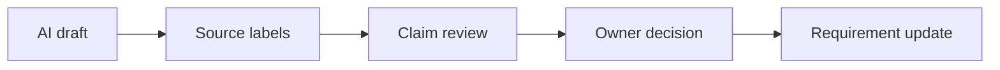
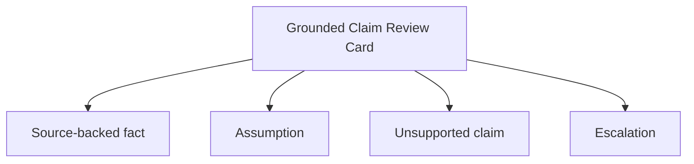

# Hallucination and Source Grounding

<div class="lesson-meta">
  <span>AI Foundations for Business Analysts</span>
  <span>Software BA</span>
  <span>Core</span>
</div>

## Story mode: project walkthrough

<div class="story-mode-panel">
  <p class="story-eyebrow">Story prototype</p>
  <h3>Maya catches a confident answer before it becomes scope</h3>
  <p class="story-intro">During a support portal redesign, AI writes a clean refund policy answer. It sounds complete, but Maya notices that the answer mixes an old policy with a new exception rule.</p>
  <div class="story-scene-grid">
<article class="story-scene">
  <span>Scene 1</span>
  <b>01</b>
  <strong>The answer sounds official</strong>
  <p>The model states that refunds are always processed within three days. Everyone likes the clarity.</p>
</article>
<article class="story-scene">
  <span>Scene 2</span>
  <b>02</b>
  <strong>The source trail is weak</strong>
  <p>Maya asks which document supports the rule. The model cannot point to a current approved source.</p>
</article>
<article class="story-scene">
  <span>Scene 3</span>
  <b>03</b>
  <strong>The rule gets grounded</strong>
  <p>She gives policy IDs, effective dates, and the instruction to mark unsupported claims.</p>
</article>
<article class="story-scene">
  <span>Scene 4</span>
  <b>04</b>
  <strong>The backlog changes</strong>
  <p>The final artifact separates source-backed rules, open policy questions, and decisions for Product.</p>
</article>
  </div>
  <div class="visual-takeaway-strip">
<span>Fluent is not factual</span>
<span>Source IDs protect scope</span>
<span>Unsupported claims become questions</span>
  </div>
</div>

## AI words in plain English

| AI term | Simple meaning | BA use |
| --- | --- | --- |
| Hallucination | An AI answer that sounds plausible but is wrong or unsupported. | Flag it before it reaches a requirement, demo, or stakeholder email. |
| Grounding | Connecting each important statement to a trusted source. | Ask AI to include source IDs, document sections, or decision records. |
| Citation | A pointer to where the answer came from. | Use it as a review aid, then manually check high-risk claims. |
| Unsupported claim | A statement with no source or owner. | Move it to questions, not scope. |

## Reality check: how this shows up in projects

<div class="fact-card-grid">
<article class="fact-card">
  <strong>Confident wording</strong>
  <span>Ask for source-backed, assumed, and unsupported sections.</span>
  <p>AI may write policy language with more certainty than the evidence deserves.</p>
</article>
<article class="fact-card">
  <strong>Mixed document versions</strong>
  <span>Label source date, owner, and approval status.</span>
  <p>Old PDFs and new meeting notes can be blended into one smooth answer.</p>
</article>
<article class="fact-card">
  <strong>Fast stakeholder reuse</strong>
  <span>Block final use until evidence is checked.</span>
  <p>A polished answer is easy to paste into Jira or email.</p>
</article>
</div>

## Visual walkthrough



## Visual decision map

<div class="visual-ba-map">
  <h3>Grounded Claim Review Card: what the BA should look for</h3>
<div>
  <strong>Fact</strong>
  <span>Supported by a current source or approved decision.</span>
  <em>Keep it and preserve the source ID.</em>
</div>
<div>
  <strong>Assumption</strong>
  <span>Reasonable but not approved.</span>
  <em>Assign an owner and validation question.</em>
</div>
<div>
  <strong>Hallucination risk</strong>
  <span>Useful-sounding but unsupported.</span>
  <em>Remove from requirement scope until verified.</em>
</div>
</div>

## Learning outcomes

- Separate facts, assumptions, and unsupported AI claims.
- Design prompts that require source grounding.
- Create review gates for high-risk AI text.

## Why this matters for BA work

<div class="ba-callout">
AI can sound certain while being wrong; BAs need source-grounded outputs before requirements move forward.
</div>

This lesson matters because BA artifacts travel quickly. A wrong policy sentence can become an acceptance criterion, release note, support script, or vendor assumption. Grounding keeps AI useful while making evidence visible enough for Product, QA, Engineering, and Operations to review.

## Common difficulties for BAs

| Difficulty | Why it is hard in BA work | How a BA handles it |
| --- | --- | --- |
| The answer is written in a professional tone. | Stakeholders may trust style more than evidence when the output is clear and well formatted. | Ask AI to label every important statement as source-backed, assumed, or unsupported. |
| Sources are scattered across old and new documents. | The model can merge stale rules with current decisions without warning. | Give each source an ID, date, owner, and status before asking for analysis. |
| The team wants speed. | Review feels like slowing down even though it prevents rework. | Use a short grounding checklist so only high-impact claims need deep checking. |

## Where this applies in real projects

| Project moment | BA move | Concrete output |
| --- | --- | --- |
| Policy requirement review | Check that each rule links to a current policy or decision. | Grounded requirement table with source ID and owner. |
| Stakeholder summary | Mark what is fact, assumption, and open question. | Summary that can be safely reviewed in a meeting. |
| AI assistant design | Define what the assistant may answer without escalation. | Answer boundary and fallback rule. |

## If this is missing

If grounding is missing, the project may accept confident text that nobody actually approved.

| If missing | Project impact | Recovery action |
| --- | --- | --- |
| AI writes a rule without evidence | QA may test the wrong behavior. | Move the statement to an open question and attach the required source. |
| Old and new policies are blended | Users receive inconsistent answers after release. | Run a source freshness review before sign-off. |
| No owner approves risky statements | Accountability becomes unclear when the answer is challenged. | Add owner, review gate, and escalation path. |

## Mental model or core concept

Treat every AI answer as a draft with a source trail. The BA does not need to distrust AI; the BA needs to make evidence visible.

## Practical BA example

For a refund flow, AI says premium customers can bypass manager approval. Maya checks the source and finds that only enterprise customers have that rule. She updates the requirement and adds a validation question for pricing tiers.

## Diagram



## BA artifact

### Grounded Claim Review Card

| Artifact line | What the BA writes | Ready signal | Risk signal |
| --- | --- | --- | --- |
| Claim | One policy, rule, or decision statement. | Statement is specific and testable. | Broad claim with no source. |
| Source | Document ID, section, date, owner. | Reviewer can open the evidence. | Source is missing or stale. |
| Status | Fact, assumption, unsupported, or conflict. | Status is visible before approval. | Everything looks final. |
| Next action | Approve, revise, ask, or remove. | Owner and due date are clear. | No one owns the risk. |

## AI expert note

As an AI reviewer, I would focus less on whether the wording is elegant and more on whether each material claim has traceable evidence. Grounded output lets AI speed up drafting without turning the model into an invisible decision maker.

## Bad vs better example

| Weak pattern | Why it fails | Better BA pattern |
| --- | --- | --- |
| Paste AI policy wording directly into Jira. | The requirement may contain invented or stale rules. | Require source ID and approval status for each rule. |
| Ask AI if it is confident. | Model confidence is not business evidence. | Ask for evidence, assumptions, and missing sources. |
| Review only the final paragraph. | The risky claim may be hidden in a neat summary. | Review claims one by one when impact is high. |

## Stakeholder questions to ask

| Stakeholder | Question | Why the BA asks |
| --- | --- | --- |
| Product owner | Which outcome should Hallucination and Source Grounding improve first? | Keeps AI work tied to business value. |
| Engineering lead | Which source, system, or constraint could make Grounded Claim Review Card hard to implement? | Turns hidden technical constraints into requirement questions. |
| QA lead | Which behavior must be testable before we trust this artifact? | Converts fluent AI text into observable checks. |
| Operations or support | What failure path creates manual work after release? | Surfaces support load and fallback needs. |

## Decision log entries

| Decision item | Options to capture | Owner | Evidence needed |
| --- | --- | --- | --- |
| Scope boundary for Grounded Claim Review Card | Must-have, later, out of scope | Product owner | Business outcome and release constraint |
| Authority for Source-backed fact and Assumption | Documented source, stakeholder decision, assumption to validate | BA + accountable stakeholder | Source ID, date, and approval status |
| Review gate before handoff | Peer review, QA review, engineering review, formal approval | BA lead or project lead | Risk level and receiving-team readiness |
| Recovery if Trusting a polished paragraph without source review. | Rewrite, defer, escalate, or run validation workshop | Decision owner | Impact on scope, testability, and release risk |

## Definition of Ready / Done

| Gate | Ready signal | Done signal |
| --- | --- | --- |
| Definition of Ready | Sources for Source-backed fact are named. | Grounded Claim Review Card can be reviewed without guessing context. |
| Definition of Ready | Open assumptions have owners and validation paths. | Stakeholders can accept, reject, or defer each assumption. |
| Definition of Done | The artifact applies this principle: AI can sound certain while being wrong; BAs need source-grounded outputs before requirements move forward. | Delivery, QA, or governance teams can act on it. |
| Definition of Done | The weak pattern "Paste AI policy wording directly into Jira." has been checked. | No unsupported AI claim is treated as approved scope. |

## Before and after artifact example

| Before | AI draft risk | Senior BA revision |
| --- | --- | --- |
| Prompt: "Create Grounded Claim Review Card." | The model may invent source facts, owners, or thresholds. | Add sources, scope boundary, output schema, and review criteria. |
| Draft statement: "Check that each rule links to a current policy or decision." | Useful, but not tied to owner or acceptance signal. | Rewrite as a project step with owner, expected artifact, and review gate. |
| Final-looking paragraph | Tone may hide uncertainty or missing stakeholder approval. | Convert into fact, assumption, decision needed, risk, and validation question. |

## Manual verification after AI output

| Verification lens | Manual check | Pass signal |
| --- | --- | --- |
| Evidence | Trace important statements in Grounded Claim Review Card to a source, decision, or labeled assumption. | No unsupported claim remains hidden. |
| Completeness | Check Source-backed fact, Assumption, Unsupported claim, Escalation against the intended audience. | Product, Engineering, QA, and Operations have what they need. |
| Testability | Ask whether QA can create positive, negative, boundary, and exception scenarios. | Ambiguous wording is rewritten or logged as a question. |
| Accountability | Confirm who approves, who reviews, and who acts when output is wrong. | Owners and escalation path are explicit. |

## AI collaboration prompt

```text
Review the draft below. Create a table with Claim, Source ID, Evidence, Assumption, Unsupported Claim, Risk, and Question for Owner. Do not treat any claim as fact unless it appears in the supplied sources.
```

## Mistakes to avoid

- Trusting a polished paragraph without source review.
- Mixing draft notes and approved policy.
- Letting unsupported claims enter acceptance criteria.

## Apply this tomorrow

1. Take one AI-generated summary and mark facts, assumptions, and unsupported claims.
2. Add source IDs to one requirement table.
3. Ask AI to list what it cannot verify.

## What a BA should remember

- Fluent text still needs evidence.
- Grounding is a BA quality control.
- Unsupported claims belong in questions, not scope.
