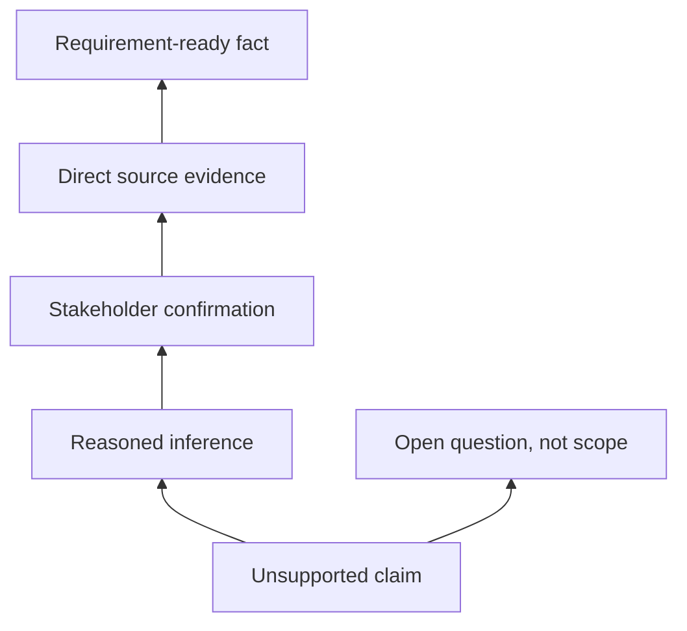

# Hallucination and Source Grounding

<div class="lesson-meta">
  <span>AI Foundations for Business Analysts</span>
  <span>Software BA</span>
  <span>Core</span>
</div>

## Learning outcomes

- Recognize common hallucination patterns.
- Require evidence, citations, and unsupported-claim labels.
- Design review gates before AI output enters delivery artifacts.

## Why this matters for BA work

<div class="ba-callout">
A BA must design evidence discipline into AI work so plausible text does not become false requirements.
</div>

This lesson matters because a hallucinated sentence can become a requirement, a test case, a vendor score, or an estimate if nobody challenges it early. BA work turns language into commitment. Grounding rules make evidence visible, convert unsupported claims into questions, and prevent confident AI prose from becoming false project certainty.

## Common difficulties for BAs

In real projects, this topic is difficult because the BA must turn messy evidence into decisions without letting AI hide uncertainty. Watch for these friction points before treating the output as ready.

| Difficulty | Why it is hard in BA work | How a BA should handle it |
| --- | --- | --- |
| Accepting confident wording as evidence. | This is hard because Hallucination and Source Grounding is usually applied under deadline pressure, incomplete evidence, and stakeholder disagreement. A fluent AI draft can make the gap less visible. | Use source labels, explicit assumptions, and a named review owner before turning this into backlog, specification, or delivery commitment. |
| Letting AI cite a source that does not actually support the claim. | This is hard because Hallucination and Source Grounding is usually applied under deadline pressure, incomplete evidence, and stakeholder disagreement. A fluent AI draft can make the gap less visible. | Use source labels, explicit assumptions, and a named review owner before turning this into backlog, specification, or delivery commitment. |
| Skipping stakeholder confirmation for inferred rules. | This is hard because Hallucination and Source Grounding is usually applied under deadline pressure, incomplete evidence, and stakeholder disagreement. A fluent AI draft can make the gap less visible. | Use source labels, explicit assumptions, and a named review owner before turning this into backlog, specification, or delivery commitment. |

## Where this applies in real projects

This lesson is useful when the BA needs to move from conversation, policy, design, or technical input into a shared artifact that the team can implement and test.

| Project moment | How to apply this lesson | Concrete BA output |
| --- | --- | --- |
| Discovery | Add an evidence column to one requirement table. | Evidence Ladder: a reviewable artifact that connects the learned concept to decisions, acceptance criteria, risks, or stakeholder alignment. |
| Refinement | Ask AI to mark unsupported claims in an existing draft. | Evidence Ladder: a reviewable artifact that connects the learned concept to decisions, acceptance criteria, risks, or stakeholder alignment. |
| Delivery | Create a list of authoritative sources for one feature. | Evidence Ladder: a reviewable artifact that connects the learned concept to decisions, acceptance criteria, risks, or stakeholder alignment. |

## If this is missing

If this capability is missing, AI may still produce polished text, but the project loses reviewability. The result is usually rework, hidden assumptions, weak acceptance criteria, or business decisions made without enough evidence.

| If missing | Project impact | Recovery action |
| --- | --- | --- |
| Accept a cited claim without opening the source | The citation may be adjacent, outdated, or unrelated to the specific claim. | Recover by using the stronger pattern: Check claim-to-source support and record evidence level in the requirement table. Then re-check the artifact against evidence, testability, ownership, and business impact before sharing it. |
| Rewrite unsupported AI claims into polished requirements | Better wording makes weak evidence harder to detect. | Recover by using the stronger pattern: Move unsupported claims into open questions with owner and validation method. Then re-check the artifact against evidence, testability, ownership, and business impact before sharing it. |
| Use the same evidence threshold for all requirements | Low-risk copy and regulated decisions need different controls. | Recover by using the stronger pattern: Define evidence levels by risk tier and business impact. Then re-check the artifact against evidence, testability, ownership, and business impact before sharing it. |

## Mental model or core concept

Hallucination is not only a model problem; it is a process problem. If a team accepts AI output without evidence rules, unsupported claims become scope, estimates, and test cases. Grounding means every important statement is tied to a source, stakeholder confirmation, or clearly labeled assumption.

## Practical BA example

During vendor evaluation, AI says Tool A supports real-time audit export. The vendor page never says that. A BA using grounding rules marks the claim unsupported, asks the vendor directly, and prevents a false requirement from entering the selection scorecard.

## Diagram



## BA artifact

### Evidence Ladder

| Evidence level | Use in BA artifact? | Required label | Example |
| --- | --- | --- | --- |
| Direct source | Yes | Source-backed fact | Policy page states 24-hour SLA. |
| Stakeholder confirmation | Yes | Confirmed decision | Ops manager approves manual override. |
| Reasoned inference | Maybe | Assumption to validate | High-risk cases likely need audit. |
| No support | No | Unsupported claim | Vendor capability not documented. |

## AI expert note

The practical control is not simply asking AI to cite sources. The BA must verify that the cited source actually supports the claim, decide which evidence level is acceptable, and require fallback when support is weak. For high-impact requirements, grounding should be part of the artifact format, not an optional review note.

## Bad vs better example

| Weak pattern | Why it fails | Stronger BA pattern |
| --- | --- | --- |
| Accept a cited claim without opening the source | The citation may be adjacent, outdated, or unrelated to the specific claim. | Check claim-to-source support and record evidence level in the requirement table. |
| Rewrite unsupported AI claims into polished requirements | Better wording makes weak evidence harder to detect. | Move unsupported claims into open questions with owner and validation method. |
| Use the same evidence threshold for all requirements | Low-risk copy and regulated decisions need different controls. | Define evidence levels by risk tier and business impact. |

## AI collaboration prompt

```text
Review this answer against the provided sources. Return a table with claim, evidence level, source ID, confidence, unsupported parts, and validation question. Do not rewrite unsupported claims as facts.
```

## Mistakes to avoid

- Accepting confident wording as evidence.
- Letting AI cite a source that does not actually support the claim.
- Skipping stakeholder confirmation for inferred rules.
- Not labeling assumptions in BRD or user stories.

## Apply this tomorrow

1. Add an evidence column to one requirement table.
2. Ask AI to mark unsupported claims in an existing draft.
3. Create a list of authoritative sources for one feature.
4. Use the phrase 'not supported by provided sources' in review prompts.

## What a BA should remember

- Grounding protects the team from false clarity.
- Unsupported claims should become questions, not requirements.
- Citation quality matters more than answer fluency.
