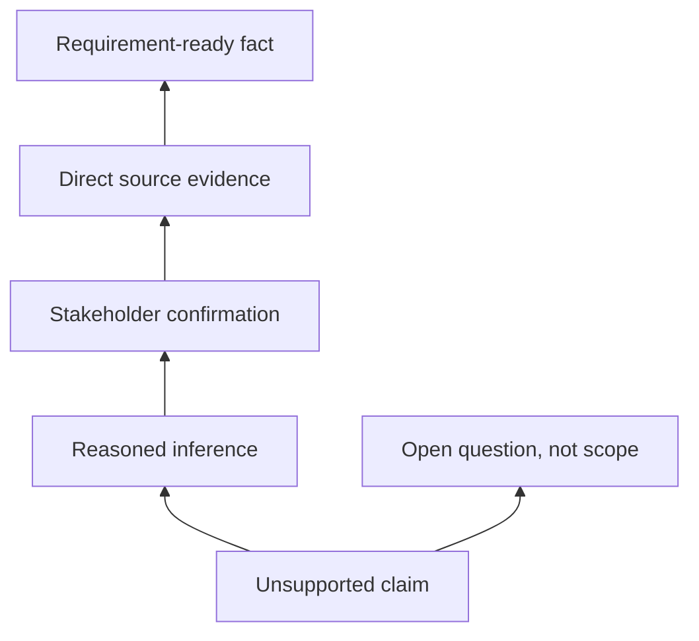

# Hallucination and Source Grounding

<div class="lesson-meta">
  <span>AI Foundations for Business Analysts</span>
  <span>Software BA</span>
  <span>Core</span>
</div>

## Learning outcomes

- Recognize common hallucination patterns.
- Require evidence, citations, and unsupported-claim labels.
- Design review gates before AI output enters delivery artifacts.

## Why this matters for BA work

<div class="ba-callout">
A BA must design evidence discipline into AI work so plausible text does not become false requirements.
</div>

Business Analysts sit between problem framing, stakeholder meaning, delivery constraints, and product decisions. In AI work, that position becomes more important because unclear language can create false certainty quickly. This lesson gives you a practical control you can apply before AI output becomes scope, backlog, or delivery commitment.

## Mental model or core concept

Hallucination is not only a model problem; it is a process problem. If a team accepts AI output without evidence rules, unsupported claims become scope, estimates, and test cases. Grounding means every important statement is tied to a source, stakeholder confirmation, or clearly labeled assumption.

## Practical BA example

During vendor evaluation, AI says Tool A supports real-time audit export. The vendor page never says that. A BA using grounding rules marks the claim unsupported, asks the vendor directly, and prevents a false requirement from entering the selection scorecard.

## Diagram



## BA artifact

### Evidence Ladder

| Evidence level | Use in BA artifact? | Required label | Example |
| --- | --- | --- | --- |
| Direct source | Yes | Source-backed fact | Policy page states 24-hour SLA. |
| Stakeholder confirmation | Yes | Confirmed decision | Ops manager approves manual override. |
| Reasoned inference | Maybe | Assumption to validate | High-risk cases likely need audit. |
| No support | No | Unsupported claim | Vendor capability not documented. |

## AI collaboration prompt

```text
Review this answer against the provided sources. Return a table with claim, evidence level, source ID, confidence, unsupported parts, and validation question. Do not rewrite unsupported claims as facts.
```

## Mistakes to avoid

- Accepting confident wording as evidence.
- Letting AI cite a source that does not actually support the claim.
- Skipping stakeholder confirmation for inferred rules.
- Not labeling assumptions in BRD or user stories.

## Apply this tomorrow

1. Add an evidence column to one requirement table.
2. Ask AI to mark unsupported claims in an existing draft.
3. Create a list of authoritative sources for one feature.
4. Use the phrase 'not supported by provided sources' in review prompts.

## What a BA should remember

- Grounding protects the team from false clarity.
- Unsupported claims should become questions, not requirements.
- Citation quality matters more than answer fluency.
