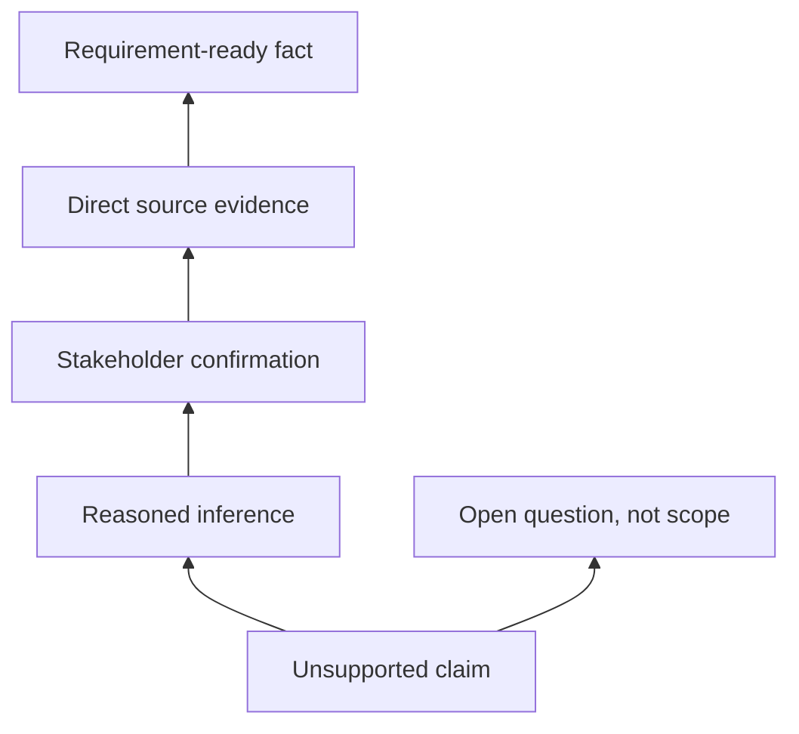

# Hallucination and Source Grounding

<div class="lesson-meta">
  <span>AI Foundations for Business Analysts</span>
  <span>Software BA</span>
  <span>Core</span>
</div>

## Learning outcomes

- Recognize common hallucination patterns.
- Require evidence, citations, and unsupported-claim labels.
- Design review gates before AI output enters delivery artifacts.

## Why this matters for BA work

<div class="ba-callout">
A BA must design evidence discipline into AI work so plausible text does not become false requirements.
</div>

This lesson matters because a hallucinated sentence can become a requirement, a test case, a vendor score, or an estimate if nobody challenges it early. BA work turns language into commitment. Grounding rules make evidence visible, convert unsupported claims into questions, and prevent confident AI prose from becoming false project certainty.

## Common difficulties for BAs

In AI Foundations for Business Analysts, Hallucination and Source Grounding becomes difficult when stakeholders expect a simple AI answer while the actual issue depends on model capability, data readiness, tool boundaries, and business decision risk. A BA should inspect the points below before treating an AI-supported artifact as ready for stakeholder decision or delivery handoff.

| Difficulty | Why it is hard in BA work | How a BA should handle it |
| --- | --- | --- |
| Accepting confident wording as evidence. | The mistake "Accepting confident wording as evidence." appears when the team discusses problem fit, model boundary, data dependency, and decision risk without agreeing which source is authoritative. AI can smooth over the disagreement, so the BA must keep uncertainty visible. | Apply this control: ask the model to compare AI and non-AI options before drafting requirements. Then use the stronger pattern "Check claim-to-source support and record evidence level in the requirement table." and ask who must approve the artifact before it affects scope, build, test, or release. |
| Letting AI cite a source that does not actually support the claim. | For Hallucination and Source Grounding, the friction is that A BA must design evidence discipline into AI work so plausible text does not become false requirements. The weak pattern is tempting because AI can produce a fluent answer before the BA has checked ownership, source freshness, or decision rights. | Apply this control: ask the model to compare AI and non-AI options before drafting requirements. Then use the stronger pattern "Move unsupported claims into open questions with owner and validation method." and ask who must approve the artifact before it affects scope, build, test, or release. |
| Skipping stakeholder confirmation for inferred rules. | This becomes hard when Evidence Ladder is expected to support the solution-shape decision. If the BA does not challenge the draft, unsupported assumptions may enter planning, testing, or stakeholder communication. | Apply this control: ask the model to compare AI and non-AI options before drafting requirements. Then use the stronger pattern "Define evidence levels by risk tier and business impact." and ask who must approve the artifact before it affects scope, build, test, or release. |

## Where this applies in real projects

Use this lesson when an AI idea first enters discovery, vendor discussion, roadmap planning, or feasibility analysis. The practical output is not a longer document; it is Evidence Ladder with enough evidence, ownership, and decision clarity for the next project conversation.

| Project moment | How to apply this lesson | Concrete BA output |
| --- | --- | --- |
| Idea intake | Add an evidence column to one requirement table. | Evidence Ladder showing problem fit, model boundary, data dependency, and decision risk, with the action "Add an evidence column to one requirement table." translated into a reviewable decision, requirement, checklist, or question for the next meeting. |
| Feasibility review | Ask AI to mark unsupported claims in an existing draft. | Evidence Ladder showing source evidence, with the action "Ask AI to mark unsupported claims in an existing draft." translated into a reviewable decision, requirement, checklist, or question for the next meeting. |
| Solution framing | Create a list of authoritative sources for one feature. | Evidence Ladder showing decision owner, with the action "Create a list of authoritative sources for one feature." translated into a reviewable decision, requirement, checklist, or question for the next meeting. |

## If this is missing

If Hallucination and Source Grounding is missing, the team may choose a tool before understanding the problem shape, creating expensive automation that does not match the business outcome. The BA can still recover, but only by converting the polished AI draft back into explicit evidence, assumptions, owners, and testable decisions.

| If missing | Project impact | Recovery action |
| --- | --- | --- |
| Accept a cited claim without opening the source | The citation may be adjacent, outdated, or unrelated to the specific claim. | Recover by using the stronger pattern: Check claim-to-source support and record evidence level in the requirement table. Rework Evidence Ladder until it exposes problem fit, model boundary, data dependency, and decision risk, and do not share it as final until evidence, ownership, and validation path are explicit. |
| Rewrite unsupported AI claims into polished requirements | Better wording makes weak evidence harder to detect. | Recover by using the stronger pattern: Move unsupported claims into open questions with owner and validation method. Rework Evidence Ladder until it exposes problem fit, model boundary, data dependency, and decision risk, and do not share it as final until evidence, ownership, and validation path are explicit. |
| Use the same evidence threshold for all requirements | Low-risk copy and regulated decisions need different controls. | Recover by using the stronger pattern: Define evidence levels by risk tier and business impact. Rework Evidence Ladder until it exposes problem fit, model boundary, data dependency, and decision risk, and do not share it as final until evidence, ownership, and validation path are explicit. |

## Mental model or core concept

Hallucination is not only a model problem; it is a process problem. If a team accepts AI output without evidence rules, unsupported claims become scope, estimates, and test cases. Grounding means every important statement is tied to a source, stakeholder confirmation, or clearly labeled assumption.

## Practical BA example

During vendor evaluation, AI says Tool A supports real-time audit export. The vendor page never says that. A BA using grounding rules marks the claim unsupported, asks the vendor directly, and prevents a false requirement from entering the selection scorecard.

## Diagram



## BA artifact

### Evidence Ladder

| Evidence level | Use in BA artifact? | Required label | Example |
| --- | --- | --- | --- |
| Direct source | Yes | Source-backed fact | Policy page states 24-hour SLA. |
| Stakeholder confirmation | Yes | Confirmed decision | Ops manager approves manual override. |
| Reasoned inference | Maybe | Assumption to validate | High-risk cases likely need audit. |
| No support | No | Unsupported claim | Vendor capability not documented. |

## AI expert note

The practical control is not simply asking AI to cite sources. The BA must verify that the cited source actually supports the claim, decide which evidence level is acceptable, and require fallback when support is weak. For high-impact requirements, grounding should be part of the artifact format, not an optional review note.

## Bad vs better example

| Weak pattern | Why it fails | Stronger BA pattern |
| --- | --- | --- |
| Accept a cited claim without opening the source | The citation may be adjacent, outdated, or unrelated to the specific claim. | Check claim-to-source support and record evidence level in the requirement table. |
| Rewrite unsupported AI claims into polished requirements | Better wording makes weak evidence harder to detect. | Move unsupported claims into open questions with owner and validation method. |
| Use the same evidence threshold for all requirements | Low-risk copy and regulated decisions need different controls. | Define evidence levels by risk tier and business impact. |

## Stakeholder questions to ask

| Stakeholder | Question | Why the BA asks it |
| --- | --- | --- |
| Product owner | Which outcome should Hallucination and Source Grounding improve, and what trade-off are you willing to accept? | Prevents AI output from optimizing for a vague goal. |
| Engineering lead | What source, system, data, or constraint would make Evidence Ladder hard to implement? | Turns hidden technical constraints into visible requirement questions. |
| QA lead | Which rule, exception, or user state must be testable before you trust this artifact? | Converts fluent AI wording into observable behavior. |
| Operations or support | What failure path would create manual work if the lesson principle "Grounding protects the team from false clarity" is ignored? | Surfaces support load, exception handling, and operating impact. |

## Decision log entries

| Decision item | Options to capture | Owner | Evidence needed |
| --- | --- | --- | --- |
| Scope boundary for Evidence Ladder | Must-have, later, out of scope | Product owner | Business outcome and release constraint |
| Authority for problem fit, model boundary, data dependency, and decision risk | Documented source, stakeholder decision, assumption to validate | BA + accountable stakeholder | Source ID, date, and approval status |
| Review gate before handoff | Peer review, QA review, engineering review, formal approval | BA lead or project lead | Risk level and receiving-team readiness |
| Recovery if Accepting confident wording as evidence. | Rewrite, defer, escalate, or run validation workshop | Decision owner | Impact on scope, testability, and release risk |

## Definition of Ready / Done

| Gate | Ready signal | Done signal |
| --- | --- | --- |
| Definition of Ready | Sources for problem fit, model boundary, data dependency, and decision risk are labeled and current. | Evidence Ladder can be reviewed without guessing missing context. |
| Definition of Ready | Open assumptions have owners and validation paths. | Stakeholders can decide whether to accept, reject, or defer each assumption. |
| Definition of Done | The artifact applies this control: ask the model to compare AI and non-AI options before drafting requirements. | Delivery, QA, or governance teams can act on the artifact. |
| Definition of Done | The weak pattern "Accepting confident wording as evidence." has been explicitly checked. | No unsupported AI claim is treated as an approved requirement. |

## Before and after artifact example

| Before | AI draft risk | Senior BA revision |
| --- | --- | --- |
| Prompt: "Create Evidence Ladder for Hallucination and Source Grounding." | The model may invent source facts, owners, thresholds, or implementation rules. | Add sources, scope boundary, source authority, output schema, and the instruction: Check claim-to-source support and record evidence level in the requirement table. |
| Draft statement: "Add an evidence column to one requirement table." | Useful action, but not yet tied to a decision owner or acceptance signal. | Rewrite as a project step with owner, expected artifact, review gate, and evidence required before handoff. |
| Final-looking paragraph about solution-shape decision | The tone may hide uncertainty and missing stakeholder approval. | Convert it into a table of fact, assumption, decision needed, risk, and validation question. |

## Manual verification after AI output

| Verification lens | Manual check | Pass signal |
| --- | --- | --- |
| Evidence | Trace every important statement in Evidence Ladder to a source, decision, or labeled assumption. | No unsupported claim remains hidden. |
| Completeness | Check problem fit, model boundary, data dependency, and decision risk against the intended audience and receiving team. | The artifact answers what product, engineering, QA, and operations need. |
| Testability | Ask whether QA can create positive, negative, boundary, and exception scenarios. | Ambiguous wording has been rewritten or logged as a question. |
| Accountability | Confirm who approves, who reviews, and who acts when the artifact is wrong. | Owners and escalation path are explicit. |

## AI collaboration prompt

```text
Review this answer against the provided sources. Return a table with claim, evidence level, source ID, confidence, unsupported parts, and validation question. Do not rewrite unsupported claims as facts.
```

## Mistakes to avoid

- Accepting confident wording as evidence.
- Letting AI cite a source that does not actually support the claim.
- Skipping stakeholder confirmation for inferred rules.
- Not labeling assumptions in BRD or user stories.

## Apply this tomorrow

1. Add an evidence column to one requirement table.
2. Ask AI to mark unsupported claims in an existing draft.
3. Create a list of authoritative sources for one feature.
4. Use the phrase 'not supported by provided sources' in review prompts.

## What a BA should remember

- Grounding protects the team from false clarity.
- Unsupported claims should become questions, not requirements.
- Citation quality matters more than answer fluency.
