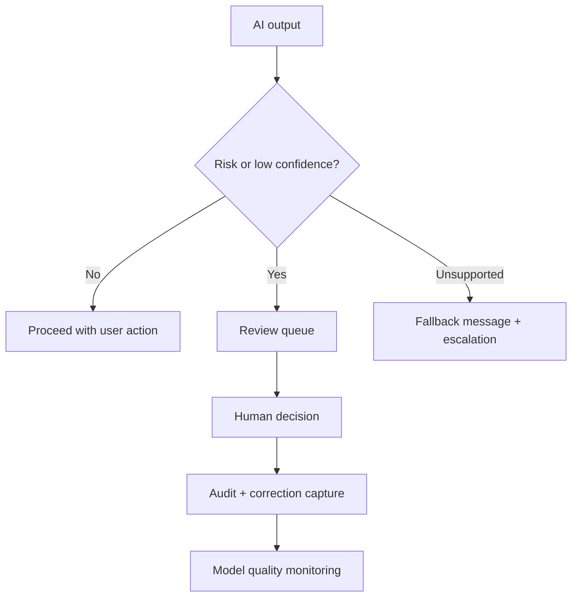

# Human Review, Monitoring, and Fallback

<div class="lesson-meta">
  <span>Building AI-Enabled Products as a BA</span>
  <span>Software BA</span>
  <span>Advanced</span>
</div>

## Learning outcomes

- Design human-in-the-loop workflows.
- Specify fallback and escalation requirements.
- Define monitoring events for AI quality and risk.

## Why this matters for BA work

<div class="ba-callout">
Responsible AI products need explicit paths for uncertainty, escalation, correction, and quality monitoring.
</div>

This lesson matters because human review is often written as a vague safeguard, then fails when operations need a real queue, SLA, decision rights, and audit trail. AI products need designed fallback and monitoring. The BA must specify what happens when confidence is low, risk is high, or evidence is missing.

## Common difficulties for BAs

In real projects, this topic is difficult because the BA must turn messy evidence into decisions without letting AI hide uncertainty. Watch for these friction points before treating the output as ready.

| Difficulty | Why it is hard in BA work | How a BA should handle it |
| --- | --- | --- |
| Writing 'human can review' without workflow details. | This is hard because Human Review, Monitoring, and Fallback is usually applied under deadline pressure, incomplete evidence, and stakeholder disagreement. A fluent AI draft can make the gap less visible. | Use source labels, explicit assumptions, and a named review owner before turning this into backlog, specification, or delivery commitment. |
| No SLA for review queues. | This is hard because Human Review, Monitoring, and Fallback is usually applied under deadline pressure, incomplete evidence, and stakeholder disagreement. A fluent AI draft can make the gap less visible. | Use source labels, explicit assumptions, and a named review owner before turning this into backlog, specification, or delivery commitment. |
| Fallback message hides uncertainty. | This is hard because Human Review, Monitoring, and Fallback is usually applied under deadline pressure, incomplete evidence, and stakeholder disagreement. A fluent AI draft can make the gap less visible. | Use source labels, explicit assumptions, and a named review owner before turning this into backlog, specification, or delivery commitment. |

## Where this applies in real projects

This lesson is useful when the BA needs to move from conversation, policy, design, or technical input into a shared artifact that the team can implement and test.

| Project moment | How to apply this lesson | Concrete BA output |
| --- | --- | --- |
| Discovery | Define one low-confidence trigger. | Human-in-the-Loop Flow Requirements: a reviewable artifact that connects the learned concept to decisions, acceptance criteria, risks, or stakeholder alignment. |
| Refinement | Write a fallback message that is honest and useful. | Human-in-the-Loop Flow Requirements: a reviewable artifact that connects the learned concept to decisions, acceptance criteria, risks, or stakeholder alignment. |
| Delivery | Add reason codes for human override. | Human-in-the-Loop Flow Requirements: a reviewable artifact that connects the learned concept to decisions, acceptance criteria, risks, or stakeholder alignment. |

## If this is missing

If this capability is missing, AI may still produce polished text, but the project loses reviewability. The result is usually rework, hidden assumptions, weak acceptance criteria, or business decisions made without enough evidence.

| If missing | Project impact | Recovery action |
| --- | --- | --- |
| Write that a human can review AI output | There is no trigger, queue, role, SLA, or decision authority. | Recover by using the stronger pattern: Specify review triggers, routing, reviewer actions, SLA, audit record, and owner. Then re-check the artifact against evidence, testability, ownership, and business impact before sharing it. |
| Use fallback messages that sound confident | Users may not understand uncertainty or the next safe action. | Recover by using the stronger pattern: Explain limitation, provide safe next step, and route to support or manual process. Then re-check the artifact against evidence, testability, ownership, and business impact before sharing it. |
| Monitor only uptime and latency | The system can be available while producing low-quality or risky outputs. | Recover by using the stronger pattern: Track override rate, unsupported queries, error categories, drift signals, and review outcomes. Then re-check the artifact against evidence, testability, ownership, and business impact before sharing it. |

## Mental model or core concept

Human-in-the-loop is not a vague promise that a person can intervene. It is a designed workflow: trigger conditions, reviewer role, queue, SLA, decision options, user messaging, audit, correction capture, and monitoring. Fallback should be safe, visible, and measurable.

## Practical BA example

An AI loan document checker flags missing documents. If confidence is high, it suggests next action; if confidence is low or document type is regulated, it routes to a reviewer. The BA specifies queue priority, reason codes, reviewer actions, customer message, and audit trail.

## Diagram



## BA artifact

### Human-in-the-Loop Flow Requirements

| Flow part | Requirement | Example | Metric |
| --- | --- | --- | --- |
| Trigger | Define when human review starts. | Confidence < 0.8 or regulated document. | Trigger accuracy by case type. |
| Reviewer action | List allowed decisions. | Approve, reject, request info, override. | Review completion SLA. |
| Fallback | Define safe response when AI cannot answer. | Show escalation message and create task. | Fallback resolution time. |
| Monitoring | Capture quality and drift signals. | Track overrides by category. | Override rate trend. |

## AI expert note

Human-in-the-loop is an operating workflow, not a slogan. Expert requirements define trigger conditions, reviewer role, allowed actions, escalation, user messaging, correction capture, quality monitoring, and accountability. A fallback is successful when it preserves user trust and business safety, not when it hides that AI failed.

## Bad vs better example

| Weak pattern | Why it fails | Stronger BA pattern |
| --- | --- | --- |
| Write that a human can review AI output | There is no trigger, queue, role, SLA, or decision authority. | Specify review triggers, routing, reviewer actions, SLA, audit record, and owner. |
| Use fallback messages that sound confident | Users may not understand uncertainty or the next safe action. | Explain limitation, provide safe next step, and route to support or manual process. |
| Monitor only uptime and latency | The system can be available while producing low-quality or risky outputs. | Track override rate, unsupported queries, error categories, drift signals, and review outcomes. |

## AI collaboration prompt

```text
Design the human-in-the-loop and fallback requirements. Include triggers, reviewer role, queue priority, SLA, allowed decisions, user messaging, audit record, correction capture, monitoring events, and operational metrics.
```

## Mistakes to avoid

- Writing 'human can review' without workflow details.
- No SLA for review queues.
- Fallback message hides uncertainty.
- Monitoring only uptime, not AI quality.

## Apply this tomorrow

1. Define one low-confidence trigger.
2. Write a fallback message that is honest and useful.
3. Add reason codes for human override.
4. Ask operations who owns the review queue.

## What a BA should remember

- Human review is a workflow requirement.
- Fallback is part of user experience.
- Monitoring must include quality, not only availability.
