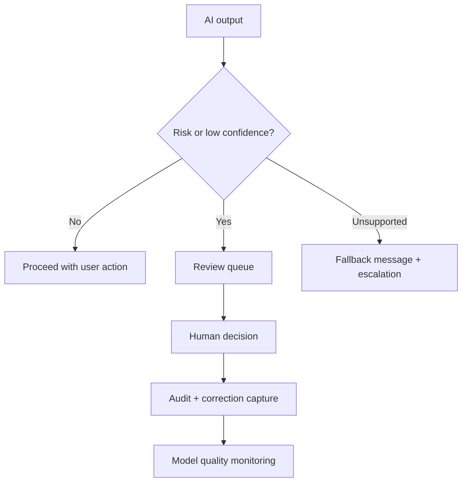

# Human Review, Monitoring, and Fallback

<div class="lesson-meta">
  <span>Building AI-Enabled Products as a BA</span>
  <span>Software BA</span>
  <span>Advanced</span>
</div>

## Learning outcomes

- Design human-in-the-loop workflows.
- Specify fallback and escalation requirements.
- Define monitoring events for AI quality and risk.

## Why this matters for BA work

<div class="ba-callout">
Responsible AI products need explicit paths for uncertainty, escalation, correction, and quality monitoring.
</div>

This lesson matters because human review is often written as a vague safeguard, then fails when operations need a real queue, SLA, decision rights, and audit trail. AI products need designed fallback and monitoring. The BA must specify what happens when confidence is low, risk is high, or evidence is missing.

## Common difficulties for BAs

In Building AI-Enabled Products as a BA, Human Review, Monitoring, and Fallback becomes difficult when AI product behavior contains uncertainty, safety boundaries, evaluation design, fallback, monitoring, and user trust concerns. A BA should inspect the points below before treating an AI-supported artifact as ready for stakeholder decision or delivery handoff.

| Difficulty | Why it is hard in BA work | How a BA should handle it |
| --- | --- | --- |
| Writing 'human can review' without workflow details. | The mistake "Writing 'human can review' without workflow details." appears when the team discusses AI task boundary, evaluation set, human review, fallback, telemetry, and harm controls without agreeing which source is authoritative. AI can smooth over the disagreement, so the BA must keep uncertainty visible. | Apply this control: make confidence, refusal, escalation, correction capture, and monitoring part of the requirement. Then use the stronger pattern "Specify review triggers, routing, reviewer actions, SLA, audit record, and owner." and ask who must approve the artifact before it affects scope, build, test, or release. |
| No SLA for review queues. | For Human Review, Monitoring, and Fallback, the friction is that Responsible AI products need explicit paths for uncertainty, escalation, correction, and quality monitoring. The weak pattern is tempting because AI can produce a fluent answer before the BA has checked ownership, source freshness, or decision rights. | Apply this control: make confidence, refusal, escalation, correction capture, and monitoring part of the requirement. Then use the stronger pattern "Explain limitation, provide safe next step, and route to support or manual process." and ask who must approve the artifact before it affects scope, build, test, or release. |
| Fallback message hides uncertainty. | This becomes hard when Human-in-the-Loop Flow Requirements is expected to support the AI feature operating contract. If the BA does not challenge the draft, unsupported assumptions may enter planning, testing, or stakeholder communication. | Apply this control: make confidence, refusal, escalation, correction capture, and monitoring part of the requirement. Then use the stronger pattern "Track override rate, unsupported queries, error categories, drift signals, and review outcomes." and ask who must approve the artifact before it affects scope, build, test, or release. |

## Where this applies in real projects

Use this lesson when the BA is specifying a feature where AI output changes user action, operational workload, or customer experience. The practical output is not a longer document; it is Human-in-the-Loop Flow Requirements with enough evidence, ownership, and decision clarity for the next project conversation.

| Project moment | How to apply this lesson | Concrete BA output |
| --- | --- | --- |
| AI behavior design | Define one low-confidence trigger. | Human-in-the-Loop Flow Requirements showing AI task boundary, evaluation set, human review, fallback, telemetry, and harm controls, with the action "Define one low-confidence trigger." translated into a reviewable decision, requirement, checklist, or question for the next meeting. |
| Evaluation planning | Write a fallback message that is honest and useful. | Human-in-the-Loop Flow Requirements showing source evidence, with the action "Write a fallback message that is honest and useful." translated into a reviewable decision, requirement, checklist, or question for the next meeting. |
| Operations handoff | Add reason codes for human override. | Human-in-the-Loop Flow Requirements showing decision owner, with the action "Add reason codes for human override." translated into a reviewable decision, requirement, checklist, or question for the next meeting. |

## If this is missing

If Human Review, Monitoring, and Fallback is missing, the feature may ship without clear confidence rules, human review triggers, fallback paths, or monitoring events. The BA can still recover, but only by converting the polished AI draft back into explicit evidence, assumptions, owners, and testable decisions.

| If missing | Project impact | Recovery action |
| --- | --- | --- |
| Write that a human can review AI output | There is no trigger, queue, role, SLA, or decision authority. | Recover by using the stronger pattern: Specify review triggers, routing, reviewer actions, SLA, audit record, and owner. Rework Human-in-the-Loop Flow Requirements until it exposes AI task boundary, evaluation set, human review, fallback, telemetry, and harm controls, and do not share it as final until evidence, ownership, and validation path are explicit. |
| Use fallback messages that sound confident | Users may not understand uncertainty or the next safe action. | Recover by using the stronger pattern: Explain limitation, provide safe next step, and route to support or manual process. Rework Human-in-the-Loop Flow Requirements until it exposes AI task boundary, evaluation set, human review, fallback, telemetry, and harm controls, and do not share it as final until evidence, ownership, and validation path are explicit. |
| Monitor only uptime and latency | The system can be available while producing low-quality or risky outputs. | Recover by using the stronger pattern: Track override rate, unsupported queries, error categories, drift signals, and review outcomes. Rework Human-in-the-Loop Flow Requirements until it exposes AI task boundary, evaluation set, human review, fallback, telemetry, and harm controls, and do not share it as final until evidence, ownership, and validation path are explicit. |

## Mental model or core concept

Human-in-the-loop is not a vague promise that a person can intervene. It is a designed workflow: trigger conditions, reviewer role, queue, SLA, decision options, user messaging, audit, correction capture, and monitoring. Fallback should be safe, visible, and measurable.

## Practical BA example

An AI loan document checker flags missing documents. If confidence is high, it suggests next action; if confidence is low or document type is regulated, it routes to a reviewer. The BA specifies queue priority, reason codes, reviewer actions, customer message, and audit trail.

## Diagram



## BA artifact

### Human-in-the-Loop Flow Requirements

| Flow part | Requirement | Example | Metric |
| --- | --- | --- | --- |
| Trigger | Define when human review starts. | Confidence < 0.8 or regulated document. | Trigger accuracy by case type. |
| Reviewer action | List allowed decisions. | Approve, reject, request info, override. | Review completion SLA. |
| Fallback | Define safe response when AI cannot answer. | Show escalation message and create task. | Fallback resolution time. |
| Monitoring | Capture quality and drift signals. | Track overrides by category. | Override rate trend. |

## AI expert note

Human-in-the-loop is an operating workflow, not a slogan. Expert requirements define trigger conditions, reviewer role, allowed actions, escalation, user messaging, correction capture, quality monitoring, and accountability. A fallback is successful when it preserves user trust and business safety, not when it hides that AI failed.

## Bad vs better example

| Weak pattern | Why it fails | Stronger BA pattern |
| --- | --- | --- |
| Write that a human can review AI output | There is no trigger, queue, role, SLA, or decision authority. | Specify review triggers, routing, reviewer actions, SLA, audit record, and owner. |
| Use fallback messages that sound confident | Users may not understand uncertainty or the next safe action. | Explain limitation, provide safe next step, and route to support or manual process. |
| Monitor only uptime and latency | The system can be available while producing low-quality or risky outputs. | Track override rate, unsupported queries, error categories, drift signals, and review outcomes. |

## AI collaboration prompt

```text
Design the human-in-the-loop and fallback requirements. Include triggers, reviewer role, queue priority, SLA, allowed decisions, user messaging, audit record, correction capture, monitoring events, and operational metrics.
```

## Mistakes to avoid

- Writing 'human can review' without workflow details.
- No SLA for review queues.
- Fallback message hides uncertainty.
- Monitoring only uptime, not AI quality.

## Apply this tomorrow

1. Define one low-confidence trigger.
2. Write a fallback message that is honest and useful.
3. Add reason codes for human override.
4. Ask operations who owns the review queue.

## What a BA should remember

- Human review is a workflow requirement.
- Fallback is part of user experience.
- Monitoring must include quality, not only availability.
