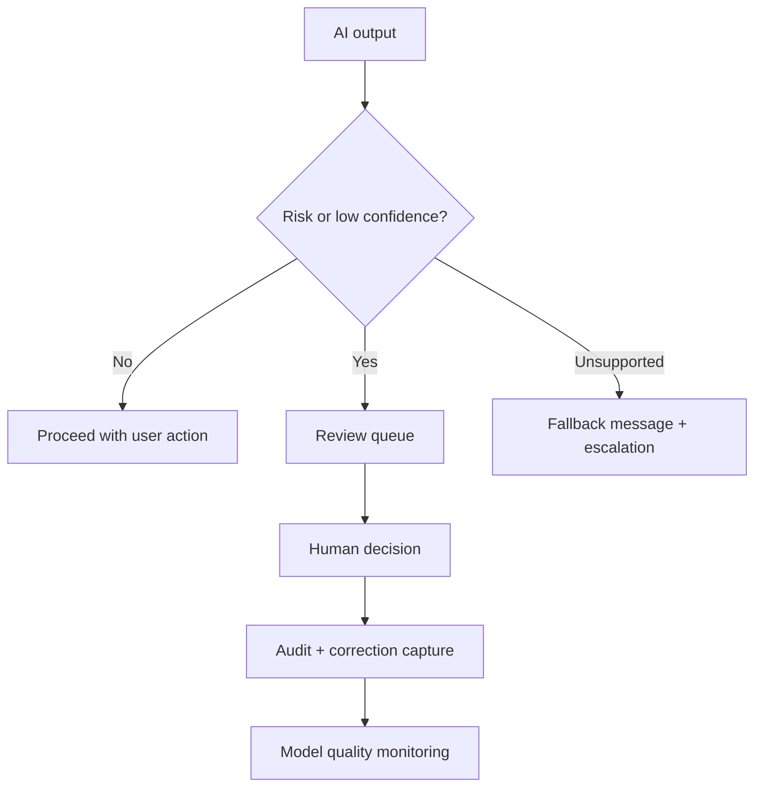

# Human Review, Monitoring, and Fallback

<div class="lesson-meta">
  <span>Building AI-Enabled Products as a BA</span>
  <span>Software BA</span>
  <span>Advanced</span>
</div>

## Learning outcomes

- Design human-in-the-loop workflows.
- Specify fallback and escalation requirements.
- Define monitoring events for AI quality and risk.

## Why this matters for BA work

<div class="ba-callout">
Responsible AI products need explicit paths for uncertainty, escalation, correction, and quality monitoring.
</div>

Business Analysts sit between problem framing, stakeholder meaning, delivery constraints, and product decisions. In AI work, that position becomes more important because unclear language can create false certainty quickly. This lesson gives you a practical control you can apply before AI output becomes scope, backlog, or delivery commitment.

## Mental model or core concept

Human-in-the-loop is not a vague promise that a person can intervene. It is a designed workflow: trigger conditions, reviewer role, queue, SLA, decision options, user messaging, audit, correction capture, and monitoring. Fallback should be safe, visible, and measurable.

## Practical BA example

An AI loan document checker flags missing documents. If confidence is high, it suggests next action; if confidence is low or document type is regulated, it routes to a reviewer. The BA specifies queue priority, reason codes, reviewer actions, customer message, and audit trail.

## Diagram



## BA artifact

### Human-in-the-Loop Flow Requirements

| Flow part | Requirement | Example | Metric |
| --- | --- | --- | --- |
| Trigger | Define when human review starts. | Confidence < 0.8 or regulated document. | Trigger accuracy by case type. |
| Reviewer action | List allowed decisions. | Approve, reject, request info, override. | Review completion SLA. |
| Fallback | Define safe response when AI cannot answer. | Show escalation message and create task. | Fallback resolution time. |
| Monitoring | Capture quality and drift signals. | Track overrides by category. | Override rate trend. |

## AI collaboration prompt

```text
Design the human-in-the-loop and fallback requirements. Include triggers, reviewer role, queue priority, SLA, allowed decisions, user messaging, audit record, correction capture, monitoring events, and operational metrics.
```

## Mistakes to avoid

- Writing 'human can review' without workflow details.
- No SLA for review queues.
- Fallback message hides uncertainty.
- Monitoring only uptime, not AI quality.

## Apply this tomorrow

1. Define one low-confidence trigger.
2. Write a fallback message that is honest and useful.
3. Add reason codes for human override.
4. Ask operations who owns the review queue.

## What a BA should remember

- Human review is a workflow requirement.
- Fallback is part of user experience.
- Monitoring must include quality, not only availability.
