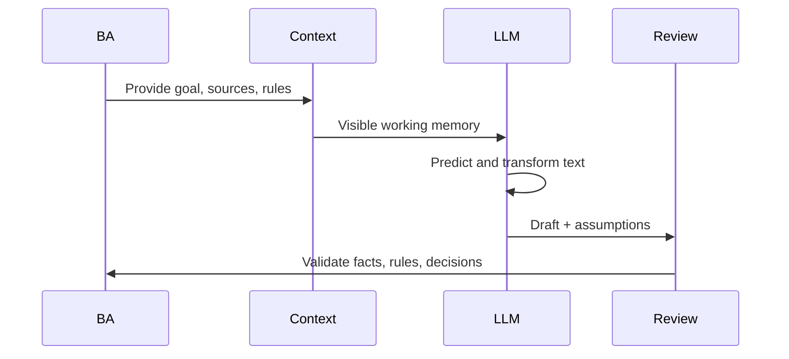

# LLM Mental Model

<div class="lesson-meta">
  <span>AI Foundations for Business Analysts</span>
  <span>Software BA</span>
  <span>Core</span>
</div>

## Learning outcomes

- Explain LLM behavior without overselling certainty.
- Design prompts that expose assumptions and missing context.
- Review AI output as probabilistic draft work.

## Why this matters for BA work

<div class="ba-callout">
LLMs are powerful text reasoning engines, but they do not know your hidden business rules unless you provide or retrieve them.
</div>

This lesson matters because LLM output often sounds complete before it is actually governed, sourced, or testable. BAs who understand the mental model can use AI as a structured drafting and critique partner without confusing fluent text with business approval. That keeps requirements reviewable and prevents hidden assumptions from entering delivery artifacts.

## Common difficulties for BAs

In AI Foundations for Business Analysts, LLM Mental Model becomes difficult when stakeholders expect a simple AI answer while the actual issue depends on model capability, data readiness, tool boundaries, and business decision risk. A BA should inspect the points below before treating an AI-supported artifact as ready for stakeholder decision or delivery handoff.

| Difficulty | Why it is hard in BA work | How a BA should handle it |
| --- | --- | --- |
| Asking AI for final truth instead of a reviewable draft. | The mistake "Asking AI for final truth instead of a reviewable draft." appears when the team discusses problem fit, model boundary, data dependency, and decision risk without agreeing which source is authoritative. AI can smooth over the disagreement, so the BA must keep uncertainty visible. | Apply this control: ask the model to compare AI and non-AI options before drafting requirements. Then use the stronger pattern "Provide rules, actors, constraints, examples, and require assumptions to be listed separately." and ask who must approve the artifact before it affects scope, build, test, or release. |
| Not separating model confidence from business approval. | For LLM Mental Model, the friction is that LLMs are powerful text reasoning engines, but they do not know your hidden business rules unless you provide or retrieve them. The weak pattern is tempting because AI can produce a fluent answer before the BA has checked ownership, source freshness, or decision rights. | Apply this control: ask the model to compare AI and non-AI options before drafting requirements. Then use the stronger pattern "Route material claims to source review or decision owners before publishing." and ask who must approve the artifact before it affects scope, build, test, or release. |
| Providing a vague task without source context or examples. | This becomes hard when LLM Output Review Card is expected to support the solution-shape decision. If the BA does not challenge the draft, unsupported assumptions may enter planning, testing, or stakeholder communication. | Apply this control: ask the model to compare AI and non-AI options before drafting requirements. Then use the stronger pattern "Add a review table for source-backed facts, assumptions, open questions, and owner decisions." and ask who must approve the artifact before it affects scope, build, test, or release. |

## Where this applies in real projects

Use this lesson when an AI idea first enters discovery, vendor discussion, roadmap planning, or feasibility analysis. The practical output is not a longer document; it is LLM Output Review Card with enough evidence, ownership, and decision clarity for the next project conversation.

| Project moment | How to apply this lesson | Concrete BA output |
| --- | --- | --- |
| Idea intake | Take one AI-generated answer and mark facts vs assumptions. | LLM Output Review Card showing problem fit, model boundary, data dependency, and decision risk, with the action "Take one AI-generated answer and mark facts vs assumptions." translated into a reviewable decision, requirement, checklist, or question for the next meeting. |
| Feasibility review | Ask AI to rewrite the same artifact using only supplied context. | LLM Output Review Card showing source evidence, with the action "Ask AI to rewrite the same artifact using only supplied context." translated into a reviewable decision, requirement, checklist, or question for the next meeting. |
| Solution framing | Add a 'questions for validation' section to your prompt. | LLM Output Review Card showing decision owner, with the action "Add a 'questions for validation' section to your prompt." translated into a reviewable decision, requirement, checklist, or question for the next meeting. |

## If this is missing

If LLM Mental Model is missing, the team may choose a tool before understanding the problem shape, creating expensive automation that does not match the business outcome. The BA can still recover, but only by converting the polished AI draft back into explicit evidence, assumptions, owners, and testable decisions.

| If missing | Project impact | Recovery action |
| --- | --- | --- |
| Ask the model for final acceptance criteria from a one-line idea | The model will fill missing policy, permissions, and edge cases with plausible inventions. | Recover by using the stronger pattern: Provide rules, actors, constraints, examples, and require assumptions to be listed separately. Rework LLM Output Review Card until it exposes problem fit, model boundary, data dependency, and decision risk, and do not share it as final until evidence, ownership, and validation path are explicit. |
| Use confidence language from the model as approval | Model confidence is not stakeholder confirmation or regulatory evidence. | Recover by using the stronger pattern: Route material claims to source review or decision owners before publishing. Rework LLM Output Review Card until it exposes problem fit, model boundary, data dependency, and decision risk, and do not share it as final until evidence, ownership, and validation path are explicit. |
| Share a polished AI draft without review markings | Stakeholders cannot see what is fact, inference, or unsupported text. | Recover by using the stronger pattern: Add a review table for source-backed facts, assumptions, open questions, and owner decisions. Rework LLM Output Review Card until it exposes problem fit, model boundary, data dependency, and decision risk, and do not share it as final until evidence, ownership, and validation path are explicit. |

## Mental model or core concept

An LLM transforms context into likely next text. It can summarize, classify, compare, draft, and infer patterns, but its answer quality depends on context, instructions, examples, and review. For BA work, the useful model is not 'AI knows the answer'; it is 'AI proposes a structured draft from supplied context, and the BA validates it.'

## Practical BA example

A BA asks an LLM to write acceptance criteria for 'premium users can export reports.' The model may invent export formats, limits, and permissions. If the BA provides subscription tiers, report types, audit rules, and examples, the model can produce a useful draft while showing assumptions that need validation.

## Diagram



## BA artifact

### LLM Output Review Card

| Review lens | Question to ask | Pass signal | Risk signal |
| --- | --- | --- | --- |
| Context | Did the model receive the actual business rule? | Output cites provided context. | Output invents policy or thresholds. |
| Assumption | Which statements are inferred? | Assumptions are labeled. | Assumptions are hidden as facts. |
| Specificity | Can QA test the output? | Rules, actors, and outcomes are explicit. | Uses vague words like fast, easy, smart. |
| Decision | Who must approve this? | Decision owner is named. | AI answer is treated as approval. |

## AI expert note

An LLM is a probabilistic system with strong language patterning, not an authoritative requirements engine. The BA must manage context, examples, constraints, and review criteria. Expert use means asking for assumptions, evidence labels, counterexamples, and testability checks, then treating the answer as a candidate artifact awaiting human validation.

## Bad vs better example

| Weak pattern | Why it fails | Stronger BA pattern |
| --- | --- | --- |
| Ask the model for final acceptance criteria from a one-line idea | The model will fill missing policy, permissions, and edge cases with plausible inventions. | Provide rules, actors, constraints, examples, and require assumptions to be listed separately. |
| Use confidence language from the model as approval | Model confidence is not stakeholder confirmation or regulatory evidence. | Route material claims to source review or decision owners before publishing. |
| Share a polished AI draft without review markings | Stakeholders cannot see what is fact, inference, or unsupported text. | Add a review table for source-backed facts, assumptions, open questions, and owner decisions. |

## AI collaboration prompt

```text
Before drafting, list missing context and assumptions. Then produce the artifact. After the draft, add a review table with source-backed facts, inferred assumptions, unsupported claims, and questions for stakeholder validation.
```

## Mistakes to avoid

- Asking AI for final truth instead of a reviewable draft.
- Not separating model confidence from business approval.
- Providing a vague task without source context or examples.
- Failing to ask the model to reveal assumptions.

## Apply this tomorrow

1. Take one AI-generated answer and mark facts vs assumptions.
2. Ask AI to rewrite the same artifact using only supplied context.
3. Add a 'questions for validation' section to your prompt.
4. Review one output with QA or developer eyes before sharing it.

## What a BA should remember

- LLMs generate plausible text, not guaranteed truth.
- Good BA prompts make missing context visible.
- The BA owns validation, not the model.
