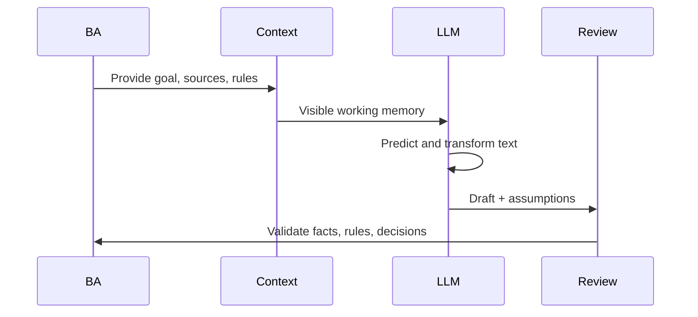

# LLM Mental Model

<div class="lesson-meta">
  <span>AI Foundations for Business Analysts</span>
  <span>Software BA</span>
  <span>Core</span>
</div>

## Learning outcomes

- Explain LLM behavior without overselling certainty.
- Design prompts that expose assumptions and missing context.
- Review AI output as probabilistic draft work.

## Why this matters for BA work

<div class="ba-callout">
LLMs are powerful text reasoning engines, but they do not know your hidden business rules unless you provide or retrieve them.
</div>

This lesson matters because LLM output often sounds complete before it is actually governed, sourced, or testable. BAs who understand the mental model can use AI as a structured drafting and critique partner without confusing fluent text with business approval. That keeps requirements reviewable and prevents hidden assumptions from entering delivery artifacts.

## Common difficulties for BAs

In real projects, this topic is difficult because the BA must turn messy evidence into decisions without letting AI hide uncertainty. Watch for these friction points before treating the output as ready.

| Difficulty | Why it is hard in BA work | How a BA should handle it |
| --- | --- | --- |
| Asking AI for final truth instead of a reviewable draft. | This is hard because LLM Mental Model is usually applied under deadline pressure, incomplete evidence, and stakeholder disagreement. A fluent AI draft can make the gap less visible. | Use source labels, explicit assumptions, and a named review owner before turning this into backlog, specification, or delivery commitment. |
| Not separating model confidence from business approval. | This is hard because LLM Mental Model is usually applied under deadline pressure, incomplete evidence, and stakeholder disagreement. A fluent AI draft can make the gap less visible. | Use source labels, explicit assumptions, and a named review owner before turning this into backlog, specification, or delivery commitment. |
| Providing a vague task without source context or examples. | This is hard because LLM Mental Model is usually applied under deadline pressure, incomplete evidence, and stakeholder disagreement. A fluent AI draft can make the gap less visible. | Use source labels, explicit assumptions, and a named review owner before turning this into backlog, specification, or delivery commitment. |

## Where this applies in real projects

This lesson is useful when the BA needs to move from conversation, policy, design, or technical input into a shared artifact that the team can implement and test.

| Project moment | How to apply this lesson | Concrete BA output |
| --- | --- | --- |
| Discovery | Take one AI-generated answer and mark facts vs assumptions. | LLM Output Review Card: a reviewable artifact that connects the learned concept to decisions, acceptance criteria, risks, or stakeholder alignment. |
| Refinement | Ask AI to rewrite the same artifact using only supplied context. | LLM Output Review Card: a reviewable artifact that connects the learned concept to decisions, acceptance criteria, risks, or stakeholder alignment. |
| Delivery | Add a 'questions for validation' section to your prompt. | LLM Output Review Card: a reviewable artifact that connects the learned concept to decisions, acceptance criteria, risks, or stakeholder alignment. |

## If this is missing

If this capability is missing, AI may still produce polished text, but the project loses reviewability. The result is usually rework, hidden assumptions, weak acceptance criteria, or business decisions made without enough evidence.

| If missing | Project impact | Recovery action |
| --- | --- | --- |
| Ask the model for final acceptance criteria from a one-line idea | The model will fill missing policy, permissions, and edge cases with plausible inventions. | Recover by using the stronger pattern: Provide rules, actors, constraints, examples, and require assumptions to be listed separately. Then re-check the artifact against evidence, testability, ownership, and business impact before sharing it. |
| Use confidence language from the model as approval | Model confidence is not stakeholder confirmation or regulatory evidence. | Recover by using the stronger pattern: Route material claims to source review or decision owners before publishing. Then re-check the artifact against evidence, testability, ownership, and business impact before sharing it. |
| Share a polished AI draft without review markings | Stakeholders cannot see what is fact, inference, or unsupported text. | Recover by using the stronger pattern: Add a review table for source-backed facts, assumptions, open questions, and owner decisions. Then re-check the artifact against evidence, testability, ownership, and business impact before sharing it. |

## Mental model or core concept

An LLM transforms context into likely next text. It can summarize, classify, compare, draft, and infer patterns, but its answer quality depends on context, instructions, examples, and review. For BA work, the useful model is not 'AI knows the answer'; it is 'AI proposes a structured draft from supplied context, and the BA validates it.'

## Practical BA example

A BA asks an LLM to write acceptance criteria for 'premium users can export reports.' The model may invent export formats, limits, and permissions. If the BA provides subscription tiers, report types, audit rules, and examples, the model can produce a useful draft while showing assumptions that need validation.

## Diagram



## BA artifact

### LLM Output Review Card

| Review lens | Question to ask | Pass signal | Risk signal |
| --- | --- | --- | --- |
| Context | Did the model receive the actual business rule? | Output cites provided context. | Output invents policy or thresholds. |
| Assumption | Which statements are inferred? | Assumptions are labeled. | Assumptions are hidden as facts. |
| Specificity | Can QA test the output? | Rules, actors, and outcomes are explicit. | Uses vague words like fast, easy, smart. |
| Decision | Who must approve this? | Decision owner is named. | AI answer is treated as approval. |

## AI expert note

An LLM is a probabilistic system with strong language patterning, not an authoritative requirements engine. The BA must manage context, examples, constraints, and review criteria. Expert use means asking for assumptions, evidence labels, counterexamples, and testability checks, then treating the answer as a candidate artifact awaiting human validation.

## Bad vs better example

| Weak pattern | Why it fails | Stronger BA pattern |
| --- | --- | --- |
| Ask the model for final acceptance criteria from a one-line idea | The model will fill missing policy, permissions, and edge cases with plausible inventions. | Provide rules, actors, constraints, examples, and require assumptions to be listed separately. |
| Use confidence language from the model as approval | Model confidence is not stakeholder confirmation or regulatory evidence. | Route material claims to source review or decision owners before publishing. |
| Share a polished AI draft without review markings | Stakeholders cannot see what is fact, inference, or unsupported text. | Add a review table for source-backed facts, assumptions, open questions, and owner decisions. |

## AI collaboration prompt

```text
Before drafting, list missing context and assumptions. Then produce the artifact. After the draft, add a review table with source-backed facts, inferred assumptions, unsupported claims, and questions for stakeholder validation.
```

## Mistakes to avoid

- Asking AI for final truth instead of a reviewable draft.
- Not separating model confidence from business approval.
- Providing a vague task without source context or examples.
- Failing to ask the model to reveal assumptions.

## Apply this tomorrow

1. Take one AI-generated answer and mark facts vs assumptions.
2. Ask AI to rewrite the same artifact using only supplied context.
3. Add a 'questions for validation' section to your prompt.
4. Review one output with QA or developer eyes before sharing it.

## What a BA should remember

- LLMs generate plausible text, not guaranteed truth.
- Good BA prompts make missing context visible.
- The BA owns validation, not the model.
