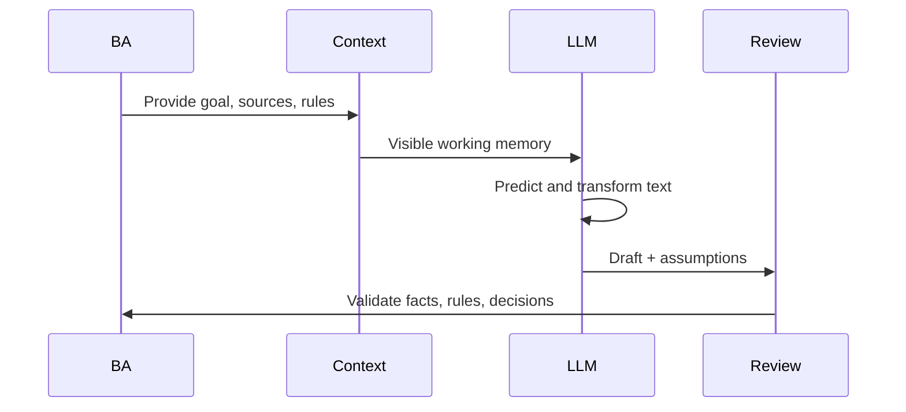

# LLM Mental Model

<div class="lesson-meta">
  <span>AI Foundations for Business Analysts</span>
  <span>Software BA</span>
  <span>Core</span>
</div>

## Learning outcomes

- Explain LLM behavior without overselling certainty.
- Design prompts that expose assumptions and missing context.
- Review AI output as probabilistic draft work.

## Why this matters for BA work

<div class="ba-callout">
LLMs are powerful text reasoning engines, but they do not know your hidden business rules unless you provide or retrieve them.
</div>

Business Analysts sit between problem framing, stakeholder meaning, delivery constraints, and product decisions. In AI work, that position becomes more important because unclear language can create false certainty quickly. This lesson gives you a practical control you can apply before AI output becomes scope, backlog, or delivery commitment.

## Mental model or core concept

An LLM transforms context into likely next text. It can summarize, classify, compare, draft, and infer patterns, but its answer quality depends on context, instructions, examples, and review. For BA work, the useful model is not 'AI knows the answer'; it is 'AI proposes a structured draft from supplied context, and the BA validates it.'

## Practical BA example

A BA asks an LLM to write acceptance criteria for 'premium users can export reports.' The model may invent export formats, limits, and permissions. If the BA provides subscription tiers, report types, audit rules, and examples, the model can produce a useful draft while showing assumptions that need validation.

## Diagram



## BA artifact

### LLM Output Review Card

| Review lens | Question to ask | Pass signal | Risk signal |
| --- | --- | --- | --- |
| Context | Did the model receive the actual business rule? | Output cites provided context. | Output invents policy or thresholds. |
| Assumption | Which statements are inferred? | Assumptions are labeled. | Assumptions are hidden as facts. |
| Specificity | Can QA test the output? | Rules, actors, and outcomes are explicit. | Uses vague words like fast, easy, smart. |
| Decision | Who must approve this? | Decision owner is named. | AI answer is treated as approval. |

## AI collaboration prompt

```text
Before drafting, list missing context and assumptions. Then produce the artifact. After the draft, add a review table with source-backed facts, inferred assumptions, unsupported claims, and questions for stakeholder validation.
```

## Mistakes to avoid

- Asking AI for final truth instead of a reviewable draft.
- Not separating model confidence from business approval.
- Providing a vague task without source context or examples.
- Failing to ask the model to reveal assumptions.

## Apply this tomorrow

1. Take one AI-generated answer and mark facts vs assumptions.
2. Ask AI to rewrite the same artifact using only supplied context.
3. Add a 'questions for validation' section to your prompt.
4. Review one output with QA or developer eyes before sharing it.

## What a BA should remember

- LLMs generate plausible text, not guaranteed truth.
- Good BA prompts make missing context visible.
- The BA owns validation, not the model.
