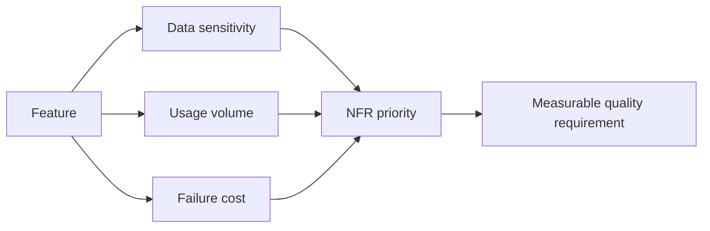

# Non-Functional Requirements and Risk

<div class="lesson-meta">
  <span>Requirements Engineering With AI</span>
  <span>Software BA</span>
  <span>Core</span>
</div>

## Learning outcomes

- Use AI to surface NFR gaps across quality attributes.
- Translate technical risks into business impact.
- Prioritize NFRs based on usage, data sensitivity, and failure cost.

## Why this matters for BA work

<div class="ba-callout">
NFRs are business risk requirements, not technical extras.
</div>

This lesson matters because AI features often fail in quality attributes that stakeholders do not state explicitly: privacy, latency, reliability, explainability, fairness, auditability, and fallback. BAs must pull these concerns forward. For AI-enabled products, NFRs are not secondary; they define whether the feature can be trusted in real operation.

## Common difficulties for BAs

In real projects, this topic is difficult because the BA must turn messy evidence into decisions without letting AI hide uncertainty. Watch for these friction points before treating the output as ready.

| Difficulty | Why it is hard in BA work | How a BA should handle it |
| --- | --- | --- |
| Treating NFRs as developer-only concerns. | This is hard because Non-Functional Requirements and Risk is usually applied under deadline pressure, incomplete evidence, and stakeholder disagreement. A fluent AI draft can make the gap less visible. | Use source labels, explicit assumptions, and a named review owner before turning this into backlog, specification, or delivery commitment. |
| Writing NFRs without measurable signals. | This is hard because Non-Functional Requirements and Risk is usually applied under deadline pressure, incomplete evidence, and stakeholder disagreement. A fluent AI draft can make the gap less visible. | Use source labels, explicit assumptions, and a named review owner before turning this into backlog, specification, or delivery commitment. |
| Ignoring privacy and audit until late testing. | This is hard because Non-Functional Requirements and Risk is usually applied under deadline pressure, incomplete evidence, and stakeholder disagreement. A fluent AI draft can make the gap less visible. | Use source labels, explicit assumptions, and a named review owner before turning this into backlog, specification, or delivery commitment. |

## Where this applies in real projects

This lesson is useful when the BA needs to move from conversation, policy, design, or technical input into a shared artifact that the team can implement and test.

| Project moment | How to apply this lesson | Concrete BA output |
| --- | --- | --- |
| Discovery | Pick one feature and ask AI for NFR gaps. | NFR Risk Matrix: a reviewable artifact that connects the learned concept to decisions, acceptance criteria, risks, or stakeholder alignment. |
| Refinement | Rewrite one NFR with a measurable acceptance signal. | NFR Risk Matrix: a reviewable artifact that connects the learned concept to decisions, acceptance criteria, risks, or stakeholder alignment. |
| Delivery | Review NFR priority with product and engineering. | NFR Risk Matrix: a reviewable artifact that connects the learned concept to decisions, acceptance criteria, risks, or stakeholder alignment. |

## If this is missing

If this capability is missing, AI may still produce polished text, but the project loses reviewability. The result is usually rework, hidden assumptions, weak acceptance criteria, or business decisions made without enough evidence.

| If missing | Project impact | Recovery action |
| --- | --- | --- |
| Write that AI output must be accurate | Accuracy is undefined without task, dataset, threshold, and failure cost. | Recover by using the stronger pattern: Specify evaluation cases, target metric, acceptable error, and escalation behavior. Then re-check the artifact against evidence, testability, ownership, and business impact before sharing it. |
| Leave privacy to the technical team | BA decisions about data, users, and workflow shape privacy exposure. | Recover by using the stronger pattern: Define prohibited data, retention, consent, access, and redaction requirements. Then re-check the artifact against evidence, testability, ownership, and business impact before sharing it. |
| Add NFRs after feature design is complete | Controls may become expensive or impossible to retrofit. | Recover by using the stronger pattern: Elicit AI-specific NFRs during discovery and include them in acceptance criteria. Then re-check the artifact against evidence, testability, ownership, and business impact before sharing it. |

## Mental model or core concept

NFRs describe how the system must behave under real-world conditions: performance, availability, security, privacy, accessibility, auditability, supportability, and compliance. AI can propose NFR categories, but the BA must tie each requirement to business impact and measurable acceptance criteria.

## Practical BA example

A payment refund feature has functional steps but no timeout, audit, fraud, data retention, or support requirements. AI creates a risk inventory; the BA turns high-risk gaps into measurable NFRs and acceptance tests.

## Diagram



## BA artifact

### NFR Risk Matrix

| Quality attribute | Business impact | Requirement example | Acceptance signal |
| --- | --- | --- | --- |
| Availability | Refunds blocked during outage. | Refund submission available 99.9% monthly. | Downtime report below threshold. |
| Privacy | PII exposed in refund notes. | Mask customer PII in support view. | Role-based access test passes. |
| Auditability | No trace for disputed refund. | Log approver, timestamp, reason, old/new status. | Audit export includes all fields. |
| Performance | Agent queue grows during peak. | Search refund status under 2 seconds p95. | Load test meets p95 target. |

## AI expert note

AI raises NFR complexity because behavior is probabilistic and data-dependent. Expert BA analysis ties each NFR to risk scenario, user harm, measurement method, threshold, owner, and operational response. Vague goals such as accurate or fast are insufficient; the spec needs measurable evaluation and monitoring commitments.

## Bad vs better example

| Weak pattern | Why it fails | Stronger BA pattern |
| --- | --- | --- |
| Write that AI output must be accurate | Accuracy is undefined without task, dataset, threshold, and failure cost. | Specify evaluation cases, target metric, acceptable error, and escalation behavior. |
| Leave privacy to the technical team | BA decisions about data, users, and workflow shape privacy exposure. | Define prohibited data, retention, consent, access, and redaction requirements. |
| Add NFRs after feature design is complete | Controls may become expensive or impossible to retrofit. | Elicit AI-specific NFRs during discovery and include them in acceptance criteria. |

## AI collaboration prompt

```text
Review this feature for NFR risk. Cover availability, performance, security, privacy, accessibility, auditability, supportability, compliance, and data retention. For each gap, provide business impact, measurable requirement, acceptance signal, and owner.
```

## Mistakes to avoid

- Treating NFRs as developer-only concerns.
- Writing NFRs without measurable signals.
- Ignoring privacy and audit until late testing.
- Failing to connect NFR priority to business risk.

## Apply this tomorrow

1. Pick one feature and ask AI for NFR gaps.
2. Rewrite one NFR with a measurable acceptance signal.
3. Review NFR priority with product and engineering.
4. Add audit and supportability to your checklist.

## What a BA should remember

- NFRs are risk controls.
- Measurable NFRs prevent vague quality debates.
- BA ownership includes business impact of failure.
