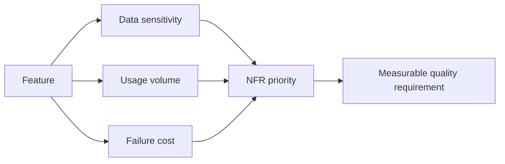

# Non-Functional Requirements and Risk

<div class="lesson-meta">
  <span>Requirements Engineering With AI</span>
  <span>Software BA</span>
  <span>Core</span>
</div>

## Learning outcomes

- Use AI to surface NFR gaps across quality attributes.
- Translate technical risks into business impact.
- Prioritize NFRs based on usage, data sensitivity, and failure cost.

## Why this matters for BA work

<div class="ba-callout">
NFRs are business risk requirements, not technical extras.
</div>

Business Analysts sit between problem framing, stakeholder meaning, delivery constraints, and product decisions. In AI work, that position becomes more important because unclear language can create false certainty quickly. This lesson gives you a practical control you can apply before AI output becomes scope, backlog, or delivery commitment.

## Mental model or core concept

NFRs describe how the system must behave under real-world conditions: performance, availability, security, privacy, accessibility, auditability, supportability, and compliance. AI can propose NFR categories, but the BA must tie each requirement to business impact and measurable acceptance criteria.

## Practical BA example

A payment refund feature has functional steps but no timeout, audit, fraud, data retention, or support requirements. AI creates a risk inventory; the BA turns high-risk gaps into measurable NFRs and acceptance tests.

## Diagram



## BA artifact

### NFR Risk Matrix

| Quality attribute | Business impact | Requirement example | Acceptance signal |
| --- | --- | --- | --- |
| Availability | Refunds blocked during outage. | Refund submission available 99.9% monthly. | Downtime report below threshold. |
| Privacy | PII exposed in refund notes. | Mask customer PII in support view. | Role-based access test passes. |
| Auditability | No trace for disputed refund. | Log approver, timestamp, reason, old/new status. | Audit export includes all fields. |
| Performance | Agent queue grows during peak. | Search refund status under 2 seconds p95. | Load test meets p95 target. |

## AI collaboration prompt

```text
Review this feature for NFR risk. Cover availability, performance, security, privacy, accessibility, auditability, supportability, compliance, and data retention. For each gap, provide business impact, measurable requirement, acceptance signal, and owner.
```

## Mistakes to avoid

- Treating NFRs as developer-only concerns.
- Writing NFRs without measurable signals.
- Ignoring privacy and audit until late testing.
- Failing to connect NFR priority to business risk.

## Apply this tomorrow

1. Pick one feature and ask AI for NFR gaps.
2. Rewrite one NFR with a measurable acceptance signal.
3. Review NFR priority with product and engineering.
4. Add audit and supportability to your checklist.

## What a BA should remember

- NFRs are risk controls.
- Measurable NFRs prevent vague quality debates.
- BA ownership includes business impact of failure.
