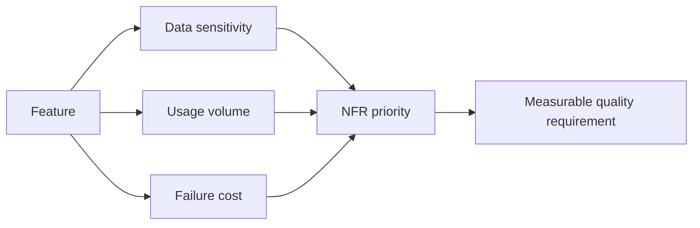

# Non-Functional Requirements and Risk

<div class="lesson-meta">
  <span>Requirements Engineering With AI</span>
  <span>Software BA</span>
  <span>Core</span>
</div>

## Learning outcomes

- Use AI to surface NFR gaps across quality attributes.
- Translate technical risks into business impact.
- Prioritize NFRs based on usage, data sensitivity, and failure cost.

## Why this matters for BA work

<div class="ba-callout">
NFRs are business risk requirements, not technical extras.
</div>

This lesson matters because AI features often fail in quality attributes that stakeholders do not state explicitly: privacy, latency, reliability, explainability, fairness, auditability, and fallback. BAs must pull these concerns forward. For AI-enabled products, NFRs are not secondary; they define whether the feature can be trusted in real operation.

## Common difficulties for BAs

In Requirements Engineering With AI, Non-Functional Requirements and Risk becomes difficult when business rules, edge cases, quality attributes, and testability constraints must survive the move from conversation into backlog. A BA should inspect the points below before treating an AI-supported artifact as ready for stakeholder decision or delivery handoff.

| Difficulty | Why it is hard in BA work | How a BA should handle it |
| --- | --- | --- |
| Treating NFRs as developer-only concerns. | The mistake "Treating NFRs as developer-only concerns." appears when the team discusses ambiguity, NFR risk, traceability, testability, and rule ownership without agreeing which source is authoritative. AI can smooth over the disagreement, so the BA must keep uncertainty visible. | Apply this control: force every requirement statement to expose actor, trigger, data, rule, exception, and verification signal. Then use the stronger pattern "Specify evaluation cases, target metric, acceptable error, and escalation behavior." and ask who must approve the artifact before it affects scope, build, test, or release. |
| Writing NFRs without measurable signals. | For Non-Functional Requirements and Risk, the friction is that NFRs are business risk requirements, not technical extras. The weak pattern is tempting because AI can produce a fluent answer before the BA has checked ownership, source freshness, or decision rights. | Apply this control: force every requirement statement to expose actor, trigger, data, rule, exception, and verification signal. Then use the stronger pattern "Define prohibited data, retention, consent, access, and redaction requirements." and ask who must approve the artifact before it affects scope, build, test, or release. |
| Ignoring privacy and audit until late testing. | This becomes hard when NFR Risk Matrix is expected to support the delivery-ready requirement. If the BA does not challenge the draft, unsupported assumptions may enter planning, testing, or stakeholder communication. | Apply this control: force every requirement statement to expose actor, trigger, data, rule, exception, and verification signal. Then use the stronger pattern "Elicit AI-specific NFRs during discovery and include them in acceptance criteria." and ask who must approve the artifact before it affects scope, build, test, or release. |

## Where this applies in real projects

Use this lesson when requirements are being refined, split, clarified, tested, or challenged by QA and delivery teams. The practical output is not a longer document; it is NFR Risk Matrix with enough evidence, ownership, and decision clarity for the next project conversation.

| Project moment | How to apply this lesson | Concrete BA output |
| --- | --- | --- |
| Backlog refinement | Pick one feature and ask AI for NFR gaps. | NFR Risk Matrix showing ambiguity, NFR risk, traceability, testability, and rule ownership, with the action "Pick one feature and ask AI for NFR gaps." translated into a reviewable decision, requirement, checklist, or question for the next meeting. |
| QA alignment | Rewrite one NFR with a measurable acceptance signal. | NFR Risk Matrix showing source evidence, with the action "Rewrite one NFR with a measurable acceptance signal." translated into a reviewable decision, requirement, checklist, or question for the next meeting. |
| Release readiness | Review NFR priority with product and engineering. | NFR Risk Matrix showing decision owner, with the action "Review NFR priority with product and engineering." translated into a reviewable decision, requirement, checklist, or question for the next meeting. |

## If this is missing

If Non-Functional Requirements and Risk is missing, requirements may look complete but still fail implementation, testing, release readiness, or operational support. The BA can still recover, but only by converting the polished AI draft back into explicit evidence, assumptions, owners, and testable decisions.

| If missing | Project impact | Recovery action |
| --- | --- | --- |
| Write that AI output must be accurate | Accuracy is undefined without task, dataset, threshold, and failure cost. | Recover by using the stronger pattern: Specify evaluation cases, target metric, acceptable error, and escalation behavior. Rework NFR Risk Matrix until it exposes ambiguity, NFR risk, traceability, testability, and rule ownership, and do not share it as final until evidence, ownership, and validation path are explicit. |
| Leave privacy to the technical team | BA decisions about data, users, and workflow shape privacy exposure. | Recover by using the stronger pattern: Define prohibited data, retention, consent, access, and redaction requirements. Rework NFR Risk Matrix until it exposes ambiguity, NFR risk, traceability, testability, and rule ownership, and do not share it as final until evidence, ownership, and validation path are explicit. |
| Add NFRs after feature design is complete | Controls may become expensive or impossible to retrofit. | Recover by using the stronger pattern: Elicit AI-specific NFRs during discovery and include them in acceptance criteria. Rework NFR Risk Matrix until it exposes ambiguity, NFR risk, traceability, testability, and rule ownership, and do not share it as final until evidence, ownership, and validation path are explicit. |

## Mental model or core concept

NFRs describe how the system must behave under real-world conditions: performance, availability, security, privacy, accessibility, auditability, supportability, and compliance. AI can propose NFR categories, but the BA must tie each requirement to business impact and measurable acceptance criteria.

## Practical BA example

A payment refund feature has functional steps but no timeout, audit, fraud, data retention, or support requirements. AI creates a risk inventory; the BA turns high-risk gaps into measurable NFRs and acceptance tests.

## Diagram



## BA artifact

### NFR Risk Matrix

| Quality attribute | Business impact | Requirement example | Acceptance signal |
| --- | --- | --- | --- |
| Availability | Refunds blocked during outage. | Refund submission available 99.9% monthly. | Downtime report below threshold. |
| Privacy | PII exposed in refund notes. | Mask customer PII in support view. | Role-based access test passes. |
| Auditability | No trace for disputed refund. | Log approver, timestamp, reason, old/new status. | Audit export includes all fields. |
| Performance | Agent queue grows during peak. | Search refund status under 2 seconds p95. | Load test meets p95 target. |

## AI expert note

AI raises NFR complexity because behavior is probabilistic and data-dependent. Expert BA analysis ties each NFR to risk scenario, user harm, measurement method, threshold, owner, and operational response. Vague goals such as accurate or fast are insufficient; the spec needs measurable evaluation and monitoring commitments.

## Bad vs better example

| Weak pattern | Why it fails | Stronger BA pattern |
| --- | --- | --- |
| Write that AI output must be accurate | Accuracy is undefined without task, dataset, threshold, and failure cost. | Specify evaluation cases, target metric, acceptable error, and escalation behavior. |
| Leave privacy to the technical team | BA decisions about data, users, and workflow shape privacy exposure. | Define prohibited data, retention, consent, access, and redaction requirements. |
| Add NFRs after feature design is complete | Controls may become expensive or impossible to retrofit. | Elicit AI-specific NFRs during discovery and include them in acceptance criteria. |

## AI collaboration prompt

```text
Review this feature for NFR risk. Cover availability, performance, security, privacy, accessibility, auditability, supportability, compliance, and data retention. For each gap, provide business impact, measurable requirement, acceptance signal, and owner.
```

## Mistakes to avoid

- Treating NFRs as developer-only concerns.
- Writing NFRs without measurable signals.
- Ignoring privacy and audit until late testing.
- Failing to connect NFR priority to business risk.

## Apply this tomorrow

1. Pick one feature and ask AI for NFR gaps.
2. Rewrite one NFR with a measurable acceptance signal.
3. Review NFR priority with product and engineering.
4. Add audit and supportability to your checklist.

## What a BA should remember

- NFRs are risk controls.
- Measurable NFRs prevent vague quality debates.
- BA ownership includes business impact of failure.
