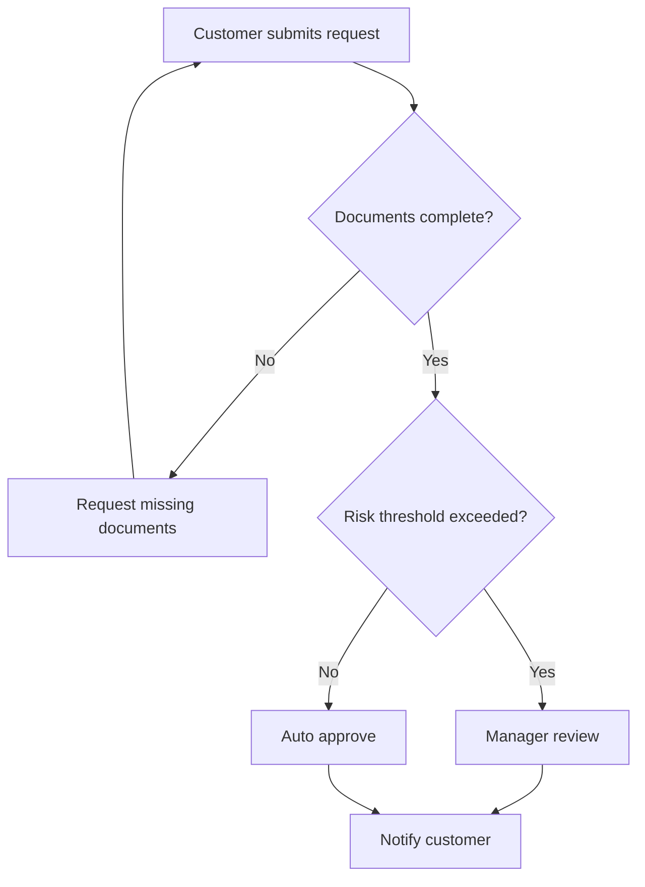

# Process Modeling With AI

<div class="lesson-meta">
  <span>AI-Augmented BA Workflow</span>
  <span>Software BA</span>
  <span>Core</span>
</div>

## Learning outcomes

- Use AI to create first-pass process maps.
- Add exception paths, roles, SLAs, and controls.
- Review process diagrams for missing ownership and policy decisions.

## Why this matters for BA work

<div class="ba-callout">
AI can draft process flows, but BA quality comes from decisions, exceptions, ownership, and operational constraints.
</div>

Business Analysts sit between problem framing, stakeholder meaning, delivery constraints, and product decisions. In AI work, that position becomes more important because unclear language can create false certainty quickly. This lesson gives you a practical control you can apply before AI output becomes scope, backlog, or delivery commitment.

## Mental model or core concept

Process modeling is not drawing boxes; it is clarifying work, decision rights, handoffs, and failure handling. AI can convert text into a flow, but the BA should challenge the draft: who owns each step, what triggers the next step, what happens when data is missing, and which controls are required.

## Practical BA example

AI drafts a clean onboarding flow: submit documents, verify, approve. The BA adds missing-document loop, duplicate customer check, risk review, SLA timer, manual override, and customer notification rules. The diagram becomes a decision tool, not decoration.

## Diagram



## BA artifact

### Process Review Checklist

| Flow element | BA review question | Evidence needed | Common gap |
| --- | --- | --- | --- |
| Actor | Who performs or owns the step? | Role matrix or SOP. | System step with no owner. |
| Decision | What rule chooses the branch? | Policy or business rule. | Diamond with vague condition. |
| Exception | What happens when input is invalid? | Support scripts and error logs. | Happy path only. |
| SLA/control | What timing or audit control applies? | Operational metric or compliance rule. | No escalation or audit. |

## AI collaboration prompt

```text
Convert this process description into a Mermaid flowchart. Include actors, decision rules, exception paths, SLAs, handoffs, inputs, outputs, controls, and unresolved policy questions. After the diagram, list missing ownership or rule gaps.
```

## Mistakes to avoid

- Accepting the first AI diagram because it looks clean.
- Omitting exceptions and manual work.
- Using process boxes without owners.
- Drawing decisions without decision rules.

## Apply this tomorrow

1. Ask AI to add exception paths to one existing flow.
2. Mark every decision diamond with a business rule.
3. Add owner labels to process steps.
4. Review the diagram with support or operations, not only product.

## What a BA should remember

- A useful process diagram exposes decisions and handoffs.
- Exceptions often contain the real requirements.
- AI drafts flow; BA validates operation.
