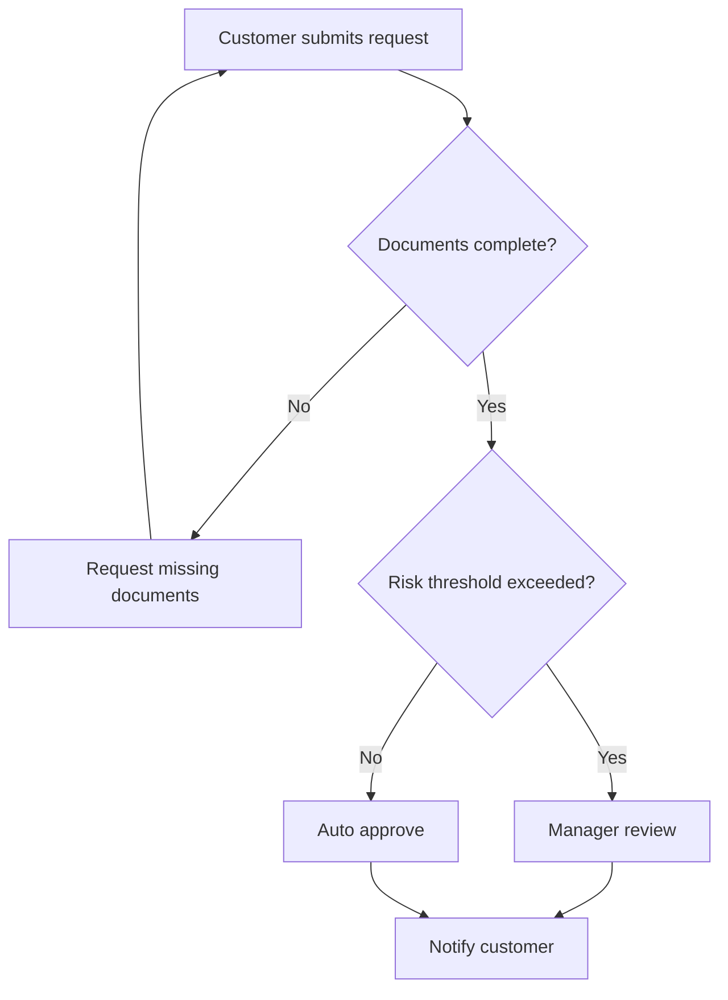

# Process Modeling With AI

<div class="lesson-meta">
  <span>AI-Augmented BA Workflow</span>
  <span>Software BA</span>
  <span>Core</span>
</div>

## Learning outcomes

- Use AI to create first-pass process maps.
- Add exception paths, roles, SLAs, and controls.
- Review process diagrams for missing ownership and policy decisions.

## Why this matters for BA work

<div class="ba-callout">
AI can draft process flows, but BA quality comes from decisions, exceptions, ownership, and operational constraints.
</div>

This lesson matters because process models are where hidden requirements usually surface: handoffs, exception paths, timing, ownership, and system boundaries. AI can convert text into diagrams, but the BA must test whether the diagram exposes operational truth. A beautiful flow that misses escalation or manual override is dangerous.

## Common difficulties for BAs

In real projects, this topic is difficult because the BA must turn messy evidence into decisions without letting AI hide uncertainty. Watch for these friction points before treating the output as ready.

| Difficulty | Why it is hard in BA work | How a BA should handle it |
| --- | --- | --- |
| Accepting the first AI diagram because it looks clean. | This is hard because Process Modeling With AI is usually applied under deadline pressure, incomplete evidence, and stakeholder disagreement. A fluent AI draft can make the gap less visible. | Use source labels, explicit assumptions, and a named review owner before turning this into backlog, specification, or delivery commitment. |
| Omitting exceptions and manual work. | This is hard because Process Modeling With AI is usually applied under deadline pressure, incomplete evidence, and stakeholder disagreement. A fluent AI draft can make the gap less visible. | Use source labels, explicit assumptions, and a named review owner before turning this into backlog, specification, or delivery commitment. |
| Using process boxes without owners. | This is hard because Process Modeling With AI is usually applied under deadline pressure, incomplete evidence, and stakeholder disagreement. A fluent AI draft can make the gap less visible. | Use source labels, explicit assumptions, and a named review owner before turning this into backlog, specification, or delivery commitment. |

## Where this applies in real projects

This lesson is useful when the BA needs to move from conversation, policy, design, or technical input into a shared artifact that the team can implement and test.

| Project moment | How to apply this lesson | Concrete BA output |
| --- | --- | --- |
| Discovery | Ask AI to add exception paths to one existing flow. | Process Review Checklist: a reviewable artifact that connects the learned concept to decisions, acceptance criteria, risks, or stakeholder alignment. |
| Refinement | Mark every decision diamond with a business rule. | Process Review Checklist: a reviewable artifact that connects the learned concept to decisions, acceptance criteria, risks, or stakeholder alignment. |
| Delivery | Add owner labels to process steps. | Process Review Checklist: a reviewable artifact that connects the learned concept to decisions, acceptance criteria, risks, or stakeholder alignment. |

## If this is missing

If this capability is missing, AI may still produce polished text, but the project loses reviewability. The result is usually rework, hidden assumptions, weak acceptance criteria, or business decisions made without enough evidence.

| If missing | Project impact | Recovery action |
| --- | --- | --- |
| Ask AI to draw a process from a paragraph and accept it | The generated flow may omit exceptions, ownership, timing, and integration constraints. | Recover by using the stronger pattern: Use the diagram as a review object and challenge every decision, handoff, and alternate path. Then re-check the artifact against evidence, testability, ownership, and business impact before sharing it. |
| Model only the happy path | Delivery teams discover queues, retries, and manual work too late. | Recover by using the stronger pattern: Add failure, cancellation, timeout, escalation, and override paths. Then re-check the artifact against evidence, testability, ownership, and business impact before sharing it. |
| Mix user actions and system actions in one lane | Responsibility and automation boundaries become unclear. | Recover by using the stronger pattern: Separate actors, systems, external services, and human reviewers into distinct lanes. Then re-check the artifact against evidence, testability, ownership, and business impact before sharing it. |

## Mental model or core concept

Process modeling is not drawing boxes; it is clarifying work, decision rights, handoffs, and failure handling. AI can convert text into a flow, but the BA should challenge the draft: who owns each step, what triggers the next step, what happens when data is missing, and which controls are required.

## Practical BA example

AI drafts a clean onboarding flow: submit documents, verify, approve. The BA adds missing-document loop, duplicate customer check, risk review, SLA timer, manual override, and customer notification rules. The diagram becomes a decision tool, not decoration.

## Diagram



## BA artifact

### Process Review Checklist

| Flow element | BA review question | Evidence needed | Common gap |
| --- | --- | --- | --- |
| Actor | Who performs or owns the step? | Role matrix or SOP. | System step with no owner. |
| Decision | What rule chooses the branch? | Policy or business rule. | Diamond with vague condition. |
| Exception | What happens when input is invalid? | Support scripts and error logs. | Happy path only. |
| SLA/control | What timing or audit control applies? | Operational metric or compliance rule. | No escalation or audit. |

## AI expert note

AI-assisted process modeling should be treated as a hypothesis of the workflow. The expert BA asks whether every decision has a rule, every exception has an owner, every system interaction has a boundary, and every loop has a stopping condition. Diagrams should trigger better questions, not decorate requirements.

## Bad vs better example

| Weak pattern | Why it fails | Stronger BA pattern |
| --- | --- | --- |
| Ask AI to draw a process from a paragraph and accept it | The generated flow may omit exceptions, ownership, timing, and integration constraints. | Use the diagram as a review object and challenge every decision, handoff, and alternate path. |
| Model only the happy path | Delivery teams discover queues, retries, and manual work too late. | Add failure, cancellation, timeout, escalation, and override paths. |
| Mix user actions and system actions in one lane | Responsibility and automation boundaries become unclear. | Separate actors, systems, external services, and human reviewers into distinct lanes. |

## AI collaboration prompt

```text
Convert this process description into a Mermaid flowchart. Include actors, decision rules, exception paths, SLAs, handoffs, inputs, outputs, controls, and unresolved policy questions. After the diagram, list missing ownership or rule gaps.
```

## Mistakes to avoid

- Accepting the first AI diagram because it looks clean.
- Omitting exceptions and manual work.
- Using process boxes without owners.
- Drawing decisions without decision rules.

## Apply this tomorrow

1. Ask AI to add exception paths to one existing flow.
2. Mark every decision diamond with a business rule.
3. Add owner labels to process steps.
4. Review the diagram with support or operations, not only product.

## What a BA should remember

- A useful process diagram exposes decisions and handoffs.
- Exceptions often contain the real requirements.
- AI drafts flow; BA validates operation.
